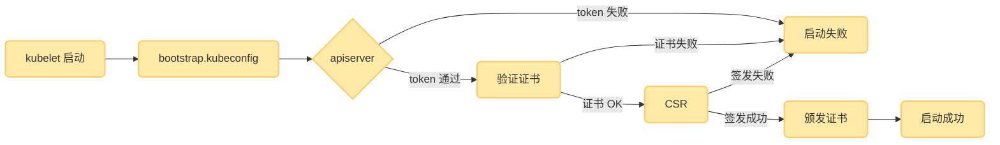
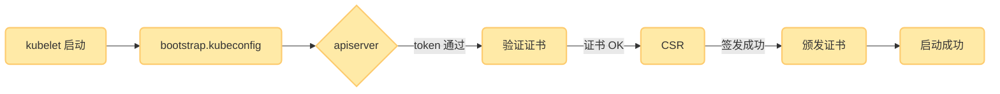

---
title: K8S_二进制集群搭建（一主两从）
icon: circle-info
order: 1
category:
  - Linux
  - Docker
  - kubernetes
tag:
  - Linux
  - Docker
  - kubernetes
  - 运维
pageview: false
date: 2025-10-23
comment: false
breadcrumb: false
isOriginal: true
---


>👨‍🎓**博主简介**
>
>&emsp;&emsp;🏅[CSDN博客专家](https://blog.csdn.net/liu_chen_yang?type=blog)
>&emsp;&emsp;🏅[云计算领域优质创作者](https://blog.csdn.net/liu_chen_yang?type=blog)
>&emsp;&emsp;🏅[华为云开发者社区专家博主](https://bbs.huaweicloud.com/community/usersnew/id_1661843828089234)
>&emsp;&emsp;🏅[阿里云开发者社区专家博主](https://developer.aliyun.com/profile/7yu26jk3lfqxg)
>💊**交流社区：**[运维交流社区](https://bbs.csdn.net/forums/lcy) 欢迎大家的加入！
>🐋 希望大家多多支持，我们一起进步！😄
>🎉如果文章对你有帮助的话，欢迎 点赞 👍🏻 评论 💬 收藏 ⭐️ 加关注+💗

---


## 一、前言
### 1.1 温馨提示
> 内容比较多，请耐心观看，有不懂的可留言
### 1.2 常见的k8s部署方式
* Mini kube
> Minikube是一个工具，可以在本地快速运行一个单节点微型K8s，仅用于学习预览K8s的一些特性使用。
> 官方部署地址: [https://kubernetes.io/zh-cn/docs/tasks/tools/](https://kubernetes.io/zh-cn/docs/tasks/tools/)
* k8s单机部署
> 采用的是`kubeadm` yum安装部署的
> 部署地址：[https://liucy.blog.csdn.net/article/details/120742911](https://liucy.blog.csdn.net/article/details/120742911)

* Kubeadmin

> Kubeadmin也是一个工具，提供kubeadm init和kubeadm join，用于快速部署K8S集群，相对简单
> 官方部署地址：[https://kubernetes.io/zh-cn/docs/reference/setup-tools/kubeadm/](https://kubernetes.io/zh-cn/docs/reference/setup-tools/kubeadm/)


* 二进制安装部署

> 生产首选，从官方下载发行版的二进制包，手动部署每个组件和自签TLS证书，组成K8s集群，新手推荐
> 下载地址：[https://github.com/kubernetes/kubernetes/releases](https://github.com/kubernetes/kubernetes/releases)

---
> **小结**：kubeadm降低部署门槛，但屏蔽了很多细节，遇到问题很难排查，如果想更容易可控，推荐使用二进制包部署kubernetes集群，虽然手动部署麻烦点，期间可以学习很多工作原理，也利于后期维护。

### 1.3 参考文献：
|标题| 链接 |
|--|--|
|  k8s二进制安装部署(详细)|[https://blog.csdn.net/qq_44078641/article/details/120049473](https://blog.csdn.net/qq_44078641/article/details/120049473)  |
|k8s1.20环境搭建部署(二进制版本)|[https://www.cnblogs.com/lizexiong/p/14882419.html](https://www.cnblogs.com/lizexiong/p/14882419.html)|

## 二、准备工作（所有节点都要做同样的操作）

> **<font color=red>温馨提示：</font>**
> 服务器需要可以访问外网，需要从网上拉取镜像需求，如果服务器不能上网，需要提前下载对应镜像并导入节点；
### 2.1 服务器配置
|集群（一主两从）|ip地址|主机名|配置（最低要求）|安装所需组件|
|--|--|--|--|--|
|主|172.16.11.230|k8s-master|2C/2G/50G| cfssl、etcd、Docker、kubectl、kube-apiserver、kube-controller-manager、kube-scheduler、kubelet、kube-proxy|
|从|172.16.11.231|k8s-node1|2C/2G/50G| etcd、Docker、kubelet、kube-proxy|
|从|172.16.11.232|k8s-node2|2C/2G/50G| etcd、Docker、kubelet、kube-proxy|

---
**<font size=4> ✅ 所需软件组件说明：</font>**

| 组件名称 | 说明 |
|----------|------|
| `cfssl` | 用于生成 TLS 证书 |
| `etcd` | 分布式键值数据库，存储集群所有数据 |
| `docker` 或 `containerd` | 容器运行时（推荐 containerd） |
| `kubectl` | 命令行工具，用于与集群交互 |
| `kube-apiserver` | Kubernetes API 服务，集群的统一入口 |
| `kube-controller-manager` | 控制器管理器，负责资源控制逻辑 |
| `kube-scheduler` | 调度器，负责 Pod 的调度 |
| `kubelet` | 节点代理，负责启动 Pod 和管理容器 |
| `kube-proxy` | 网络代理，负责服务发现和负载均衡 |

---

**<font size=4> ✅ 软件版本说明：</font>**
|软件| 版本 |
|--|--|
|  linux|centos7  |
|cfssl|1.2.0|
|etcd|3.4.9|
|Docker|24.0.5|
|Kubernetes|1.20.10|
|Calico|3.15.5|

---
**<font size=4> ✅ Kubernetes一主两从结构图</font>**
> **其他说明：**
> * 这里etcd为了节省机器，复用k8s节点；
> * `kubectl`是操作命令，因为只需要再master节点上操作，所以只需要再master节点安装`kubectl`就行；


---
**<font size=4> ✅ 本文路径说明：</font>**

|路径|说明  |
|--|--|
|/software-cfssl|存放`cfssl`工具包，用于生成证书的|
|  /opt/packages/|存放`etcd、docker、kubernetes`等二进制包  |
|/opt/kubernetes/|存放`k8s`的配置文件、证书、日志等|
|/opt/etcd/|存放`etcd`的配置文件、证书、日志等|
|/opt/TLS/|存放自签证书的路径（一般生成的证书都在这里）|


### 2.2 关闭防火墙
```bash
systemctl stop firewalld && systemctl disable firewalld
```
如果在生产服务器之类的不能关闭防火墙，那就需要开启几个端口；（这里说的是k8所用到的端口及是否需要对外开放）


- master节点：

| 规则  | 端口  | 监听组件                 | 用途说明                                                                 | 使用者/访问方                          | 是否对外开放 |
|-------|-------|--------------------------|--------------------------------------------------------------------------|----------------------------------------|--------------|
| TCP   | 2379  | etcd                     | etcd client 端口（apiserver 读写数据）                                   | kube-apiserver                         | **<font color=gren>是</font>**（仅对控制面） |
| TCP   | 2380  | etcd                     | etcd peer 端口（集群内部选举、复制）                                     | 其他 etcd 节点                         | **<font color=gren>是</font>**（仅对 etcd 成员） |
| TCP   | 6443  | kube-apiserver           | Kubernetes API 入口                                                       | 所有外部/内部客户端                    | **<font color=gren>是</font>**       |
| TCP   | 179   | Calico/BIRD              | BGP 路由协议，用于节点间交换 Pod 网段路由                                | 集群内其他 Calico 节点                 | **<font color=gren>是</font>**           |
| TCP   | 9099  | calico/node              | Calico 健康检查 & metrics（liveness/readiness）                         | kubelet、Prometheus                    | 否           |
| TCP   | 10248 | kubelet                  | kubelet 健康检查端点 `/healthz`                                          | kubelet 自身、控制面                   | 否           |
| TCP   | 10249 | kube-proxy               | kube-proxy metrics 接口                                                  | Prometheus、HPA 控制器                 | 否           |
| TCP   | 10250 | kubelet                  | kubelet HTTPS API（logs/exec/metrics/csi）                               | kube-apiserver、metrics-server         | **<font color=gren>是</font>**       |
| TCP   | 10251 | kube-scheduler           | scheduler 指标与调试端点                                                 | 控制面组件、Prometheus                 | 否           |
| TCP   | 10252 | kube-controller-manager  | controller-manager 指标与调试端点                                        | 控制面组件、Prometheus                 | 否           |
| TCP   | 10255 | kubelet                  | **只读 HTTP** API（已弃用，默认关闭）                                    | 早期 heapster、监控组件                | **否**（建议关闭） |
| TCP   | 10256 | kube-proxy               | kube-proxy 健康检查 `/healthz`                                           | kubelet、负载均衡探针                  | 否           |
| TCP   | 10257 | kube-controller-manager  | **HTTPS** 安全指标与调试端点（--secure-port）                            | 控制面、Prometheus                     | 否           |
| TCP   | 10259 | kube-scheduler           | **HTTPS** 安全指标与调试端点（--secure-port）                            | 控制面、Prometheus                     | 否           |


- node节点：


| 规则  | 端口    | 监听组件        | 用途说明                                         | 使用者/访问方                           | 是否对外开放           |
| --- | ----- | ----------- | -------------------------------------------- | --------------------------------- | ---------------- |
| TCP   | 179   | Calico/BIRD              | BGP 路由协议，用于节点间交换 Pod 网段路由                                | 集群内其他 Calico 节点                 | **<font color=gren>是</font>**           |
| TCP   | 2379  | etcd                     | etcd client 端口（apiserver 读写数据）                                   | kube-apiserver                         | **<font color=gren>是</font>**（仅对控制面） |
| TCP   | 2380  | etcd                     | etcd peer 端口（集群内部选举、复制）                                     | 其他 etcd 节点                         | **<font color=gren>是</font>**（仅对 etcd 成员） |
| TCP | 9099  | calico/node | Calico 健康检查 & Prometheus 指标                  | kubelet、Prometheus                | 否                |
| TCP | 10248 | kubelet     | kubelet 自身 `/healthz` 健康探针                   | kubelet、控制面组件                     | 否                |
| TCP | 10249 | kube-proxy  | kube-proxy Prometheus 指标接口                   | Prometheus、HPA 控制器                | 否                |
| TCP | 10250 | kubelet     | **kubelet HTTPS API**（logs/exec/metrics/CSI） | **kube-apiserver**、metrics-server |  **<font color=gren>是</font>** （控制面需访问）    |
| TCP | 10255 | kubelet     | **只读 HTTP API**（已弃用，默认关闭）                    | 旧版 heapster、监控                    | 建议关闭             |
| TCP | 10256 | kube-proxy  | kube-proxy `/healthz` 健康检查                   | kubelet、LB 探针                     | 否                |


### 2.3 关闭selinux
临时关闭selinux（沙盒）如需永久关闭selinux需要修改为`sed -i 's/^SELINUX=enforcing$/SELINUX=disabled/' /etc/selinux/config`
```bash
#临时关闭selinux
setenforce 0

#永久关闭selinux
sed -i 's/^SELINUX=enforcing$/SELINUX=disabled/' /etc/selinux/config

#查看selinux是否关闭
getenforce
#如果是Disabled就是永久关闭，如果是permissive是临时关闭。
```
### 2.4 关闭交换分区Swap
```bash
#临时关闭所有的交换分区
swapoff -a

#永久关闭所有的交换分区
sed -i '/swap/s/^\(.*\)$/#\1/g' /etc/fstab
```
### 2.5 修改三台集群的主机名：（每个主机限一条命令）
> 找到自己IP对应的主从；
```bash
[root@k8s-master ~]# hostnamectl set-hostname k8s-master
[root@k8s-node1 ~]# hostnamectl set-hostname k8s-node1
[root@k8s-node2 ~]# hostnamectl set-hostname k8s-node2
```
修改完成之后可以重新连接服务器；或执行命令`su`，新连接一下；

### 2.6 所有节点都添加集群ip与主机名到hosts中：
```bash
cat >> /etc/hosts << EOF 
172.16.11.230 k8s-master
172.16.11.231 k8s-node1
172.16.11.232 k8s-node2
EOF
```
添加完之后可以自行查看确保添加完成：`cat /etc/hosts`
<font color=red>注意：ip一定要改成自己的ip，不要直接复制粘贴</font>

### 2.7 配置相关的内核参数
将桥接的IPv4 流量传递到iptables 的链
```bash
cat <<EOF >  /etc/sysctl.d/k8s.conf
net.bridge.bridge-nf-call-ip6tables = 1
net.bridge.bridge-nf-call-iptables = 1
EOF

#让其生效
sysctl --system
```
> **配置此操作的作用**：是为了让 Linux 内核对桥接网络流量也使用 iptables 处理，确保 Kubernetes 的 Service、NetworkPolicy 和网络插件能正常工作。

### 2.8 三台机器进行时间同步
```bash
#安裝同步时间命令
yum install ntpdate -y

#同步时间
ntpdate cn.pool.ntp.org

#设置定时任务每五分钟同步一次时间
echo "*/5 * * * * root /usr/sbin/ntpdate cn.pool.ntp.org &>/dev/null" >> /etc/crontab
```

### 2.9 安装所需命令
> 这里以`centos7`的操作系统来举例，如果是ubuntu的话可以直接下载，但需要注意安装名称可能会与centos不同；

- 添加centos源并将下载地址更换为阿里云地址

```bash
#添加centos源
curl -o /etc/yum.repos.d/CentOS-Base.repo https://mirrors.aliyun.com/repo/Centos-7.repo

#将下载地址更换为阿里云地址
sed -i -e '/mirrors.cloud.aliyuncs.com/d' -e '/mirrors.aliyuncs.com/d' /etc/yum.repos.d/CentOS-Base.repo
```
- 添加epel扩展源

```bash
curl -o /etc/yum.repos.d/epel.repo http://mirrors.aliyun.com/repo/epel-7.repo
```
- 清除缓存

```bash
yum clean all
```
- 重新加载源缓存

```bash
yum makecache
```

- 升级yum并安装一些会用到的命令
```bash
yum -y update && yum -y install lrzsz wget conntrack ipvsadm ipset jq psmisc sysstat curl iptables net-tools libseccomp gcc gcc-c++ yum-utils device-mapper-persistent-data lvm2 bash-completion
```
安装需要一些时间，就等待安装即可；


### 2.10 特殊说明:
>如果是虚拟机克隆的环境建议执行 <font color=red>`rm -rf /etc/udev/*`</font>  保证网卡UUID不同

## 三、部署etcd集群
### 3.1 etcd 简介
> Etcd 是一个`分布式键值存储系统`，主要被用来共享配置和服务发现；而Kubernetes默认使用的是`Etcd`进行数据存储；
> 所以先准备一个Etcd数据库，为解决Etcd单点故障，应采用集群方式部署，这里使用3台组建集群，可容忍1台机器故障，当然，你也可以使用5台组建集群，可容忍2台机器故障；

### 3.2 服务器规划
|节点名称| IP |
|--|--|
|etcd-1  | 172.16.11.230 |
|etcd-2  | 172.16.11.231 |
|etcd-3  | 172.16.11.232 |

**说明：**
为了节省机器，这里与k8s节点复用，也可以部署在k8s机器之外，只要apiserver能连接到就行。

### 3.3 cfssl证书生成工具准备
>**cfssl简介:**
cfssl是一个开源的证书管理工具，使用json文件生成证书，相比openssl更方便使用。  
找任意一台服务器操作，这里用Master节点。

**为什么需要证书？**

K8s所有组件采用https加密通信，这些组件一般由两套根证书生成:K8S组件（apiserver）和Etcd。


按照需求分类来说，这里所有的服务组件`controller-manager`、`scheduler`、`kubelet`、`kube-proxy`、`kubectl`等需要访问apiserver，这里需要一套。Apiserver访问etcd集群又是一套单独的。所以这里2套证书是2个不同自签CA颁发的。

* cfssl证书生成工具准备
```bash
#创建目录存放cfssl工具
mkdir /software-cfssl

#下载相关工具
wget https://pkg.cfssl.org/R1.2/cfssl_linux-amd64 -P /software-cfssl/
wget https://pkg.cfssl.org/R1.2/cfssljson_linux-amd64 -P /software-cfssl/
wget https://pkg.cfssl.org/R1.2/cfssl-certinfo_linux-amd64 -P /software-cfssl/

cd /software-cfssl/
chmod +x *
cp -ar cfssl_linux-amd64 /usr/local/bin/cfssl
cp -ar cfssljson_linux-amd64 /usr/local/bin/cfssljson
cp -ar cfssl-certinfo_linux-amd64 /usr/local/bin/cfssl-certinfo
```


**说明:**  
如果下载失败,可以使用最后提供的下载连接；

### 3.4 自签证书颁发机构(CA)
#### 3.4.1 创建工作目录
```bash
mkdir -p /opt/{etcd,kubernetes,TLS}
mkdir -p /opt/TLS/{etcd,kubernetes}
cd /opt/TLS/etcd
```

#### 3.4.2 生成自签CA配置
```bash
cat > ca-config.json << EOF
{
  "signing": {
    "default": {
      "expiry": "87600h"
    },
    "profiles": {
      "www": {
         "expiry": "87600h",
         "usages": [
            "signing",
            "key encipherment",
            "server auth",
            "client auth"
        ]
      }
    }
  }
}
EOF

cat > ca-csr.json << EOF
{
    "CN": "etcd CA",
    "key": {
        "algo": "rsa",
        "size": 2048
    },
    "names": [
        {
            "C": "CN",
            "L": "BeiJing",
            "ST": "BeiJing"
        }
    ]
}
EOF
```

#### 3.4.3 生成自签CA证书

```bash
cfssl gencert -initca ca-csr.json | cfssljson -bare ca -
```
执行以上命令会在当前目录下生成 `ca-key.pem`和`ca.pem`文件;


### 3.5 使用自签CA签发etcd https证书
#### 3.5.1 创建证书申请文件
```bash
cat > server-csr.json << EOF
{
    "CN": "etcd",
    "hosts": [
    "172.16.11.230",
    "172.16.11.231",
    "172.16.11.232"
    ],
    "key": {
        "algo": "rsa",
        "size": 2048
    },
    "names": [
        {
            "C": "CN",
            "L": "BeiJing",
            "ST": "BeiJing"
        }
    ]
}
EOF
```
**说明:**  
上述文件hosts字段中ip为所有etcd节点的集群内部通信ip,一个都不能少,为了方便后期扩容可以多写几个预留的ip。

#### 3.5.2 生成证书

```bash
cfssl gencert -ca=ca.pem -ca-key=ca-key.pem -config=ca-config.json -profile=www server-csr.json | cfssljson -bare server
```
执行以上命令会在当前目录下生成 `server-key.pem`和`server.pem`文件;


### 3.6 准备部署etcd集群文件及路径

#### 3.6.1 下载etcd二进制文件


**下载地址**：[https://github.com/etcd-io/etcd/releases/download/v3.4.9/etcd-v3.4.9-linux-amd64.tar.gz](https://github.com/etcd-io/etcd/releases/download/v3.4.9/etcd-v3.4.9-linux-amd64.tar.gz)

**说明:**  
下载后上传到服务器任意位置即可，如果下载有问题，可使用附件中的文件。
也可以下载到和kubenetes的同级目录`/opt/packages/`，方便日后寻找或查看等，这里我就下载到这个路径吧。

---
> <font color=blue>以下操作在master上面操作，为简化操作，待会将master节点生成的所有文件拷贝到其他节点。</font>

#### 3.6.2 创建工作目录并解压二进制包

```bash
mkdir -p /opt/etcd/{bin,cfg,ssl}
mkdir -p /opt/packages/
# 下载上传到 /opt/packages/ 下并进行解压
cd /opt/packages/
tar xf etcd-v3.4.9-linux-amd64.tar.gz
mv etcd-v3.4.9-linux-amd64/{etcd,etcdctl} /opt/etcd/bin/
```

### 3.7 创建etcd配置文件

```bash
cat > /opt/etcd/cfg/etcd.conf << EOF
#[Member]
ETCD_NAME="etcd-1"
ETCD_DATA_DIR="/var/lib/etcd/default.etcd"
ETCD_LISTEN_PEER_URLS="https://172.16.11.230:2380"
ETCD_LISTEN_CLIENT_URLS="https://172.16.11.230:2379"

#[Clustering]
ETCD_INITIAL_ADVERTISE_PEER_URLS="https://172.16.11.230:2380"
ETCD_ADVERTISE_CLIENT_URLS="https://172.16.11.230:2379"
ETCD_INITIAL_CLUSTER="etcd-1=https://172.16.11.230:2380,etcd-2=https://172.16.11.231:2380,etcd-3=https://172.16.11.232:2380"
ETCD_INITIAL_CLUSTER_TOKEN="etcd-cluster"
ETCD_INITIAL_CLUSTER_STATE="new"
EOF
```

**配置说明:**

*   ETCD\_NAME： 节点名称,集群中唯一
*   ETCD\_DATA\_DIR：数据目录，<font color=red>如果后面需要升级etcd记得需要备份数据目录，否则会冲突报错；</font>
*   ETCD\_LISTEN\_PEER\_URLS：集群通讯监听地址
*   ETCD\_LISTEN\_CLIENT\_URLS：客户端访问监听地址
*   ETCD\_INITIAL\_CLUSTER：集群节点地址
*   ETCD\_INITIALCLUSTER\_TOKEN：集群Token
*   ETCD\_INITIALCLUSTER\_STATE：加入集群的状态：new是新集群,existing表示加入已有集群

### 3.8 systemd管理etcd

```bash
cat > /usr/lib/systemd/system/etcd.service << EOF
[Unit]
Description=Etcd Server
After=network.target
After=network-online.target
Wants=network-online.target

[Service]
Type=notify
EnvironmentFile=/opt/etcd/cfg/etcd.conf
ExecStart=/opt/etcd/bin/etcd \
--cert-file=/opt/etcd/ssl/server.pem \
--key-file=/opt/etcd/ssl/server-key.pem \
--peer-cert-file=/opt/etcd/ssl/server.pem \
--peer-key-file=/opt/etcd/ssl/server-key.pem \
--trusted-ca-file=/opt/etcd/ssl/ca.pem \
--peer-trusted-ca-file=/opt/etcd/ssl/ca.pem \
--logger=zap
Restart=on-failure
LimitNOFILE=65536

[Install]
WantedBy=multi-user.target
EOF
```
### 3.9 将CA签发的etcd证书复制到etcd的TLS里

```bash
# 将CA签发的证书复制到etcd的ssl目录里
cp -ar /opt/TLS/etcd/{ca-key.pem,ca.pem,server-key.pem,server.pem} /opt/etcd/ssl/
```

### 3.10 将master节点所有生成的文件拷贝到节点2和节点3
> IP地址和后面的值根据自己的实际情况改变。
```bash
for i in {1..2};do
scp -r /opt/etcd/ root@172.16.11.23$i:/opt/
scp /usr/lib/systemd/system/etcd.service root@172.16.11.23$i:/usr/lib/systemd/system/
done
```

### 3.11 修改节点2，节点3 ,etcd.conf配置文件中的节点名称和当前服务器IP:

```bash
cd /opt/etcd/cfg/
vim etcd.conf
```

```bash
#[Member]
ETCD_NAME="etcd-1"  #节点2修改为: etcd-2 节点3修改为: etcd-3
ETCD_DATA_DIR="/var/lib/etcd/default.etcd"
ETCD_LISTEN_PEER_URLS="https://172.16.11.230:2380"		#修改为对应节点IP
ETCD_LISTEN_CLIENT_URLS="https://172.16.11.230:2379"	#修改为对应节点IP

#[Clustering]
ETCD_INITIAL_ADVERTISE_PEER_URLS="https://172.16.11.230:2380"	#修改为对应节点IP
ETCD_ADVERTISE_CLIENT_URLS="https://172.16.11.230:2379"			#修改为对应节点IP
ETCD_INITIAL_CLUSTER="etcd-1=https://172.16.11.230:2380,etcd-2=https://172.16.11.231:2380,etcd-3=https://172.16.11.232:2380"
ETCD_INITIAL_CLUSTER_TOKEN="etcd-cluster"
ETCD_INITIAL_CLUSTER_STATE="new"
```


### 3.12 启动etcd并设置开机自启（集群都启动）

**说明:**  
etcd须多个节点同时启动,不然执行`systemctl start etcd`会一直卡在前台,连接其他节点,建议通过批量管理工具,或者脚本同时启动etcd。

```bash
systemctl daemon-reload
systemctl restart etcd
systemctl enable etcd
systemctl status etcd
```

### 3.13 检查etcd集群状态
> IP需改成自己的
```bash
ETCDCTL_API=3 /opt/etcd/bin/etcdctl --cacert=/opt/etcd/ssl/ca.pem --cert=/opt/etcd/ssl/server.pem --key=/opt/etcd/ssl/server-key.pem --endpoints="https://172.16.11.230:2379,https://172.16.11.231:2379,https://172.16.11.232:2379" endpoint health --write-out=table
```


**如果`HEALTH`为true状态证明部署的没有问题**

### 3.14 etcd部署完成

## 四、部署Docker（所有节点）
> 这里使用Docker作为容器引擎,也可以换成别的,例如containerd,k8s在1.20版本就不在支持docker

推荐使用部署脚本一键部署：[docker24.0.5离线安装包 （一键部署）](https://download.csdn.net/download/liu_chen_yang/88647183)
### 4.1 解压二进制包

```bash
# 如果提示下载无法连接SSL，可以多试几次或者网页下载在上传；
wget https://download.docker.com/linux/static/stable/x86_64/docker-24.0.5.tgz
# 下载的包也是统一放到/opt/packages/下，没有的可以创建一下
cd /opt/packages/
tar xf docker-24.0.5.tgz
mv docker/* /usr/bin/
# 查看docker目录下是否还有文件，没有就可以删了。
ls docker
rm -rf docker
```

### 4.2 配置镜像加速

```bash
mkdir -p /etc/docker
tee /etc/docker/daemon.json <<-'EOF'
{
  "registry-mirrors": ["https://docker.sunzishaokao.com"]
}
EOF
```
>众所周知，docker镜像在国内基本拉不到了，而且镜像源时不时就不能用了，不过不用担心，大家可以参考此文，每个月都会更新docker镜像源，再也不用担心docker拉镜像拉不下来了。
>文章地址：[https://liucy.blog.csdn.net/article/details/129085538](https://liucy.blog.csdn.net/article/details/129085538)

### 4.3 systemd管理docker

```bash
cat > /usr/lib/systemd/system/docker.service << EOF
[Unit]  
Description=Docker Application Container Engine  
After=network.target  
  
[Service]  
Type=notify  
ExecStart=/usr/bin/dockerd  
ExecReload=/bin/kill -s HUP $MAINPID  
LimitNOFILE=1048576  
LimitNPROC=1048576  
  
[Install]  
WantedBy=multi-user.target
EOF
```

### 4.4 启动并设置开机启动

```bash
systemctl daemon-reload
systemctl restart docker
systemctl enable docker
systemctl status docker
```

## 五、部署Master节点

### 5.1 生成kube-apiserver证书

#### 5.1.1 自签证书颁发机构(CA)

```bash
cd /opt/TLS/kubernetes

cat > ca-config.json << EOF
{
  "signing": {
    "default": {
      "expiry": "87600h"
    },
    "profiles": {
      "kubernetes": {
         "expiry": "87600h",
         "usages": [
            "signing",
            "key encipherment",
            "server auth",
            "client auth"
        ]
      }
    }
  }
}
EOF

cat > ca-csr.json << EOF
{
    "CN": "kubernetes",
    "key": {
        "algo": "rsa",
        "size": 2048
    },
    "names": [
        {
            "C": "CN",
            "L": "Beijing",
            "ST": "Beijing",
            "O": "k8s",
            "OU": "System"
        }
    ]
}
EOF
```

生成证书：

```bash
cfssl gencert -initca ca-csr.json | cfssljson -bare ca -
```

执行以上命令会在当前目录下生成 `ca-ket.pem` 和 `ca.pem`文件;


#### 5.1.2 使用自签CA签发kube-apiserver https证书

创建证书申请文件：

```bash
cat > server-csr.json << EOF
{
    "CN": "kubernetes",
    "hosts": [
      "10.0.0.1",
      "127.0.0.1",
      "172.16.11.230",
      "172.16.11.231",
      "172.16.11.232",
      "kubernetes",
      "kubernetes.default",
      "kubernetes.default.svc",
      "kubernetes.default.svc.cluster",
      "kubernetes.default.svc.cluster.local"
    ],
    "key": {
        "algo": "rsa",
        "size": 2048
    },
    "names": [
        {
            "C": "CN",
            "L": "BeiJing",
            "ST": "BeiJing",
            "O": "k8s",
            "OU": "System"
        }
    ]
}
EOF
```

**说明:**  
上述文件中hosts字段中IP为所有Master/LB/VIP IP,一个都不能少,为了方便后期扩容可以多写几个预留的IP。`172`的ip可以改为自己集群ip就行；

**生成证书:**

```bash
cfssl gencert -ca=ca.pem -ca-key=ca-key.pem -config=ca-config.json -profile=kubernetes server-csr.json | cfssljson -bare server
```
执行以上命令会在当前目录下生成 `server-key.pem`和`server.pem`文件;


### 5.2 安装kubectl命令

#### 5.2.1 下载Kubernetes二进制包

**Kubernetes下载地址1.20各版本下载地址：**[https://github.com/kubernetes/kubernetes/blob/master/CHANGELOG/CHANGELOG-1.20.md](https://github.com/kubernetes/kubernetes/blob/master/CHANGELOG/CHANGELOG-1.20.md)
选择自己要下载的版本，找到`Server Binaries`，根据平台选择自己需要下载的文件；  


也可以直接在服务器上下载，我这里是`1.20.10`版本：

```bash
cd /opt/packages/
wget https://dl.k8s.io/v1.20.10/kubernetes-server-linux-amd64.tar.gz
```

#### 5.2.2 解压二进制包并创建软件目录

上传刚才下载的kubernetes软件包到服务器上

```bash
# 创建kubernetes软件目录
mkdir -p /opt/kubernetes/{bin,cfg,ssl,logs} 
# 解压二进制包
tar xf kubernetes-server-linux-amd64.tar.gz
# 进入复制所需命令
cd kubernetes/server/bin
cp -ar kube-apiserver kube-scheduler kube-controller-manager /opt/kubernetes/bin
cp -ar kubectl /usr/bin/
# kubectl查看版本
kubectl version
```


### 5.3 部署 kube-apiserver

#### 5.3.1 创建配置文件

```bash
cat > /opt/kubernetes/cfg/kube-apiserver.conf << EOF
KUBE_APISERVER_OPTS="--logtostderr=false \\
--v=2 \\
--log-dir=/opt/kubernetes/logs \\
--etcd-servers=https://172.16.11.230:2379,https://172.16.11.231:2379,https://172.16.11.232:2379 \\
--etcd-cafile=/opt/etcd/ssl/ca.pem \\
--etcd-certfile=/opt/etcd/ssl/server.pem \\
--etcd-keyfile=/opt/etcd/ssl/server-key.pem \\
--bind-address=172.16.11.230 \\
--secure-port=6443 \\
--advertise-address=172.16.11.230 \\
--allow-privileged=true \\
--service-cluster-ip-range=10.0.0.0/24 \\
--service-node-port-range=30000-32767 \\
--enable-admission-plugins=NamespaceLifecycle,LimitRanger,ServiceAccount,ResourceQuota,NodeRestriction \\
--authorization-mode=RBAC,Node \\
--enable-bootstrap-token-auth=true \\
--token-auth-file=/opt/kubernetes/cfg/token.csv \\
--tls-cert-file=/opt/kubernetes/ssl/server.pem  \\
--tls-private-key-file=/opt/kubernetes/ssl/server-key.pem \\
--client-ca-file=/opt/kubernetes/ssl/ca.pem \\
--service-account-issuer=https://kubernetes.default.svc.cluster.local \\
--service-account-key-file=/opt/kubernetes/ssl/ca-key.pem \\
--service-account-signing-key-file=/opt/kubernetes/ssl/server-key.pem \\
--kubelet-client-certificate=/opt/kubernetes/ssl/server.pem \\
--kubelet-client-key=/opt/kubernetes/ssl/server-key.pem \\
--requestheader-client-ca-file=/opt/kubernetes/ssl/ca.pem \\
--proxy-client-cert-file=/opt/kubernetes/ssl/server.pem \\
--proxy-client-key-file=/opt/kubernetes/ssl/server-key.pem \\
--requestheader-allowed-names=kubernetes \\
--requestheader-extra-headers-prefix=X-Remote-Extra- \\
--requestheader-group-headers=X-Remote-Group \\
--requestheader-username-headers=X-Remote-User \\
--enable-aggregator-routing=true \\
--audit-log-path=/opt/kubernetes/logs/k8s-audit.log \\
--audit-log-maxage=30 \\
--audit-log-maxbackup=3 \\
--audit-log-maxsize=100"
EOF
```

**说明:**  
上面配置后面的两个`\\`第一个代表的是转义符，第二个代表的是换行符，用转义符是为了使用EOF保留换行符。

* [x] 日志相关

| 参数                        | 含义                                   |
| ------------------------- | ------------------------------------ |
| `--logtostderr=false`     | 不把日志写到 stderr，而是写文件（配合 `--log-dir`）。 |
| `--v=2`                   | 日志级别，数字越大越详细；2 是官方推荐生产值。             |
| `--log-dir=/opt/kubernetes/logs` | 日志目录，需提前建好并给 kube-apiserver 用户写权限。 |

* [x] 连接 etcd 集群

| 参数                                                                                                | 含义                             |
| ------------------------------------------------------------------------------------------------- | ------------------------------ |
| `--etcd-servers=` | 后端 etcd 地址列表，**英文逗号分隔，不能有空格**。 |
| `--etcd-cafile=/opt/etcd/ssl/ca.pem`                                                              | 校验 etcd 服务端证书的 CA。             |
| `--etcd-certfile=/opt/etcd/ssl/server.pem`                                                        | apiserver 访问 etcd 时用的客户端证书。    |
| `--etcd-keyfile=/opt/etcd/ssl/server-key.pem`                                                     | 对应私钥。                          |

* [x] 监听与广告地址

| 参数                                  | 含义                                                                |
| ----------------------------------- | ----------------------------------------------------------------- |
| `--bind-address=172.16.11.230`      | 监听地址，apiserver 监听的 **本地 IP**（0.0.0.0 表示全部网卡）。                          |
| `--secure-port=6443`                | 提供 HTTPS 服务的端口，默认 6443。                                           |
| `--advertise-address=172.16.11.230` | **集群外组件**（kubelet、kube-proxy、外部 LB）应该连的 IP；多主场景通常写 VIP 或当前节点实 IP。 |

* [x] 功能开关

| 参数                        | 含义                                                  |
| ------------------------- | --------------------------------------------------- |
| `--allow-privileged=true` | 允许运行特权容器，必须开，否则 kube-proxy、Calico 等 DaemonSet 无法启动。 |

* [x]  Service 网段与 NodePort 范围

| 参数                                       | 含义                                                                     |
| ---------------------------------------- | ---------------------------------------------------------------------- |
| `--service-cluster-ip-range=10.0.0.0/24` | 集群 **Virtual IP** 段，Service 的 ClusterIP 从这里分配；**不要和 Pod CIDR、节点网络重叠**。 |
| `--service-node-port-range=30000-32767`  | NodePort 类型 Service 可使用的宿主机端口范围，可自定义。                                  |

* [x] 准入插件

| 参数                                                                                                       | 含义                                     |
| -------------------------------------------------------------------------------------------------------- | -------------------------------------- |
| `--enable-admission-plugins=NamespaceLifecycle,LimitRanger,ServiceAccount,ResourceQuota,NodeRestriction` | 启用的准入控制器，缺一个都可能导致集群异常；顺序也有影响，保持官方推荐即可。 |

* [x] 认证与授权

| 参数                                         | 含义                                                  |
| ------------------------------------------ | --------------------------------------------------- |
| `--authorization-mode=RBAC,Node`           | 授权顺序：先 RBAC，再 Node（kubelet 访问 apiserver 时用的专用授权器）。  |
| `--enable-bootstrap-token-auth=true`       | 允许使用 bootstrap token 自动签发 kubelet 证书，必需开，否则新节点无法注册。 |
| `--token-auth-file=/opt/kubernetes/cfg/token.csv` | 静态 token 文件（旧版 bootstrap 方式，可与 bootstrap token 并存）。 |

* [x] 服务端 TLS（对外）

| 参数                                                   | 含义                                                       |
| ---------------------------------------------------- | -------------------------------------------------------- |
| `--tls-cert-file=/opt/kubernetes/ssl/server.pem`            | apiserver 对外暴露的 HTTPS 证书（含 SAN，必须包含所有访问地址）。              |
| `--tls-private-key-file=/opt/kubernetes/ssl/server-key.pem` | 对应私钥。                                                    |
| `--client-ca-file=/opt/kubernetes/ssl/ca.pem`               | 校验 **客户端证书** 的 CA（kubectl、kubelet、controller-manager 等）。 |

* [x] 服务账户（ServiceAccount）相关

| 参数                                                               | 含义                                                                                                               |
| ---------------------------------------------------------------- | ---------------------------------------------------------------------------------------------------------------- |
| `--service-account-issuer=`                                   | 签发 ServiceAccount token 的 issuer 字段，任意字符串，但要与 kube-controller-manager 的 `--service-account-private-key-file` 对应。 |
| `--service-account-key-file=/opt/kubernetes/ssl/ca-key.pem`             | 用来给 SA token **签名** 的私钥（老用法，可用单独 RSA 密钥）。                                                                        |
| `--service-account-signing-key-file=/opt/kubernetes/ssl/server-key.pem` | 新版 SA JWT 签名私钥，**与上面可以复用同一密钥**，但建议单独生成。                                                                          |

* [x] 连接 kubelet 的客户端证书

| 参数                                                     | 含义                                               |
| ------------------------------------------------------ | ------------------------------------------------ |
| `--kubelet-client-certificate=/opt/kubernetes/ssl/server.pem` | apiserver 访问 kubelet（exec/logs/metrics）时用的客户端证书。 |
| `--kubelet-client-key=/opt/kubernetes/ssl/server-key.pem`     | 对应私钥。                                            |

* [x] 聚合层（Aggregator）（供 Metrics-Server、Custom-Metrics-API 使用）

| 参数                                                    | 含义                                                                                                 |
| ----------------------------------------------------- | -------------------------------------------------------------------------------------------------- |
| `--requestheader-client-ca-file=/opt/kubernetes/ssl/ca.pem`  | 校验 **前端代理**（如 metrics-server）证书的 CA。                                                               |
| `--proxy-client-cert-file=/opt/kubernetes/ssl/server.pem`    | apiserver 当**反向代理**时，自己用的客户端证书，去向后端扩展 API Server 认证。                                               |
| `--proxy-client-key-file=/opt/kubernetes/ssl/server-key.pem` | 对应私钥。                                                                                              |
| `--requestheader-allowed-names=kubernetes`            | 代理证书里的 CN 必须等于 `kubernetes`，否则拒接。                                                                  |
| `--requestheader-*-headers`                           | 告诉 apiserver 从 HTTP 头里取真实用户名/组/扩展字段，防止伪造。                                                          |
| `--enable-aggregator-routing=true`                    | 让 apiserver 把对 `/apis/metrics.k8s.io/*` 等请求**直接转发**到扩展服务，而不是让客户端自己去寻址；必需开，否则 metrics-server 会 503。 |

* [x] 审计日志

| 参数                                             | 含义                 |
| ---------------------------------------------- | ------------------ |
| `--audit-log-path=/opt/kubernetes/logs/k8s-audit.log` | 审计日志输出文件。          |
| `--audit-log-maxage=30`                        | 保留 30 天。           |
| `--audit-log-maxbackup=3`                      | 最多保留 3 个旧文件。       |
| `--audit-log-maxsize=100`                      | 单个文件达到 100 MB 就轮转。 |

---
---
* [x] 易错点提醒
- etcd 地址**不能有空格**，否则 apiserver 启动会报 `invalid argument`。
- 所有证书路径**必须可读**，否则启动直接 fail。
- `--service-cluster-ip-range` 一旦设定**不可更改**，除非重建集群。
- 多主高可用时，`--advertise-address` 写**当前节点实 IP** 或**VIP**，不要写 127.0.0.1。
- 聚合层证书可以复用同一套，但生产建议单独生成一对，权限更小。

把上面参数都检查一遍，确认路径、IP、逗号无误后，就可以启动 kube-apiserver 了。

---
---
#### 5.3.2 将CA签发的k8s证书复制到kubernetes的TLS里

```bash
cp -ar /opt/TLS/kubernetes/{ca-key.pem,ca.pem,server-key.pem,server.pem} /opt/kubernetes/ssl/
```

#### 5.3.3 启用TLS bootstrapping机制

TLS Bootstraping：Master apiserver启用TLS认证后，Node节点kubelet和kube-proxy要与kube-apiserver进行通信，必须使用CA签发的有效证书才可以，当Node节点很多时，这种客户端证书颁发需要大量工作，同样也会增加集群扩展复杂度。为了简化流程，Kubernetes引入了TLS bootstraping机制来自动颁发客户端证书，kubelet会以一个低权限用户自动向apiserver申请证书，kubelet的证书由apiserver动态签署。所以强烈建议在Node上使用这种方式，目前主要用于kubelet，kube-proxy还是由我们统一颁发一个证书。  
TLS bootstraping 工作流程：  



<br>
全部正常工作流程：



<br>
创建上述配置文件中token文件：

```bash
cat > /opt/kubernetes/cfg/token.csv << EOF
14bc0c1956e615553c0f17d38a46626b,kubelet-bootstrap,10001,"system:node-bootstrapper"
EOF
```

> token文件格式：`token,用户名,UID,用户组`，格式是固定的 4 段，用英文逗号隔开。

token也可自行生成替换（以下命令是随机生成16位字符）：

```bash
head -c 16 /dev/urandom | od -An -t x | tr -d ' '
```

#### 5.3.4 systemd管理apiserver

```bash
cat > /usr/lib/systemd/system/kube-apiserver.service << EOF
[Unit]
Description=Kubernetes API Server
Documentation=https://github.com/kubernetes/kubernetes

[Service]
EnvironmentFile=/opt/kubernetes/cfg/kube-apiserver.conf
ExecStart=/opt/kubernetes/bin/kube-apiserver \$KUBE_APISERVER_OPTS
Restart=on-failure

[Install]
WantedBy=multi-user.target
EOF
```

#### 5.3.5 启动并设置开机启动

```bash
systemctl daemon-reload
systemctl start kube-apiserver 
systemctl enable kube-apiserver
systemctl status kube-apiserver
```
### 5.4 部署 kube-controller-manager

#### 5.4.1 创建配置文件

```bash
cat > /opt/kubernetes/cfg/kube-controller-manager.conf << EOF
KUBE_CONTROLLER_MANAGER_OPTS="--logtostderr=false \\
--v=2 \\
--log-dir=/opt/kubernetes/logs \\
--leader-elect=true \\
--kubeconfig=/opt/kubernetes/cfg/kube-controller-manager.kubeconfig \\
--bind-address=127.0.0.1 \\
--allocate-node-cidrs=true \\
--cluster-cidr=10.244.0.0/16 \\
--service-cluster-ip-range=10.0.0.0/24 \\
--cluster-signing-cert-file=/opt/kubernetes/ssl/ca.pem \\
--cluster-signing-key-file=/opt/kubernetes/ssl/ca-key.pem  \\
--root-ca-file=/opt/kubernetes/ssl/ca.pem \\
--service-account-private-key-file=/opt/kubernetes/ssl/ca-key.pem \\
--cluster-signing-duration=87600h0m0s"
EOF
```
配置文件说明：
* [x] 日志相关

| 内容                                | 含义                                   |
| -------------------------------- | ------------------------------------ |
| `--logtostderr=false`            | 不输出到 stderr，写文件（配合 `--log-dir`）。     |
| `--v=2`                          | 日志级别，2 足够生产使用。                       |
| `--log-dir=/opt/kubernetes/logs` | 日志落盘目录，**需提前建好并给 systemd 用户写权限**。 ⚠️ |

* [x] 高可用开关


| 内容                     | 含义                                |
| --------------------- | --------------------------------- |
| `--leader-elect=true` | 多主场景必须开，让各实例通过 etcd 选主；单主可关但建议保留。 |

* [x] 身份与连接

|  内容                                                                     | 含义                                                                     |
| --------------------------------------------------------------------- | ---------------------------------------------------------------------- |
| `--kubeconfig=/opt/kubernetes/cfg/kube-controller-manager.kubeconfig` | 自带 **apiserver 地址 + 客户端证书 + CA**，用于与 apiserver 通信；**文件必须存在且证书未过期**。 ⚠️ |
| `--bind-address=127.0.0.1`                                            | 控制器监听 **仅本机** 的 metrics 端口（10252/10257）；多主监控需改成 `0.0.0.0` 或实 IP。 ⚠️    |

* [x] 网络段分配

| 内容                                        | 含义                                                                   |
| ---------------------------------------- | -------------------------------------------------------------------- |
| `--allocate-node-cidrs=true`             | 让 **Node IPAM** 生效，必须为 true，否则 controller 不会给 Node 分配 PodCIDR。 ⚠️    |
| `--cluster-cidr=10.244.0.0/16`           | 整个集群 **Pod 网段**，与 kube-proxy、CNI、kubelet 的 `--cluster-cidr` 保持一致。 ⚠️ |
| `--service-cluster-ip-range=10.0.0.0/24` | **Service VIP 范围**，必须和 **apiserver** 的同名参数完全一致。 ⚠️                   |

* [x] 证书自动签发（CA 与期限）

| 内容                                                           | 含义                                               |
| ----------------------------------------------------------- | ------------------------------------------------ |
| `--cluster-signing-cert-file=/opt/kubernetes/ssl/ca.pem`    | 给 **Node、CSR、ServiceAccount** 签证书的 **CA 证书**。自动为kubelet颁发证书的CA,apiserver保持一致 |
| `--cluster-signing-key-file=/opt/kubernetes/ssl/ca-key.pem` | 自动为kubelet颁发证书的CA,apiserver保持一致                           |
| `--cluster-signing-duration=87600h0m0s`                     | 签出的证书有效期 **10 年**，生产可缩短（如 8760h）。                |


* [x] 根 CA & ServiceAccount JWT

| 内容                                                                  | 含义                                                                                                                           |
| ------------------------------------------------------------------- | ---------------------------------------------------------------------------------------------------------------------------- |
| `--root-ca-file=/opt/kubernetes/ssl/ca.pem`                         | 注入到 **每个 ServiceAccount** 的 `/var/run/secrets/kubernetes.io/serviceaccount/ca.crt`；与 apiserver 的 `--client-ca-file` 保持一致。 ⚠️ |
| `--service-account-private-key-file=/opt/kubernetes/ssl/ca-key.pem` | 给 **SA token** 签名的私钥；与 apiserver 的 `--service-account-signing-key-file` 必须 **同一对密钥**，否则 token 验证失败。 ⚠️                       |


#### 5.4.2 生成kube-controller-manager证书

```bash
# 切换工作目录
cd /opt/TLS/kubernetes

# 创建证书请求文件
cat > kube-controller-manager-csr.json << EOF
{
  "CN": "system:kube-controller-manager",
  "hosts": [],
  "key": {
    "algo": "rsa",
    "size": 2048
  },
  "names": [
    {
      "C": "CN",
      "L": "BeiJing", 
      "ST": "BeiJing",
      "O": "system:masters",
      "OU": "System"
    }
  ]
}
EOF
```
**生成证书:**

```bash
cfssl gencert -ca=ca.pem -ca-key=ca-key.pem -config=ca-config.json -profile=kubernetes kube-controller-manager-csr.json | cfssljson -bare kube-controller-manager
```

执行以上命令会在当前目录下生成 `kube-controller-manager-key.pem`和`kube-controller-manager.pem`文件;


#### 5.4.3 生成 kube-controller-manager 的 kubeconfig 文件
> 以下内容是在命令行直接执行的，需要注意`生成的kubeconfig文件路径`、所有`pem`的位置、及`IP`地址，如果不一样记得修改；

```bash
KUBE_CONFIG="/opt/kubernetes/cfg/kube-controller-manager.kubeconfig"
KUBE_APISERVER="https://172.16.11.230:6443"

kubectl config set-cluster kubernetes \
  --certificate-authority=/opt/kubernetes/ssl/ca.pem \
  --embed-certs=true \
  --server=${KUBE_APISERVER} \
  --kubeconfig=${KUBE_CONFIG}
  
kubectl config set-credentials kube-controller-manager \
  --client-certificate=/opt/TLS/kubernetes/kube-controller-manager.pem \
  --client-key=/opt/TLS/kubernetes/kube-controller-manager-key.pem \
  --embed-certs=true \
  --kubeconfig=${KUBE_CONFIG}
  
kubectl config set-context default \
  --cluster=kubernetes \
  --user=kube-controller-manager \
  --kubeconfig=${KUBE_CONFIG}
  
kubectl config use-context default --kubeconfig=${KUBE_CONFIG}
```
生成完之后会在`/opt/kubernetes/cfg/`目录下有一个`kube-controller-manager.kubeconfig`文件；


#### 5.4.4 systemd管理controller-manager

```bash
cat > /usr/lib/systemd/system/kube-controller-manager.service << EOF
[Unit]
Description=Kubernetes Controller Manager
Documentation=https://github.com/kubernetes/kubernetes

[Service]
EnvironmentFile=/opt/kubernetes/cfg/kube-controller-manager.conf
ExecStart=/opt/kubernetes/bin/kube-controller-manager \$KUBE_CONTROLLER_MANAGER_OPTS
Restart=on-failure

[Install]
WantedBy=multi-user.target
EOF
```
#### 5.4.5 启动并设置开机自启

> 需确保`kube-apiserver`服务起来，否则`kube-controller-manager`会启动失败；
```bash
systemctl daemon-reload
systemctl start kube-controller-manager
systemctl enable kube-controller-manager
systemctl status kube-controller-manager
```

### 5.5 部署 kube-scheduler

#### 5.5.1 创建配置文件

```bash
cat > /opt/kubernetes/cfg/kube-scheduler.conf << EOF
KUBE_SCHEDULER_OPTS="--logtostderr=false \\
--v=2 \\
--log-dir=/opt/kubernetes/logs \\
--leader-elect \\
--kubeconfig=/opt/kubernetes/cfg/kube-scheduler.kubeconfig \\
--bind-address=127.0.0.1"
EOF
```

*   \-\-kubeconfig ：连接apiserver配置文件
*   \-\-leader-elect ：当该组件启动多个时,自动选举(HA)。

#### 5.5.2 生成kube-scheduler证书 
```bash
# 切换工作目录
cd /opt/TLS/kubernetes

# 创建证书请求文件
cat > kube-scheduler-csr.json << EOF
{
  "CN": "system:kube-scheduler",
  "hosts": [],
  "key": {
    "algo": "rsa",
    "size": 2048
  },
  "names": [
    {
      "C": "CN",
      "L": "BeiJing",
      "ST": "BeiJing",
      "O": "system:masters",
      "OU": "System"
    }
  ]
}
EOF
```
**生成证书**

```bash
cfssl gencert -ca=ca.pem -ca-key=ca-key.pem -config=ca-config.json -profile=kubernetes kube-scheduler-csr.json | cfssljson -bare kube-scheduler
```
执行以上命令会在当前目录下生成 `kube-scheduler-key.pem`和`kube-scheduler.pem`文件;


#### 5.5.3 生成 kube-scheduler 的 kubeconfig 文件

> 以下内容是在命令行直接执行的，需要注意`生成的kubeconfig文件路径`、所有`pem`的位置、及`IP`地址，如果不一样记得修改；


```bash
KUBE_CONFIG="/opt/kubernetes/cfg/kube-scheduler.kubeconfig"
KUBE_APISERVER="https://172.16.11.230:6443"

kubectl config set-cluster kubernetes \
  --certificate-authority=/opt/kubernetes/ssl/ca.pem \
  --embed-certs=true \
  --server=${KUBE_APISERVER} \
  --kubeconfig=${KUBE_CONFIG}
  
kubectl config set-credentials kube-scheduler \
  --client-certificate=/opt/TLS/kubernetes/kube-scheduler.pem \
  --client-key=/opt/TLS/kubernetes/kube-scheduler-key.pem \
  --embed-certs=true \
  --kubeconfig=${KUBE_CONFIG}
  
kubectl config set-context default \
  --cluster=kubernetes \
  --user=kube-scheduler \
  --kubeconfig=${KUBE_CONFIG}
  
kubectl config use-context default --kubeconfig=${KUBE_CONFIG}
```
生成完之后会在`/opt/kubernetes/cfg/`目录下有一个`kube-scheduler.kubeconfig`文件；


#### 5.5.4 systemd管理scheduler

```bash
cat > /usr/lib/systemd/system/kube-scheduler.service << EOF
[Unit]
Description=Kubernetes Scheduler
Documentation=https://github.com/kubernetes/kubernetes

[Service]
EnvironmentFile=/opt/kubernetes/cfg/kube-scheduler.conf
ExecStart=/opt/kubernetes/bin/kube-scheduler \$KUBE_SCHEDULER_OPTS
Restart=on-failure

[Install]
WantedBy=multi-user.target
EOF
```

#### 5.5.5 启动并设置开机启动
> 需确保`kube-apiserver`、`kube-controller-manager`服务起来了，否则`kube-scheduler`会启动失败；
```bash
systemctl daemon-reload
systemctl start kube-scheduler
systemctl enable kube-scheduler
systemctl status kube-scheduler
```

### 5.6 查看集群状态
#### 5.6.1 生成kubectl连接集群的证书

```bash
# 切换工作目录
cd /opt/TLS/kubernetes

# 创建证书请求文件
cat > admin-csr.json <<EOF
{
  "CN": "admin",
  "hosts": [],
  "key": {
    "algo": "rsa",
    "size": 2048
  },
  "names": [
    {
      "C": "CN",
      "L": "BeiJing",
      "ST": "BeiJing",
      "O": "system:masters",
      "OU": "System"
    }
  ]
}
EOF
```
**生成证书**

```bash
cfssl gencert -ca=ca.pem -ca-key=ca-key.pem -config=ca-config.json -profile=kubernetes admin-csr.json | cfssljson -bare admin
```
执行以上命令会在当前目录下生成 `admin-key.pem`和`admin.pem`文件;


#### 5.6.2 生成 kubectl 的 kubeconfig 文件
> 以下内容是在命令行直接执行的，需要注意`生成的kubeconfig文件路径`、所有`pem`的位置、及`IP`地址，如果不一样记得修改；

```bash
mkdir /root/.kube

KUBE_CONFIG="/root/.kube/config"
KUBE_APISERVER="https://172.16.11.230:6443"

kubectl config set-cluster kubernetes \
  --certificate-authority=/opt/kubernetes/ssl/ca.pem \
  --embed-certs=true \
  --server=${KUBE_APISERVER} \
  --kubeconfig=${KUBE_CONFIG}
  
kubectl config set-credentials cluster-admin \
  --client-certificate=/opt/TLS/kubernetes/admin.pem \
  --client-key=/opt/TLS/kubernetes/admin-key.pem \
  --embed-certs=true \
  --kubeconfig=${KUBE_CONFIG}
  
kubectl config set-context default \
  --cluster=kubernetes \
  --user=cluster-admin \
  --kubeconfig=${KUBE_CONFIG}
  
kubectl config use-context default --kubeconfig=${KUBE_CONFIG}
```
生成完之后会在`/root/.kube/`目录下有一个`config`文件；


#### 5.6.3 通过kubectl工具查看当前集群组件状态 

```bash
[root@k8s-master .kube]# kubectl get cs
Warning: v1 ComponentStatus is deprecated in v1.19+
NAME                 STATUS    MESSAGE             ERROR
scheduler            Healthy   ok                  
controller-manager   Healthy   ok                  
etcd-0               Healthy   {"health":"true"}   
etcd-1               Healthy   {"health":"true"}   
etcd-2               Healthy   {"health":"true"}   
```

> `kubectl get cs` 里的 **cs** 是 **componentstatus** 的缩写，即“**组件状态**”。  
> 这条命令用来**快速查看 Kubernetes 控制平面四大核心组件的健康状况**：
> - scheduler  
> - controller-manager  
> - etcd-0  
> - （1.19 之后 apiserver 不再列出，因为 apiserver 自己就是接口提供者）


如上`STATUS`都是`Healthy`说明Master节点所有组件运行正常。
更明显的可以看后面的`MESSAGE`都是`ok`或`true`，那么也可以说明Master节点所有组件运行正常。

#### 5.6.4 授权kubelet-bootstrap用户允许请求证书

```bash
kubectl create clusterrolebinding kubelet-bootstrap \
--clusterrole=system:node-bootstrapper \
--user=kubelet-bootstrap
```
验证：

```bash
kubectl get clusterrolebinding kubelet-bootstrap -o wide
```


## 六、Master节点部署Node
### 6.1 复制kubelet及kube-proxy命令

```bash
# 进入复制所需命令
cd /opt/packages/kubernetes/server/bin
cp -ar kubelet kube-proxy /opt/kubernetes/bin
```
### 6.2 部署kubelet

#### 6.2.1 创建kubelet配置文件

```bash
cat > /opt/kubernetes/cfg/kubelet.conf << EOF
KUBELET_OPTS="--logtostderr=false \\
--v=2 \\
--log-dir=/opt/kubernetes/logs \\
--hostname-override=k8s-master \\
--network-plugin=cni \\
--kubeconfig=/opt/kubernetes/cfg/kubelet.kubeconfig \\
--bootstrap-kubeconfig=/opt/kubernetes/cfg/bootstrap.kubeconfig \\
--config=/opt/kubernetes/cfg/kubelet-config.yml \\
--cert-dir=/opt/kubernetes/ssl \\
--pod-infra-container-image=registry.cn-hangzhou.aliyuncs.com/google-containers/pause-amd64:3.0"
EOF
```
**个别参数解析：**

*   `--hostname-override` ：显示名称,集群唯一(不可重复)。
*   `--network-plugin` ：启用CNI。
*   `--kubeconfig` ： 空路径,会自动生成,后面用于连接apiserver。
*   `--bootstrap-kubeconfig` ：首次启动向apiserver申请证书。
*   `--config` ：配置文件参数。
*   `--cert-dir` ：kubelet证书目录。
*   `--pod-infra-container-image` ：管理Pod网络容器的镜像 init container

#### 6.2.2 配置kubelet参数文件

```bash
cat > /opt/kubernetes/cfg/kubelet-config.yml << EOF
kind: KubeletConfiguration
apiVersion: kubelet.config.k8s.io/v1beta1
address: 0.0.0.0
port: 10250
readOnlyPort: 10255
cgroupDriver: cgroupfs
clusterDNS:
- 10.0.0.2
clusterDomain: cluster.local 
failSwapOn: false
authentication:
  anonymous:
    enabled: false
  webhook:
    cacheTTL: 2m0s
    enabled: true
  x509:
    clientCAFile: /opt/kubernetes/ssl/ca.pem 
authorization:
  mode: Webhook
  webhook:
    cacheAuthorizedTTL: 5m0s
    cacheUnauthorizedTTL: 30s
evictionHard:
  imagefs.available: 15%
  memory.available: 100Mi
  nodefs.available: 10%
  nodefs.inodesFree: 5%
maxOpenFiles: 1000000
maxPods: 110
EOF
```
**个别参数解析：**

*  `imagefs.available: 15%`  ： **镜像存储**剩余 <15% 开始驱离 Pod（按镜像用量排序）。        
* `memory.available: 100Mi` ： **节点可用内存**<100Mi 立即驱离，最敏感指标；可酌情调到 200~500Mi。
*  `nodefs.available: 10%` / `nodefs.inodesFree: 5%`：**根分区**空间/索引耗尽保护；**/var/lib/kubelet** 必须在此分区。 
*  `maxOpenFiles: 1000000`： 给 **kubelet 进程**的 ulimit；容器太多时防止 “too many open files”。                     
*  `maxPods: 110` ：本节点 **最大 Pod 数**，与 kube-scheduler 的 `NodeAllocatable` 一致；受 CNI/网卡/CPU 限制，可向下调。 

#### 6.2.3 生成kubelet初次加入集群引导kubeconfig文件

```bash
KUBE_CONFIG="/opt/kubernetes/cfg/bootstrap.kubeconfig"
KUBE_APISERVER="https://172.16.11.230:6443" # apiserver IP:PORT
TOKEN="14bc0c1956e615553c0f17d38a46626b" # 与token.csv里保持一致  /opt/kubernetes/cfg/token.csv 

# 生成 kubelet bootstrap kubeconfig 配置文件
kubectl config set-cluster kubernetes \
  --certificate-authority=/opt/kubernetes/ssl/ca.pem \
  --embed-certs=true \
  --server=${KUBE_APISERVER} \
  --kubeconfig=${KUBE_CONFIG}
  
kubectl config set-credentials "kubelet-bootstrap" \
  --token=${TOKEN} \
  --kubeconfig=${KUBE_CONFIG}
  
kubectl config set-context default \
  --cluster=kubernetes \
  --user="kubelet-bootstrap" \
  --kubeconfig=${KUBE_CONFIG}
  
kubectl config use-context default --kubeconfig=${KUBE_CONFIG}
```

#### 6.2.4 systemd管理kubelet

```bash
cat > /usr/lib/systemd/system/kubelet.service << EOF
[Unit]
Description=Kubernetes Kubelet
After=docker.service

[Service]
EnvironmentFile=/opt/kubernetes/cfg/kubelet.conf
ExecStart=/opt/kubernetes/bin/kubelet \$KUBELET_OPTS
Restart=on-failure
LimitNOFILE=65536

[Install]
WantedBy=multi-user.target
EOF
```

#### 6.2.5 启动并设置开机启动

```bash
systemctl daemon-reload
systemctl restart kubelet
systemctl enable kubelet
systemctl status kubelet
```

#### 6.2.6 允许kubelet证书申请并加入集群

```bash
#查看kubelet证书请求
[root@k8s-master bin]# kubectl get csr
NAME                                                   AGE   SIGNERNAME                                    REQUESTOR           CONDITION
node-csr-EyTv0HKOIFIvYxhnE2Oe5hVIaKkg4cbVeuKnBH2i0_Q   12s   kubernetes.io/kube-apiserver-client-kubelet   kubelet-bootstrap   Pending

#允许kubelet节点申请
[root@k8s-master bin]# kubectl certificate approve node-csr-EyTv0HKOIFIvYxhnE2Oe5hVIaKkg4cbVeuKnBH2i0_Q
certificatesigningrequest.certificates.k8s.io/node-csr-EyTv0HKOIFIvYxhnE2Oe5hVIaKkg4cbVeuKnBH2i0_Q approved

#查看申请
[root@k8s-master bin]# kubectl get csr
NAME                                                   AGE     SIGNERNAME                                    REQUESTOR           CONDITION
node-csr-KbHieprZUMOvTFMHGQ1RNTZEhsSlT5X6wsh2lzfUry4   2m35s   kubernetes.io/kube-apiserver-client-kubelet   kubelet-bootstrap   Approved,Issued

#查看节点
[root@k8s-master bin]# kubectl get nodes
NAME          STATUS     ROLES    AGE     VERSION
k8s-master   NotReady   <none>    17s     v1.20.10
```


**说明：**  
&emsp;&emsp;由于网络插件还没有部署，所以查看`nodes`节点的时候`STATUS`展示的是`NotReady`状态。

### 6.3 部署kube-proxy

#### 6.3.1 创建配置文件

```bash
cat > /opt/kubernetes/cfg/kube-proxy.conf << EOF
KUBE_PROXY_OPTS="--logtostderr=false \\
--v=2 \\
--log-dir=/opt/kubernetes/logs \\
--config=/opt/kubernetes/cfg/kube-proxy-config.yml"
EOF
```

#### 6.3.2 配置参数文件

```bash
cat > /opt/kubernetes/cfg/kube-proxy-config.yml << EOF
kind: KubeProxyConfiguration
apiVersion: kubeproxy.config.k8s.io/v1alpha1
bindAddress: 0.0.0.0
metricsBindAddress: 0.0.0.0:10249
clientConnection:
  kubeconfig: /opt/kubernetes/cfg/kube-proxy.kubeconfig
hostnameOverride: k8s-master
clusterCIDR: 10.244.0.0/16
EOF
```

#### 6.3.3 生成kube-proxy证书文件

```bash
# 切换工作目录
cd /opt/TLS/kubernetes

# 创建证书请求文件
cat > kube-proxy-csr.json << EOF
{
  "CN": "system:kube-proxy",
  "hosts": [],
  "key": {
    "algo": "rsa",
    "size": 2048
  },
  "names": [
    {
      "C": "CN",
      "L": "BeiJing",
      "ST": "BeiJing",
      "O": "k8s",
      "OU": "System"
    }
  ]
}
EOF
```
**生成证书**

```bash
cfssl gencert -ca=ca.pem -ca-key=ca-key.pem -config=ca-config.json -profile=kubernetes kube-proxy-csr.json | cfssljson -bare kube-proxy
```
执行以上命令会在当前目录下生成 `kube-proxy` 相关的证书文件;


#### 6.3.4 生成kube-proxy.kubeconfig文件

```bash
KUBE_CONFIG="/opt/kubernetes/cfg/kube-proxy.kubeconfig"
KUBE_APISERVER="https://172.16.11.230:6443"

kubectl config set-cluster kubernetes \
  --certificate-authority=/opt/kubernetes/ssl/ca.pem \
  --embed-certs=true \
  --server=${KUBE_APISERVER} \
  --kubeconfig=${KUBE_CONFIG}
  
kubectl config set-credentials kube-proxy \
  --client-certificate=./kube-proxy.pem \
  --client-key=./kube-proxy-key.pem \
  --embed-certs=true \
  --kubeconfig=${KUBE_CONFIG}
  
kubectl config set-context default \
  --cluster=kubernetes \
  --user=kube-proxy \
  --kubeconfig=${KUBE_CONFIG}
  
kubectl config use-context default --kubeconfig=${KUBE_CONFIG}
```
#### 6.3.5 systemd管理kube-proxy

```bash
cat > /usr/lib/systemd/system/kube-proxy.service << EOF
[Unit]
Description=Kubernetes Proxy
After=network.target

[Service]
EnvironmentFile=/opt/kubernetes/cfg/kube-proxy.conf
ExecStart=/opt/kubernetes/bin/kube-proxy \$KUBE_PROXY_OPTS
Restart=on-failure
LimitNOFILE=65536

[Install]
WantedBy=multi-user.target
EOF
```

#### 6.3.6 启动并设置开机自启

```bash
systemctl daemon-reload
systemctl start kube-proxy
systemctl enable kube-proxy
systemctl status kube-proxy
```

### 6.4 部署网络组件(Calico)

Calico是一个纯三层的数据中心网络方案，是目前Kubernetes主流的集群网络方案。

* 拉取`calico.yaml`文件

```bash
# 拉取默认是最新3.15中最新的3.15.5版本，如果需要其他版本可以在文章最后找附件calico-yml。
curl -O https://calico-v3-15.netlify.app/archive/v3.15/manifests/calico.yaml
```
* 创建并启动网络服务
```bash
kubectl apply -f calico.yaml
# 查看创建的网络服务
kubectl get pods -n kube-system
```
> 第一次创建很慢，因为要拉取镜像，可以使用`kubectl describe pod -n kube-system  calico-node-pgxpz` 查看详细创建过程，如果是卡到了docker拉取镜像这里，那就可能是docker的镜像加速地址失效了，可以参考如下文章，每个月都会更新docker镜像加速地址；
>docker镜像加速文章地址：[https://liucy.blog.csdn.net/article/details/129085538](https://liucy.blog.csdn.net/article/details/129085538)

等`Calico Pod`的`READY`都为`1/1`或者`STATUS`是`Running`的时候，就是正常启动成功了；节点也会准备就绪。

```bash
[root@k8s-master packages]# kubectl get pods -n kube-system
NAME                                      READY   STATUS    RESTARTS   AGE
calico-kube-controllers-bc4f7c685-llqwk   1/1     Running   0          33m
calico-node-pgxpz                         1/1     Running   0          33m

# 再次查看nodes节点的状态，为Ready即可；
[root@k8s-master packages]# kubectl get nodes 
NAME         STATUS   ROLES    AGE   VERSION
k8s-master   Ready    <none>   21h   v1.20.10
```


---
`calico`默认拉取的镜像都有如下：


---

### 6.5 授权apiserver访问kubelet

>**为什么让apiserver访问kubelete？**<br>
> 需要**让 kube-apiserver 有权限去调用 kubelet 的 “只读” 接口（`/logs`、`/metrics`、`/exec`、`/portforward`…）相当于给“apiserver 自己”签发一张 RBAC 通行证**，让它有资格替用户去 kubelet 拿数据，这样 `kubectl logs`、`kubectl exec`等命令才能正常工作。如果没有它，`kubectl logs/exec/portforward/` 全部会卡在 **Forbidden**。

> **应用场景**：如`kubectl logs`、`kubectl exec `、`kubectl cp`等。

```bash
cat > apiserver-to-kubelet-rbac.yaml << EOF
apiVersion: rbac.authorization.k8s.io/v1
kind: ClusterRole
metadata:
  annotations:
    rbac.authorization.kubernetes.io/autoupdate: "true"
  labels:
    kubernetes.io/bootstrapping: rbac-defaults
  name: system:kube-apiserver-to-kubelet
rules:
  - apiGroups:
      - ""
    resources:
      - nodes/proxy
      - nodes/stats
      - nodes/log
      - nodes/spec
      - nodes/metrics
      - pods/log
    verbs:
      - "*"
---
apiVersion: rbac.authorization.k8s.io/v1
kind: ClusterRoleBinding
metadata:
  name: system:kube-apiserver
  namespace: ""
roleRef:
  apiGroup: rbac.authorization.k8s.io
  kind: ClusterRole
  name: system:kube-apiserver-to-kubelet
subjects:
  - apiGroup: rbac.authorization.k8s.io
    kind: User
    name: kubernetes
EOF
```

```bash
# 创建并运行
kubectl apply -f apiserver-to-kubelet-rbac.yaml
```
* 验证

```bash
# 看 ClusterRole
kubectl get clusterrole system:kube-apiserver-to-kubelet

# 看 ClusterRoleBinding
kubectl get clusterrolebinding system:kube-apiserver

# 查看详情
kubectl describe clusterrole system:kube-apiserver-to-kubelet
kubectl describe clusterrolebinding system:kube-apiserver
```
只要两条 `get` 都能拿到资源，且 `describe` 里规则、subjects 无误，就说明 **YAML 语法层面成功**。

```bash
# 找任意 Pod 查看日志
kubectl logs -n <ns> <pod>
kubectl logs -n kube-system calico-node-pgxpz
```
- 若 RBAC 没配，会报  
  `Error from server: Forbidden (user kubernetes cannot get nodes/proxy)`  
- 若成功返回日志，则 **授权链路 100% 生效**。

> **总结验证是否成功**：先用 `kubectl get clusterrole/clusterrolebinding` 看对象是否存在，再用 `kubectl logs/exec/top` 等命令实测功能；两者都通过即可确认“此 YAML 已成功生效”。

### 6.6 部署 Metrics-Server 实现 `kubectl top` 与自动伸缩

（解决 `error: Metrics API not available`，为 HPA/VPA 提供 CPU/内存指标）

> **为什么必须装 Metrics-Server？**  
> `kubectl top`、HPA、VPA、调度器评分等都需要实时 CPU/内存数据；Metrics-Server 把这些指标聚合并暴露成 **Metrics API (`v1beta1.metrics.k8s.io`)**，缺了它集群就“看不见”资源用量。

> **应用场景**：`kubectl top nodes/pods`、HPA 自动伸缩、调度器优选、kube-scheduler 打分。

* 版本对照表

| Metrics-Server 版本 | 兼容 K8s 版本       | 备注                                     |
| ----------------- | --------------- | -------------------------------------- |
| v0.3.x            | 1.8 – 1.17      | 老版本，镜像仍在 gcr.io，国内拉取困难                 |
| v0.4.x            | 1.16 – 1.19     | 末代 v1beta1 单版本 API                     |
| v0.5.x            | 1.19 – 1.22     | 开始支持 autoscaling/v2beta1；需 TLS 校验      |
| **v0.6.3**        | **1.20 – 1.25** | **1.20 推荐版本**；支持 autoscaling/v2；国内镜像可用 |
| v0.7.x            | 1.26+           | 默认使用 v1 API，最低要求 1.26                  |


* 1、安装：下载官方 YAML
> 下载不下来看最后附件链接里面都有；
```bash
wget https://github.com/kubernetes-sigs/metrics-server/releases/download/v0.6.3/components.yaml
```
* 2、修改为国内镜像源 + 参数
```bash
sed -i 's|registry.k8s.io/metrics-server|registry.cn-hangzhou.aliyuncs.com/google_containers|g' components.yaml

# 在 args 区追加两行
sed -i '/args:/a\        - --kubelet-insecure-tls' components.yaml
sed -i '/args:/a\        - --kubelet-preferred-address-types=InternalIP,Hostname,ExternalIP' components.yaml
```
 
* 3、部署 & 等待 Ready
```bash
kubectl apply -f components.yaml

# 看 Pod
kubectl get pods -n kube-system | grep metrics-server
```
等待状态 `Running` `1/1` 即成功；

* 4、验证 API 注册成功
```bash
kubectl get apiservice | grep metrics
# 出现 v1beta1.metrics.k8s.io True 即注册完成
```

* 5、验证 `kuberctl top`
```bash
kubectl top nodes
```
如下输出正常，则成功；


### 6.7 kubernetes强化tab（安装之后会tab可以补全命令及参数）

```bash
echo 'source  <(kubectl  completion  bash)' >> ~/.bashrc
```
>1、退出连接，重新连接；
> 2、或者`bash`更新环境就可以使用了。

## 七、新增加Work Node（其他两个node节点）

### 7.1 拷贝以部署好的相关文件到新节点

在`Master`节点将`Work Node`涉及文件拷贝到其他新节点 `172.16.11.231`/`172.16.11.232`

```bash
for i in {1..2}; do scp -r /opt/kubernetes root@172.16.11.23$i:/opt/; done

for i in {1..2}; do scp -r /usr/lib/systemd/system/{kubelet,kube-proxy}.service root@172.16.11.23$i:/usr/lib/systemd/system; done
```

### 7.2 删除kubelet证书和kubeconfig文件

```bash
rm -f /opt/kubernetes/cfg/kubelet.kubeconfig 
rm -f /opt/kubernetes/ssl/kubelet*
```

**说明:**  
这几个文件是证书申请审批后自动生成的，每个Node不同，必须删除。

### 7.3 修改kubelet和kubeproxy配置中的主机名

```bash
# ---------------------node1---------------------
vi /opt/kubernetes/cfg/kubelet.conf
--hostname-override=k8s-node1

vi /opt/kubernetes/cfg/kube-proxy-config.yml
hostnameOverride: k8s-node1

# ---------------------node2---------------------
vi /opt/kubernetes/cfg/kubelet.conf
--hostname-override=k8s-node2

vi /opt/kubernetes/cfg/kube-proxy-config.yml
hostnameOverride: k8s-node2
```

### 7.4 启动并设置开机自启

```bash
systemctl daemon-reload
systemctl start kubelet kube-proxy
systemctl enable kubelet kube-proxy
systemctl status kubelet kube-proxy
```

### 7.5 在Master节点上同意新的Node kubelet证书申请

```bash
#查看证书请求
[root@k8s-master ~]# kubectl get csr
NAME                                                   AGE   SIGNERNAME                                    REQUESTOR           CONDITION
node-csr-n8MYKY4us2_nVF-qRNZCYFGouhLO9-gj-mHMsPfrvZQ   17h   kubernetes.io/kube-apiserver-client-kubelet   kubelet-bootstrap   Pending
node-csr-nj5FFQBNkH-z2NEoQpRjkVhHfps7mzGvWKIWvoO1Fh4   17h   kubernetes.io/kube-apiserver-client-kubelet   kubelet-bootstrap   Pending

#同意新的node请求
[root@k8s-master ~]# kubectl certificate approve node-csr-n8MYKY4us2_nVF-qRNZCYFGouhLO9-gj-mHMsPfrvZQ node-csr-nj5FFQBNkH-z2NEoQpRjkVhHfps7mzGvWKIWvoO1Fh4
certificatesigningrequest.certificates.k8s.io/node-csr-n8MYKY4us2_nVF-qRNZCYFGouhLO9-gj-mHMsPfrvZQ approved
certificatesigningrequest.certificates.k8s.io/node-csr-nj5FFQBNkH-z2NEoQpRjkVhHfps7mzGvWKIWvoO1Fh4 approved

# 查看申请
[root@k8s-master ~]# kubectl get csr
NAME                                                   AGE   SIGNERNAME                                    REQUESTOR           CONDITION
node-csr-n8MYKY4us2_nVF-qRNZCYFGouhLO9-gj-mHMsPfrvZQ   18h   kubernetes.io/kube-apiserver-client-kubelet   kubelet-bootstrap   Approved,Issued
node-csr-nj5FFQBNkH-z2NEoQpRjkVhHfps7mzGvWKIWvoO1Fh4   18h   kubernetes.io/kube-apiserver-client-kubelet   kubelet-bootstrap   Approved,Issued
```


### 7.6 查看Node节点的状态
> 要稍等会才`STATUS`会变成`Ready`，因为需要再node节点上下载一些初始化`calico`镜像，当然两台node节点的docker镜像加速地址也需要为可用的，否则会下载失败导致起不来；

```bash
[root@k8s-master ~]# kubectl get nodes
NAME         STATUS     ROLES    AGE     VERSION
k8s-master   Ready      <none>   44h     v1.20.10
k8s-node1    NotReady   <none>   6m37s   v1.20.10
k8s-node2    NotReady   <none>   6m37s   v1.20.10
```
可用使用命令查看所有的pods，会多出来两个`calico`pod，这代表的是再其他两个节点上运行的网络插件，使用`-o wide`可用看清楚这个pod再哪个节点上运行着；

```bash
[root@k8s-master ~]# kubectl get pods -A  -o wide
NAMESPACE     NAME                                      READY   STATUS    RESTARTS   AGE    IP                NODE         NOMINATED NODE   READINESS GATES
kube-system   calico-kube-controllers-bc4f7c685-llqwk   1/1     Running   0          25h    192.168.235.193   k8s-master   <none>           <none>
kube-system   calico-node-d4mkp                         1/1     Running   1          170m   172.16.11.232     k8s-node2    <none>           <none>
kube-system   calico-node-pgxpz                         1/1     Running   0          25h    172.16.11.230     k8s-master   <none>           <none>
kube-system   calico-node-z56kl                         1/1     Running   0          170m   172.16.11.231     k8s-node1    <none>           <none>
```

所有`calico-node-*`的`READY `都为`1/1`或者`STATUS`状态都为`Running`，说明都起来了， 这时候就可以再次检查`node`节点的状态了。

```bash
[root@k8s-master ~]# kubectl get nodes
NAME         STATUS   ROLES    AGE    VERSION
k8s-master   Ready    <none>   47h    v1.20.10
k8s-node1    Ready    <none>   172m   v1.20.10
k8s-node2    Ready    <none>   172m   v1.20.10
```


---
两台node节点上`calico`服务默认拉取的镜像都有如下：


确保这四个都有，pod的`calico`的状态就会正常运行；

---


## 八、附加：网盘链接

> 网盘链接：[k8s1.20.10集群所需包](https://pan.baidu.com/s/1JH4wZ8F4qokgBdD1cZ0RPA?pwd=k8s1)

## 九、问题：
待定。。
