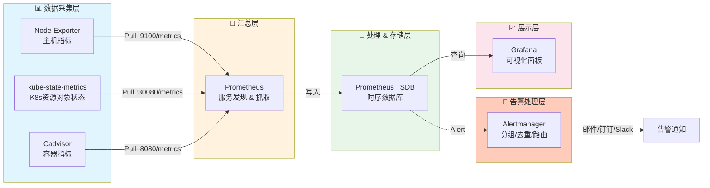
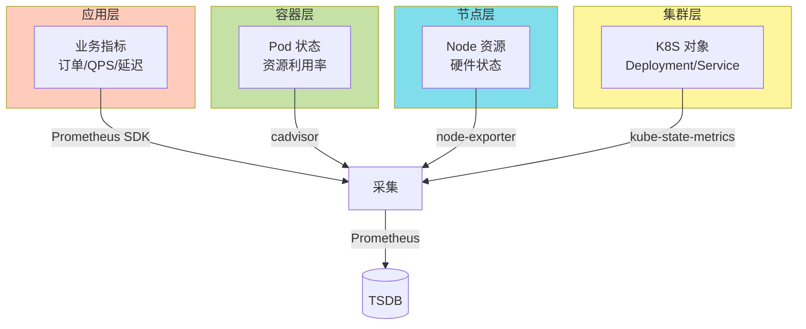
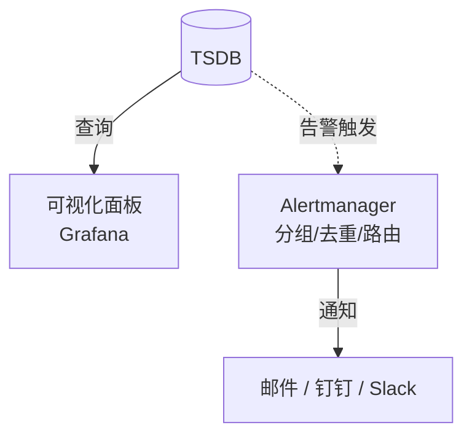

>👨‍🎓**博主简介**
>
>&emsp;&emsp;🏅[CSDN博客专家](https://blog.csdn.net/liu_chen_yang?type=blog)
>&emsp;&emsp;🏅[云计算领域优质创作者](https://blog.csdn.net/liu_chen_yang?type=blog)
>&emsp;&emsp;🏅[华为云开发者社区专家博主](https://bbs.huaweicloud.com/community/usersnew/id_1661843828089234)
>&emsp;&emsp;🏅[阿里云开发者社区专家博主](https://developer.aliyun.com/profile/7yu26jk3lfqxg)
>💊**交流社区：**[运维交流社区](https://bbs.csdn.net/forums/lcy) 欢迎大家的加入！
>🐋 希望大家多多支持，我们一起进步！😄
>🎉如果文章对你有帮助的话，欢迎 点赞 👍🏻 评论 💬 收藏 ⭐️ 加关注+💗

---


## 一、Prometheus 监控 k8s 方案及架构图


* **容器资源监控**：

> 通过 **cAdvisor DaemonSet** 采集容器 CPU、内存、磁盘 I/O、网络流量等指标。
> cAdvisor 以 **特权容器**形式运行在每个 Node，通过 `hostPort: 8080` 暴露 `/metrics` 端点，供外部 Prometheus 抓取容器指标，存储到自身的**时序数据库**中，最后使用 Grafana 进行可视化展示。
> 与 kubelet 内置 cAdvisor 不同，独立部署可解决外部访问认证问题。

* **宿主机监控**：

> 通过 **Node Exporter DaemonSet** 采集物理机 CPU、内存、磁盘、网络、系统负载等指标。
> 通过 `hostPort: 9100`暴露 `/metrics` 端点，Prometheus 通过 **Pull 模式** 抓取宿主机资源状态指标，存储到自身的 **时序数据库（TSDB）** 中，最后使用 Grafana 进行可视化展示。

* **集群对象监控**：

> 通过 **kube-state-metrics** 监听 API Server，将 K8s 资源对象（Pod、Deployment、Node、Service 等）状态转换为 Prometheus 指标，通过`hostPort:8080`暴露 `/metrics` 端点，Prometheus在进行抓取,存储到自身的 **时序数据库（TSDB）** 中，最后使用 Grafana 进行可视化展示。


* **Prometheus + Grafana + Alertmanager K8S 监控告警方案架构图**

> 端口中：
> `Node Exporter`默认端口为9100，可自行修改；
> `kube-state-metrics`端口默认是8080，本文使用NodePort方式暴露出30080，可自行修改；
> `Cadvisor`默认端口为8080，可自行修改；



## 二、Kubernetes监控指标
### 2.1 K8S 集群层面监控

| 监控指标 | 说明 | 应用场景 |
|---------|------|---------|
| **Node 资源利用率** | CPU、内存、磁盘、网络等硬件资源使用 | 节点负载评估、资源瓶颈定位 |
| **Node 数量** | 节点规模与资源利用率、业务负载的比例 | 成本核算、自动扩缩容策略 |
| **Pod 数量** | 各负载阶段下 Pod 与 Node 的分布关系 | 容量规划、服务器资源预估 |
| **资源对象状态** | Pod、Deployment、Service、Job、ConfigMap 等对象健康状态 | 集群健康度监控、故障排查 |

### 2.2 Pod 层面监控

| 监控指标 | 说明 | 数据来源 |
|---------|------|---------|
| **Pod 运行状态** | 正常 Running / 异常 Pending、CrashLoopBackOff、Failed 数量分布 | kube-state-metrics |
| **容器资源利用率** | Pod 及内部容器的 CPU、内存、网络、磁盘 IO 使用 | cadvisor |
| **应用性能指标** | 并发连接数、请求 QPS、响应延迟、错误率 | 应用埋点（Prometheus SDK） |

### 2.3 监控组件对照表

| 监控目标 | 采集组件 | 核心指标 | 部署方式 |
|---------|---------|---------|---------|
| **容器性能** | cadvisor | CPU、内存、网络、磁盘利用率 | kubelet 内置 |
| **Node 性能** | node-exporter | CPU、内存、磁盘、系统负载、硬件温度 | 二进制|
| **K8S 资源对象** | kube-state-metrics | Pod/Deployment/Service/Node 状态、副本数、重启次数 | Deployment |
| **应用自定义** | Prometheus SDK | 业务指标（订单量、接口延迟等） | 应用代码集成 |

### 2.4 Kubernetes 监控指标分层采集及告警架构





## 三、部署 Prometheus 监控 kubernetes 资源所需服务

|服务名称| 版本 | 端口| 对外端口|
|--|--|--|--|
|  node_exporter| 1.10.2 | 9100 |宿主机部署：**9100**  |
|kube-state-metrics  |2.3.0  | 8080 |k8s使用nodeport模式：**30080**  |
|cAdvisor  |  latest|  8080|k8s使用network=host模式：**8080** |


> 需注意：
> * **镜像版本**：`kube-state-metrics`版本对应的是`kubernetes1.20.10`的版本。
> * **网络模式**：`kube-state-metrics`使用的`NodePort`、`cAdvisor`使用的`hostNetwork: true`，无需配置`service`。
> * **端口**：如果Prometheus是在k8s中部署的，网络模式都可以采用`ClusterIP`方式，在Prometheus配置中填写`svc域名:port`即可；还需注意`kube-state-metrics`和`cAdvisor`的 <font color=red>端口</font>，他两都是<font color=red>8080，需要进行区分；</font>

### 3.1 创建监控所需namespace
```bash
kubectl create namespace monitoring
```

### 3.2 部署node_exporter

* 二进制部署node_exporter（需每台被监控端都部署）
> 二进制方式部署`node_exporter`服务可参考：[【Linux】Prometheus + Grafana 的部署及介绍（亲测无问题）](https://blog.csdn.net/liu_chen_yang/article/details/131049402) 第四、五步；

* k8s部署node_exporter（采用DaemonSet方式部署，每个节点都会自动部署一个）
> k8s方式部署`node_exporter`服务可参考：[k8s部署Prometheus + node_exporter + Grafana + Alertmanager](https://liucy.blog.csdn.net/article/details/155443737)第三步；
### 3.3 部署 kube-state-metrics
> `kube-state-metrics`  是一个 **K8s 集群级别的监控代理**，通过监听 **API Server** 实时获取资源对象（Pod、Deployment、Node、PVC 等）的状态信息，并将其转换为 **Prometheus 格式的指标**暴露出来。

* `vi kube-state-metrics.yaml`
```yaml
apiVersion: rbac.authorization.k8s.io/v1
kind: ClusterRole
metadata:
  name: kube-state-metrics
rules:
- apiGroups: [""]
  resources: ["nodes", "pods", "services", "resourcequotas", "replicationcontrollers", "limitranges", "persistentvolumeclaims", "persistentvolumes", "namespaces", "endpoints", "secrets", "configmaps"]
  verbs: ["list", "watch"]
- apiGroups: ["apps"]
  resources: ["statefulsets", "daemonsets", "deployments", "replicasets"]
  verbs: ["list", "watch"]
- apiGroups: ["batch"]
  resources: ["cronjobs", "jobs"]
  verbs: ["list", "watch"]
- apiGroups: ["autoscaling"]
  resources: ["horizontalpodautoscalers"]
  verbs: ["list", "watch"]
- apiGroups: ["policy"]
  resources: ["poddisruptionbudgets"]
  verbs: ["list", "watch"]
- apiGroups: ["certificates.k8s.io"]
  resources: ["certificatesigningrequests"]
  verbs: ["list", "watch"]
- apiGroups: ["storage.k8s.io"]
  resources: ["storageclasses", "volumeattachments"]
  verbs: ["list", "watch"]
- apiGroups: ["admissionregistration.k8s.io"]
  resources: ["mutatingwebhookconfigurations", "validatingwebhookconfigurations"]
  verbs: ["list", "watch"]
- apiGroups: ["networking.k8s.io"]
  resources: ["networkpolicies", "ingresses"]
  verbs: ["list", "watch"]
- apiGroups: ["coordination.k8s.io"]
  resources: ["leases"]
  verbs: ["list", "watch"]
---
apiVersion: rbac.authorization.k8s.io/v1
kind: ClusterRoleBinding
metadata:
  name: kube-state-metrics
roleRef:
  apiGroup: rbac.authorization.k8s.io
  kind: ClusterRole
  name: kube-state-metrics
subjects:
- kind: ServiceAccount
  name: kube-state-metrics
  namespace: monitoring
---
apiVersion: v1
kind: ServiceAccount
metadata:
  name: kube-state-metrics
  namespace: monitoring
---
apiVersion: apps/v1
kind: Deployment
metadata:
  name: kube-state-metrics
  namespace: monitoring
spec:
  replicas: 1
  selector:
    matchLabels:
      app: kube-state-metrics
  template:
    metadata:
      labels:
        app: kube-state-metrics
    spec:
      serviceAccountName: kube-state-metrics
      containers:
      - name: kube-state-metrics
        image: bitnami/kube-state-metrics:2.3.0
        ports:
        - containerPort: 8080
          name: http-metrics
        - containerPort: 8081
          name: telemetry
        livenessProbe:
          httpGet:
            path: /healthz
            port: 8080
          initialDelaySeconds: 5
          timeoutSeconds: 5
        readinessProbe:
          httpGet:
            path: /healthz  
            port: 8080      
          initialDelaySeconds: 5
          timeoutSeconds: 5
        resources:          
          requests:
            memory: "100Mi"
            cpu: "100m"
          limits:
            memory: "200Mi"
            cpu: "200m"
---
apiVersion: v1
kind: Service
metadata:
  name: kube-state-metrics
  namespace: monitoring
spec:
  type: NodePort 
  ports:
  - name: http-metrics
    port: 8080
    targetPort: http-metrics
    nodePort: 30080  # 指定端口（30000-32767范围）
  - name: telemetry
    port: 8081
    targetPort: telemetry
    nodePort: 30081
  selector:
    app: kube-state-metrics
```

此 YAML 文件包含了部署 kube-state-metrics 所需的全部资源对象，共 5 个部分，使用`---`进行分割资源对象：
1. **ClusterRole**（集群角色）
2. **ClusterRoleBinding**（集群角色绑定）
3. **ServiceAccount**（服务账户）
4. **Deployment**（部署）
5. **Service**（服务）


* 创建并启动服务

```bash
kubectl apply -f kube-state-metrics.yaml
```
* 验证

```bash
# 查看 Pod 状态（状态为1/1则为运行成功）
kubectl get pods -n monitoring -l app=kube-state-metrics -o wide

# 查看日志确认无权限错误
kubectl logs -n monitoring kube-state-metrics-<pod名称后缀>

# 测试 metrics 接口
curl http://<NodeIP>:30080/metrics

# 查看采集的指标数量（正常会有200多个）
curl -s http://<NodeIP>:30080/metrics | grep -c "^# TYPE"
```

### 3.4 部署 cAdvisor（DaemonSet方式）

* `vi cadvisor.yaml`

```yaml
apiVersion: apps/v1
kind: DaemonSet
metadata:
  name: cadvisor
  namespace: monitoring
spec:
  selector:
    matchLabels:
      name: cadvisor
  template:
    metadata:
      labels:
        name: cadvisor
    spec:
      automountServiceAccountToken: false
      hostNetwork: true
      hostPID: true
      tolerations:           # ← 添加容忍度，可以添加多个容忍
        - key: node-role.kubernetes.io/master
          effect: NoSchedule
          operator: Exists
        - key: node-role.kubernetes.io/control-plane
          effect: NoSchedule
          operator: Exists
      containers:
      - name: cadvisor
        image: google/cadvisor:latest
        ports:
        - containerPort: 8080
          hostPort: 8080
          name: http
        args:
          - --housekeeping_interval=10s
          - --max_housekeeping_interval=15s
          - --disable_metrics=percpu,sched,tcp,udp,disk
        # 容器内路径，用于挂载宿主机目录及文件
        volumeMounts:
        # 系统核心
        - name: rootfs
          mountPath: /rootfs
          readOnly: true
        - name: var-run
          mountPath: /var/run
          readOnly: false
        - name: sys
          mountPath: /sys
          readOnly: true
        # 容器运行时（Docker 多路径 + Containerd）
        - name: docker
          mountPath: /var/lib/docker
          readOnly: true
          # 如果集群节点有docker路径不一样，可以新增一个
        - name: docker2
          mountPath: /data/docker
          readOnly: true
        - name: containerd
          mountPath: /var/lib/containerd
          readOnly: true
        - name: containerd-socket
          mountPath: /run/containerd
          readOnly: true
        # 磁盘信息
        - name: disk
          mountPath: /dev/disk
          readOnly: true
        securityContext:
          privileged: true
      # 宿主机路径映射（与上面 volumeMounts 一一对应）
      volumes:
      - name: rootfs
        hostPath:
          path: /
      - name: var-run
        hostPath:
          path: /var/run
      - name: sys
        hostPath:
          path: /sys
      - name: docker
        hostPath:
          path: /var/lib/docker
      - name: docker2                    
        hostPath:
          path: /data/docker
      - name: containerd                 
        hostPath:
          path: /var/lib/containerd
      - name: containerd-socket          
        hostPath:
          path: /run/containerd/
      - name: disk                        
        hostPath:
          path: /dev/disk
---
apiVersion: v1
kind: Service
metadata:
  name: cadvisor
  namespace: monitoring
spec:
  type: ClusterIP
  ports:
  - port: 8080
    targetPort: 8080
    name: http
  selector:
    name: cadvisor
```

* 挂载各路径的作用

| 挂载名称 | 容器内路径 | 宿主机路径 | 作用 | 不挂载的后果 |
|---------|-----------|-----------|------|------------|
| `rootfs` | `/rootfs` | `/` | 读取宿主机根目录，获取系统级信息（CPU、内存、磁盘分区、进程等） | 看不到宿主机整体资源，只能看到容器相对值 |
| `var-run` | `/var/run` | `/var/run` | 访问 docker/containerd 的 socket 文件，与容器运行时通信 | 无法实时获取容器列表，只能读到缓存数据 |
| `sys` | `/sys` | `/sys` | 读取 cgroup 和内核数据，获取容器资源使用量的核心来源 | **完全采集不到任何容器指标**，cadvisor 失效 |
| `docker` | `/var/lib/docker` | `/var/lib/docker` | 读取 docker 容器元数据、镜像信息、容器状态、日志路径 | docker 容器显示为空，看不到容器名、镜像、启动时间 |
| `docker2` | `/data/docker` | `/data/docker` | 备用 docker 数据路径（某些节点自定义路径） | 该节点 docker 容器信息缺失 |
| `containerd` | `/var/lib/containerd` | `/var/lib/containerd` | 读取 containerd 容器元数据、镜像、快照信息 | containerd 容器显示为空 |
| `containerd-socket` | `/run/containerd` | `/run/containerd` | 访问 containerd 的 socket 文件，实时通信 | 无法获取 containerd 容器动态信息 |
| `disk` | `/dev/disk` | `/dev/disk` | 获取磁盘设备信息、分区表、磁盘容量和 I/O 统计 | 缺少磁盘容量、I/O 指标，无法监控存储 |


* 创建并启动服务

```bash
kubectl apply -f cadvisor.yaml
```
* 验证

```bash
# 1. 查看 Pod 运行状态（状态为1/1则为运行成功）
kubectl get pods -n monitoring -l name=cadvisor -o wide

# 2. 测试 metrics 接口（任一节点的 8080 端口）
curl http://<node-ip>:8080/metrics | head -20

# 3. 检查容器日志
kubectl logs -n monitoring cadvisor-<pod名称后缀> | tail -20

# 4. 查看采集到的容器指标（任一节点的 8080 端口）
curl http://<node-ip>:8080/api/v1.3/containers/ | head -50
```
页面访问测试：`node-ip:8080` 和 `node-ip:8080/metrics `


## 四、Prometheus 添加 K8s 集群监控目标配置
### 4.1 Prometheus 添加配置
> 添加`kube-state-metrics`和`cadvisor`到Prometheus配置中；
> * `kube-state-metrics`是采用的nodeport吧端口对外暴露了30080，所以直接写`集群任意IP:30080`即可；
> * `cadvisor`采用的是network=host模式，直接写`集群每台节点的ip:8088`即可；
> 加`clusterip`是因为适配k8s部署的Prometheus，可直接使用域名；

```yaml
  - job_name: 'kube-state-metrics'
    static_configs:
      - targets: ['172.16.11.230:30080']

  - job_name: 'cadvisor'
    static_configs:
      - targets: ['172.16.11.230:8080','172.16.11.231:8080','172.16.11.232:8080']
```


### 4.2 重载 Prometheus 配置
> `localhost`可换为`IP`；

```bash
curl -X POST http://localhost:9090/-/reload
```

### 4.3 Prometheus 页面查看
> `172.16.11.230:9090/targets`


添加完成，检查PromQL是否支持查询k8s信息；

### 4.4 检查 Prometheus 是否支持 kubernetes 的 PromQL

> 在`Prometheus`页面的`Query`输入`kube`，只要可以出现`kube_*`并可以查出来就没问题；


## 五、常用K8s监控指标 PromQL 

### 5.1 常用指标

> 可查看：[【云原生】PromQL 常用内置指标](https://blog.csdn.net/liu_chen_yang/article/details/155569882) 第 <font color=#00A3DC>十六、kubernetes 常用指标</font>

### 5.2 常用PromQL

#### 5.2.1 服务器层 (Node/基础设施)

```sql
# ========== CPU 监控 ==========

# CPU 使用率（按节点）
100 - (avg by(instance) (irate(node_cpu_seconds_total{mode="idle"}[5m])) * 100)

# CPU 各模式使用率分布（用户态/系统态/IO等待等）
avg by(instance, mode) (irate(node_cpu_seconds_total[5m])) * 100

# CPU 负载（1分钟/5分钟/15分钟）
node_load1 / on(instance) (count by(instance) (node_cpu_seconds_total{mode="idle"}) / 2)
node_load5
node_load15

# ========== 内存监控 ==========

# 内存使用率（推荐用 MemAvailable，更准确）
(1 - node_memory_MemAvailable_bytes / node_memory_MemTotal_bytes) * 100

# 内存使用量（按节点）
node_memory_MemTotal_bytes - node_memory_MemAvailable_bytes

# Swap 使用率
(1 - node_memory_SwapFree_bytes / node_memory_SwapTotal_bytes) * 100

# ========== 磁盘监控 ==========

# 磁盘使用率（排除 tmpfs 等虚拟文件系统）
(1 - node_filesystem_avail_bytes{mountpoint!~"/boot|/run.*",fstype!~"tmpfs|rootfs"} / node_filesystem_size_bytes) * 100

# 磁盘 IO 利用率（读写时间占比）
irate(node_disk_io_time_seconds_total[5m]) * 100

# 磁盘吞吐量（读/写 MB/s）
irate(node_disk_read_bytes_total[5m]) / 1024 / 1024
irate(node_disk_written_bytes_total[5m]) / 1024 / 1024

# 磁盘 IOPS
irate(node_disk_reads_completed_total[5m])
irate(node_disk_writes_completed_total[5m])

# ========== 网络监控 ==========

# 网络带宽使用率（入站/出站 MB/s）
irate(node_network_receive_bytes_total{device!~"lo|veth.*|docker.*|flannel.*|cali.*"}[5m]) / 1024 / 1024
irate(node_network_transmit_bytes_total{device!~"lo|veth.*|docker.*|flannel.*|cali.*"}[5m]) / 1024 / 1024

# 网络错误包数
irate(node_network_receive_errs_total[5m])
irate(node_network_transmit_errs_total[5m])

# TCP 连接数
node_netstat_Tcp_CurrEstab
```

#### 5.2.2 容器资源层 (Container/Pod)

```sql
# ========== Pod CPU 监控 ==========

# Pod CPU 使用率（占 Request 百分比）
sum(rate(container_cpu_usage_seconds_total{image!="",pod!=""}[5m])) by (pod, namespace) 
/ 
sum(kube_pod_container_resource_requests{resource="cpu",container!="POD"}) by (pod, namespace) * 100

# Pod CPU 使用率（占 Limit 百分比）
sum(rate(container_cpu_usage_seconds_total{image!="",pod!=""}[5m])) by (pod, namespace) 
/ 
sum(kube_pod_container_resource_limits{resource="cpu",container!="POD"}) by (pod, namespace) * 100

# 容器 CPU 节流率（throttling，说明 CPU 被限制）
rate(container_cpu_cfs_throttled_seconds_total{image!=""}[5m])

# ========== Pod 内存监控 ==========

# Pod 内存使用量（Working Set，更准确）
sum(container_memory_working_set_bytes{image!="",pod!=""}) by (pod, namespace)

# Pod 内存使用率（占 Request 百分比）
sum(container_memory_working_set_bytes{image!="",pod!=""}) by (pod, namespace) 
/ 
sum(kube_pod_container_resource_requests{resource="memory",container!="POD"}) by (pod, namespace) * 100

# Pod 内存使用率（占 Limit 百分比）- OOM 预警关键指标
sum(container_memory_working_set_bytes{image!="",pod!=""}) by (pod, namespace) 
/ 
sum(kube_pod_container_resource_limits{resource="memory",container!="POD"}) by (pod, namespace) * 100

# 容器 OOM Kill 次数
increase(container_memory_failures_total{type="pgmajfault"}[10m])

# ========== 容器状态监控 ==========

# 容器重启次数（10分钟内变化）
increase(kube_pod_container_status_restarts_total[10m]) > 0

# 正在等待的容器（如镜像拉取中）
kube_pod_container_status_waiting_reason{reason=~"ImagePullBackOff|ErrImagePull|CrashLoopBackOff|ContainerCreating"}

# Pod 处于 Terminating 状态超过 5 分钟
time() - kube_pod_deletion_timestamp > 300 and kube_pod_status_phase{phase="Running"} == 1
```

#### 5.2.3 K8s 对象状态层 (调度/编排)

```sql
# ========== Pod 状态监控 ==========

# 各命名空间 Pending Pod 数量
sum(kube_pod_status_phase{phase="Pending"}) by (namespace)

# 各命名空间 Failed Pod 数量
sum(kube_pod_status_phase{phase="Failed"}) by (namespace)

# Unknown 状态 Pod（节点失联）
sum(kube_pod_status_phase{phase="Unknown"}) by (namespace)

# 非 Running 状态 Pod 列表
sum by (namespace, pod) (kube_pod_status_phase{phase=~"Pending|Failed|Unknown"} == 1)

# Pod 未就绪（Not Ready）
sum by (namespace, pod) (kube_pod_status_ready{condition="false"} == 1)

# ========== Deployment 监控 ==========

# Deployment 期望副本数与实际副本数差异
kube_deployment_spec_replicas - kube_deployment_status_replicas_available

# Deployment 更新进度（滚动更新中）
kube_deployment_status_observed_generation != kube_deployment_metadata_generation

# Deployment 健康状态（不可用副本 > 0）
kube_deployment_status_replicas_unavailable > 0

# ========== StatefulSet/DaemonSet 监控 ==========

# StatefulSet 副本缺失
kube_statefulset_replicas - kube_statefulset_status_replicas_ready

# DaemonSet 调度失败（期望 vs 实际）
kube_daemonset_status_desired_number_scheduled - kube_daemonset_status_current_number_scheduled

# DaemonSet 未就绪 Pod 数
kube_daemonset_status_number_unavailable > 0

# ========== Job/CronJob 监控 ==========

# Job 失败次数（最近1小时）
increase(kube_job_status_failed[1h]) > 0

# Job 执行时间（开始到现在）
time() - kube_job_status_start_time

# CronJob 下次调度时间监控
kube_cronjob_next_schedule_time - time() < 0  # 错过调度

# ========== HPA 监控 ==========

# HPA 当前副本数 vs 期望
kube_horizontalpodautoscaler_status_current_replicas != kube_horizontalpodautoscaler_status_desired_replicas

# HPA 达到最大副本数（扩容受限）
kube_horizontalpodautoscaler_status_current_replicas == kube_horizontalpodautoscaler_spec_max_replicas

# HPA 指标缺失（无法获取指标）
kube_horizontalpodautoscaler_status_condition{condition="ScalingActive",status="false"} == 1
```
#### 5.2.4 集群容量与资源规划层

```sql
# ========== 集群 CPU 容量规划 ==========

# CPU Request 使用率（集群整体，> 80% 需扩容）
sum(kube_pod_container_resource_requests{resource="cpu"})
/
sum(kube_node_status_allocatable{resource="cpu"}) * 100

# CPU Limit 使用率（防止 overcommit 过高）
sum(kube_pod_container_resource_limits{resource="cpu"})
/
sum(kube_node_status_allocatable{resource="cpu"}) * 100

# 可分配 CPU 剩余量（按节点）
kube_node_status_allocatable{resource="cpu"} - sum by (node) (kube_pod_container_resource_requests{resource="cpu"})

# ========== 集群内存容量规划 ==========

# Memory Request 使用率（集群整体）
sum(kube_pod_container_resource_requests{resource="memory"})
/
sum(kube_node_status_allocatable{resource="memory"}) * 100

# Memory Limit 使用率（危险指标，应 < 100%）
sum(kube_pod_container_resource_limits{resource="memory"})
/
sum(kube_node_status_allocatable{resource="memory"}) * 100

# 节点内存压力状态
kube_node_status_condition{condition="MemoryPressure",status="true"} == 1
kube_node_status_condition{condition="DiskPressure",status="true"} == 1
kube_node_status_condition{condition="PIDPressure",status="true"} == 1

# ========== Pod 资源分配合规性 ==========

# 未设置 CPU Limit 的容器（风险项）
count by (namespace, pod) (kube_pod_container_info{container!="POD"}) 
unless 
count by (namespace, pod) (kube_pod_container_resource_limits{resource="cpu"})

# 未设置内存 Limit 的容器（OOM 风险）
count by (namespace, pod) (kube_pod_container_info{container!="POD"}) 
unless 
count by (namespace, pod) (kube_pod_container_resource_limits{resource="memory"})

# 未设置 Request 的容器（调度风险）
count by (namespace, pod) (kube_pod_container_info{container!="POD"}) 
unless 
count by (namespace, pod) (kube_pod_container_resource_requests{resource="cpu"})
```

#### 5.2.5 K8s 核心组件监控 (Control Plane)

```sql
# ========== API Server 监控 ==========

# API Server QPS（按动词和资源）
sum(rate(apiserver_request_total[5m])) by (verb, resource)

# API Server 请求延迟（P99）
histogram_quantile(0.99, sum(rate(apiserver_request_duration_seconds_bucket{verb!~"WATCH|LIST"}[5m])) by (le, verb))

# API Server 错误率（5xx）
sum(rate(apiserver_request_total{code=~"5.."}[5m])) / sum(rate(apiserver_request_total[5m])) * 100

# ETCD 写延迟（磁盘 fsync）
histogram_quantile(0.99, sum(rate(etcd_disk_wal_fsync_duration_seconds_bucket[5m])) by (le))

# ETCD 空间使用率
(etcd_mvcc_db_total_size_in_bytes / etcd_server_quota_backend_bytes) * 100

# ========== Scheduler 监控 ==========

# 调度失败率
sum(rate(scheduler_schedule_attempts_total{result="unschedulable"}[5m]))

# 调度延迟（e2e）
histogram_quantile(0.99, sum(rate(scheduler_e2e_scheduling_duration_seconds_bucket[5m])) by (le))

# ========== Controller Manager 监控 ==========

# 工作队列深度（堆积情况）
workqueue_depth{name=~"kube-system.*"}

# 重试次数增加
increase(workqueue_retries_total[10m]) > 0
```

#### 5.2.6 存储层监控 (PVC/Storage)

```sql
# ========== PVC 监控 ==========

# PVC 使用率（需 kubelet_volume_stats 指标）
(kubelet_volume_stats_capacity_bytes - kubelet_volume_stats_available_bytes) / kubelet_volume_stats_capacity_bytes * 100

# PVC 剩余空间小于 10GB
kubelet_volume_stats_available_bytes / 1024 / 1024 / 1024 < 10

# 未绑定的 PVC（Pending 状态）
kube_persistentvolumeclaim_status_phase{phase="Pending"} == 1

# PV 可用状态监控
kube_persistentvolume_status_phase{phase=~"Failed|Released"} == 1

# ========== Storage Class 性能 ==========

# 存储操作延迟（如果有 CSI 指标）
histogram_quantile(0.95, sum(rate(csi_sidecar_operations_seconds_bucket[5m])) by (le, driver_name))
```

#### 5.2.7 网络与服务层 (Service/Ingress)

```sql
# ========== Service 监控 ==========

# Service Endpoint 可用性（Endpoint 为空）
kube_endpoint_address_available == 0 and kube_endpoint_address_not_ready > 0

# Service 无后端 Pod
kube_service_spec_type unless count by (service, namespace) (kube_endpoint_address_available > 0)

# ========== Ingress 监控（需 nginx-ingress 或类似） ==========

# Ingress 请求 QPS
sum(rate(nginx_ingress_controller_requests[5m])) by (ingress, status)

# Ingress 5xx 错误率
sum(rate(nginx_ingress_controller_requests{status=~"5.."}[5m])) by (ingress) 
/ 
sum(rate(nginx_ingress_controller_requests[5m])) by (ingress) * 100

# Ingress 上行/下行流量
sum(rate(nginx_ingress_controller_bytes_sent_bucket[5m])) by (ingress)
sum(rate(nginx_ingress_controller_request_size_bucket[5m])) by (ingress)

# Ingress 响应时间 P99
histogram_quantile(0.99, sum(rate(nginx_ingress_controller_request_duration_seconds_bucket[5m])) by (le, ingress))
```

## 六、 配置 Kubernetes 常用 Alertmanager 告警规则
> 如下告警规则可根据自己实际情况进行修改，例如：我的k8s集群是使用二进制systemd方式部署的，如果您不是使用这种方式，可以更换为自己的部署方式监控；

* `kubernetes_rules.yml`

> **注意：**`severity`参数的值建议使用英文，这里为了演示采用了中文，如果需要用中文也可以，alertmanager配置中配置路由和静默等相关`severity`请更换为对应中文；
> * 严重: `critical`
> * 警告: `warning`

```yaml
groups:

  # =========================
  # 1) Kubernetes 核心服务（systemd）
  # =========================
  - name: kubernetes核心服务状态
    rules:

      - alert: docker服务宕机
        expr: node_systemd_unit_state{name="docker.service",state="active"} == 0
        for: 1m
        labels:
          severity: 严重
        annotations:
          summary: "IP为 {{ $labels.instance }} 的 docker 服务已停止"
          description: "IP为 {{ $labels.instance }} 的 docker 服务当前为非激活状态，请立即检查 Docker 服务状态。"

      - alert: containerd服务宕机
        expr: node_systemd_unit_state{name="containerd.service",state="active"} == 0
        for: 1m
        labels:
          severity: 严重
        annotations:
          summary: "IP为 {{ $labels.instance }} 的 containerd 服务已停止"
          description: "IP为 {{ $labels.instance }} 的 containerd 服务当前为非激活状态，请立即检查 containerd 服务状态。"

      - alert: etcd服务宕机
        expr: node_systemd_unit_state{name="etcd.service",state="active"} == 0
        for: 1m
        labels:
          severity: 严重
        annotations:
          summary: "IP为 {{ $labels.instance }} 的 etcd 服务已停止"
          description: "IP为 {{ $labels.instance }} 的 etcd 服务当前为非激活状态，请立即检查 etcd 及集群健康，防止数据不一致或集群无法选主。"

      - alert: kubeApiserver服务宕机
        expr: node_systemd_unit_state{name="kube-apiserver.service",state="active"} == 0
        for: 1m
        labels:
          severity: 严重
        annotations:
          summary: "IP为 {{ $labels.instance }} 的 kube-apiserver 服务已停止"
          description: "IP为 {{ $labels.instance }} 的 kube-apiserver 服务当前为非激活状态，将导致整个集群 API 不可用，请立即排查。"

      - alert: kubeControllerManager服务宕机
        expr: node_systemd_unit_state{name="kube-controller-manager.service",state="active"} == 0
        for: 1m
        labels:
          severity: 严重
        annotations:
          summary: "IP为 {{ $labels.instance }} 的 kube-controller-manager 服务已停止"
          description: "IP为 {{ $labels.instance }} 的 kube-controller-manager 服务当前为非激活状态，将导致副本控制器、节点控制器等无法工作，请立即修复。"

      - alert: kubeScheduler服务宕机
        expr: node_systemd_unit_state{name="kube-scheduler.service",state="active"} == 0
        for: 1m
        labels:
          severity: 严重
        annotations:
          summary: "IP为 {{ $labels.instance }} 的 kube-scheduler 服务已停止"
          description: "IP为 {{ $labels.instance }} 的 kube-scheduler 服务当前为非激活状态，将导致 Pod 无法被调度到新节点，请立即检查。"

      - alert: kubelet服务宕机
        expr: node_systemd_unit_state{name="kubelet.service",state="active"} == 0
        for: 1m
        labels:
          severity: 严重
        annotations:
          summary: "IP为 {{ $labels.instance }} 的 kubelet 服务已停止"
          description: "IP为 {{ $labels.instance }} 的 kubelet 服务当前为非激活状态，将导致该节点 Pod 生命周期无法管理，请立即恢复 kubelet。"

      - alert: kubeProxy服务宕机
        expr: node_systemd_unit_state{name="kube-proxy.service",state="active"} == 0
        for: 1m
        labels:
          severity: 严重
        annotations:
          summary: "IP为 {{ $labels.instance }} 的 kube-proxy 服务已停止"
          description: "IP为 {{ $labels.instance }} 的 kube-proxy 服务当前为非激活状态，将导致该节点服务流量无法转发，请立即检查。"

      - alert: chronyd服务宕机
        expr: node_systemd_unit_state{name=~"chronyd.service|chrony.service",state="active"} == 0
        for: 5m
        labels:
          severity: 警告
        annotations:
          summary: "IP为 {{ $labels.instance }} 的时间同步服务已停止"
          description: "时间不同步会引发证书校验、etcd 选主、日志对齐等问题，建议尽快恢复 chrony/ntp。"

  # =========================
  # 2) 节点资源与容量（带当前值）
  # =========================
  - name: 节点资源与容量
    rules:

      - alert: 节点CPU使用率过高
        expr: (1 - avg by (instance) (rate(node_cpu_seconds_total{mode="idle"}[5m]))) * 100 > 90
        for: 5m
        labels:
          severity: 警告
        annotations:
          summary: 'IP为 {{ $labels.instance }} 的 CPU 使用率过高'
          description: '当前CPU使用率为: {{ printf "%.2f" $value }}%，建议: 排查热点进程/Pod，或扩容节点资源。'

      - alert: 节点CPU使用率极高
        expr: (1 - avg by (instance) (rate(node_cpu_seconds_total{mode="idle"}[5m]))) * 100 > 97
        for: 5m
        labels:
          severity: 严重
        annotations:
          summary: 'IP为 {{ $labels.instance }} 的 CPU 使用率极高'
          description: '当前CPU使用率为: {{ printf "%.2f" $value }}%，建议: 立即定位热点，避免 kubelet/关键组件被拖慢。'

      - alert: 节点内存使用率过高
        expr: (1 - (node_memory_MemAvailable_bytes / node_memory_MemTotal_bytes)) * 100 > 90
        for: 10m
        labels:
          severity: 警告
        annotations:
          summary: 'IP为 {{ $labels.instance }} 的内存使用率过高'
          description: '当前内存使用率为: {{ printf "%.2f" $value }}%，建议: 排查内存大户进程/Pod，必要时提升内存或调整限额。'

      - alert: 节点内存使用率极高
        expr: (1 - (node_memory_MemAvailable_bytes / node_memory_MemTotal_bytes)) * 100 > 97
        for: 5m
        labels:
          severity: 严重
        annotations:
          summary: 'IP为 {{ $labels.instance }} 的内存压力极高'
          description: '当前内存使用率为: {{ printf "%.2f" $value }}%，建议: 高风险 OOM/驱逐，立即处理（释放内存/扩容/降载）。'

      - alert: 节点磁盘空间不足
        expr: (1 - node_filesystem_avail_bytes{fstype!~"tmpfs|overlay|squashfs|ramfs",mountpoint!="/media/cdrom"} / node_filesystem_size_bytes{fstype!~"tmpfs|overlay|squashfs|ramfs",mountpoint!="/media/cdrom"}) * 100 > 90
        for: 10m
        labels:
          severity: 警告
        annotations:
          summary: 'IP为 {{ $labels.instance }} 的磁盘使用率过高'
          description: '告警磁盘: {{ $labels.mountpoint }}；当前使用率: {{ printf "%.2f" $value }}%；建议: 清理日志/容器镜像/临时文件，或扩容磁盘。'

      - alert: 节点磁盘空间极低
        expr: (1 - node_filesystem_avail_bytes{fstype!~"tmpfs|overlay|squashfs|ramfs",mountpoint!="/media/cdrom"} / node_filesystem_size_bytes{fstype!~"tmpfs|overlay|squashfs|ramfs",mountpoint!="/media/cdrom"}) * 100 > 95
        for: 5m
        labels:
          severity: 严重
        annotations:
          summary: 'IP为 {{ $labels.instance }} 的磁盘使用率极高'
          description: '告警磁盘: {{ $labels.mountpoint }}；当前使用率: {{ printf "%.2f" $value }}%；建议: 立即处理，避免 kubelet/容器运行时写入失败导致节点异常。'

      - alert: 节点Inode不足
        expr: (1 - node_filesystem_files_free{fstype!~"tmpfs|overlay|squashfs|ramfs"} / node_filesystem_files{fstype!~"tmpfs|overlay|squashfs|ramfs"}) * 100 > 90
        for: 10m
        labels:
          severity: 警告
        annotations:
          summary: 'IP为 {{ $labels.instance }} 的 Inode 使用率过高'
          description: '告警磁盘: {{ $labels.mountpoint }}；当前Inode使用率: {{ printf "%.2f" $value }}%；建议: 清理小文件（日志/缓存/容器层），避免创建文件失败。'

      - alert: 节点负载过高
        expr: (node_load1 / count without(cpu, mode) (node_cpu_seconds_total{mode="idle"})) > 2
        for: 10m
        labels:
          severity: 警告
        annotations:
          summary: 'IP为 {{ $labels.instance }} 的系统负载过高'
          description: '当前 Load1/CPU核数为: {{ printf "%.2f" $value }}；建议: 可能存在 IO/CPU 饱和，排查 top、iostat、容器限流与磁盘问题。'


  # =========================
  # 3) 节点网络与系统资源（连接、句柄、错误包）
  # =========================
  - name: 节点网络与系统资源
    rules:

      - alert: 节点网络接收错误过多
        expr: rate(node_network_receive_errs_total{device!~"lo|veth.*|docker.*|cni.*|flannel.*|cali.*"}[5m]) > 10
        for: 10m
        labels:
          severity: 警告
        annotations:
          summary: 'IP为 {{ $labels.instance }} 的网络接收错误过多'
          description: '网卡: {{ $labels.device }}；当前每秒接收错误: {{ printf "%.2f" $value }}；建议: 排查物理链路/网卡驱动/丢包与交换机端口。'

      - alert: 节点网络发送错误过多
        expr: rate(node_network_transmit_errs_total{device!~"lo|veth.*|docker.*|cni.*|flannel.*|cali.*"}[5m]) > 10
        for: 10m
        labels:
          severity: 警告
        annotations:
          summary: 'IP为 {{ $labels.instance }} 的网络发送错误过多'
          description: '网卡: {{ $labels.device }}；当前每秒发送错误: {{ printf "%.2f" $value }}；建议: 排查链路质量/拥塞/驱动与 MTU 配置。'

      - alert: 节点conntrack使用率过高
        expr: (node_nf_conntrack_entries / node_nf_conntrack_entries_limit) * 100 > 80
        for: 10m
        labels:
          severity: 警告
        annotations:
          summary: 'IP为 {{ $labels.instance }} 的 conntrack 使用率过高'
          description: '当前使用率: {{ printf "%.2f" $value }}%；建议: 检查连接风暴/异常流量，必要时调大 nf_conntrack_max。'

      - alert: 节点文件句柄使用率过高
        expr: (node_filefd_allocated / node_filefd_maximum) * 100 > 80
        for: 10m
        labels:
          severity: 警告
        annotations:
          summary: 'IP为 {{ $labels.instance }} 的文件句柄使用率过高'
          description: '当前使用率: {{ printf "%.2f" $value }}%；建议: 排查打开文件数异常的进程/容器，必要时提升系统限制。'


  # ==================================================
  # 4) Pod/容器层（需要 kube-state-metrics）
  # ==================================================
  - name: Pod与容器状态
    rules:

      - alert: Pod崩溃循环
        expr: kube_pod_container_status_waiting_reason{reason="CrashLoopBackOff"} == 1
        for: 5m
        labels: { severity: 严重 }
        annotations:
          summary: 'Pod CrashLoopBackOff'
          description: 'namespace={{ $labels.namespace }} pod={{ $labels.pod }} container={{ $labels.container }} 发生 CrashLoopBackOff。'

      - alert: 镜像拉取失败
        expr: kube_pod_container_status_waiting_reason{reason=~"ImagePullBackOff|ErrImagePull"} == 1
        for: 5m
        labels: { severity: 严重 }
        annotations:
          summary: '镜像拉取失败'
          description: 'namespace={{ $labels.namespace }} pod={{ $labels.pod }} container={{ $labels.container }} 镜像拉取失败。'

      - alert: Pod频繁重启
        expr: increase(kube_pod_container_status_restarts_total[30m]) > 3
        for: 5m
        labels: { severity: 警告 }
        annotations:
          summary: 'Pod重启次数过多'
          description: 'namespace={{ $labels.namespace }} pod={{ $labels.pod }} container={{ $labels.container }} 30分钟内重启>3次。'

      - alert: Pod未就绪
        expr: kube_pod_status_ready{condition="true"} == 0 and kube_pod_status_phase{phase=~"Running|Pending|Unknown"} == 1
        for: 10m
        labels: { severity: 警告 }
        annotations:
          summary: 'Pod长时间未Ready'
          description: 'namespace={{ $labels.namespace }} pod={{ $labels.pod }} 持续10分钟未Ready，请检查探针/依赖/资源。'


  # ==================================================
  # 5) Workload 层（Deployment/StatefulSet/DaemonSet）
  # ==================================================
  - name: Workload副本与发布
    rules:

      - alert: Deployment副本不足
        expr: kube_deployment_status_replicas_available < kube_deployment_spec_replicas
        for: 10m
        labels: { severity: 警告 }
        annotations:
          summary: 'Deployment副本不足'
          description: 'namespace={{ $labels.namespace }} deployment={{ $labels.deployment }} 可用副本低于期望值。'

      - alert: StatefulSet副本不足
        expr: kube_statefulset_status_replicas_ready < kube_statefulset_spec_replicas
        for: 10m
        labels: { severity: 警告 }
        annotations:
          summary: 'StatefulSet副本不足'
          description: 'namespace={{ $labels.namespace }} statefulset={{ $labels.statefulset }} 就绪副本不足。'

      - alert: DaemonSet调度异常
        expr: kube_daemonset_status_number_misscheduled > 0 or kube_daemonset_status_desired_number_scheduled != kube_daemonset_status_current_number_scheduled
        for: 10m
        labels: { severity: 警告 }
        annotations:
          summary: 'DaemonSet调度异常'
          description: 'namespace={{ $labels.namespace }} daemonset={{ $labels.daemonset }} 调度数量不一致或存在误调度。'


  # ==================================================
  # 6) 调度与容量（Pending/资源逼近）
  # ==================================================
  - name: 调度与容量风险
    rules:

      - alert: Pod长时间Pending
        expr: kube_pod_status_phase{phase="Pending"} == 1
        for: 10m
        labels: { severity: 警告 }
        annotations:
          summary: 'Pod长时间Pending'
          description: 'namespace={{ $labels.namespace }} pod={{ $labels.pod }} Pending超过10分钟，可能资源不足或约束不满足。'

      - alert: 集群CPURequests接近耗尽
        expr: (sum(kube_pod_container_resource_requests{resource="cpu"}) / sum(kube_node_status_allocatable{resource="cpu"})) * 100 > 90
        for: 10m
        labels: { severity: 警告 }
        annotations:
          summary: '集群CPU requests接近耗尽'
          description: '当前CPU requests占比: {{ printf "%.2f" $value }}%，阈值: 90%，持续: 10分钟。'

      - alert: 集群内存Requests接近耗尽
        expr: (sum(kube_pod_container_resource_requests{resource="memory"}) / sum(kube_node_status_allocatable{resource="memory"})) * 100 > 90
        for: 10m
        labels: { severity: 警告 }
        annotations:
          summary: '集群内存 requests接近耗尽'
          description: '当前内存 requests占比: {{ printf "%.2f" $value }}%，阈值: 90%，持续: 10分钟。'
```


### 6.1 配置完成告警规则重载 Prometheus 配置
> `localhost`可换为`IP`；

```bash
curl -X POST http://localhost:9090/-/reload
```

### 6.2 Prometheus 页面查看告警规则
> `172.16.11.230:9090/targets`


> 配置完成！！！
