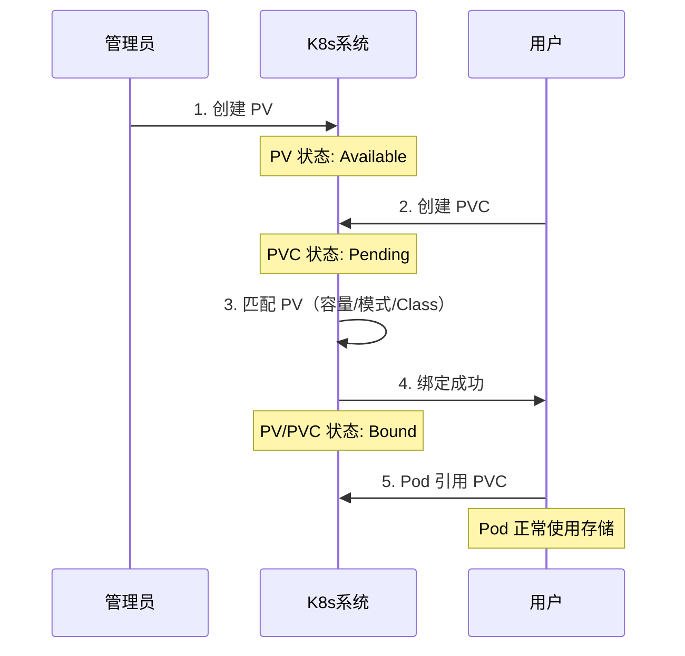
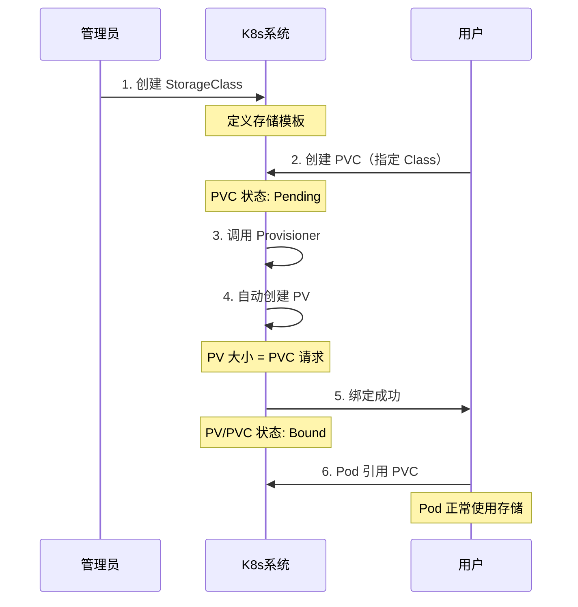

---
title: Kubernetes 共享存储：PV、PVC、StorageClass 详解及使用
icon: circle-info
order: 1
category:
  - Linux
  - kubernetes
tag:
  - Linux
  - kubernetes
  - 共享存储
  - yaml
  - 运维
pageview: false
date: 2026-08-24
comment: false
breadcrumb: false
---

>👨‍🎓**博主简介**
>
>&emsp;&emsp;🏅[CSDN博客专家](https://blog.csdn.net/liu_chen_yang?type=blog)
>&emsp;&emsp;🏅[云计算领域优质创作者](https://blog.csdn.net/liu_chen_yang?type=blog)
>&emsp;&emsp;🏅[华为云开发者社区专家博主](https://bbs.huaweicloud.com/community/usersnew/id_1661843828089234)
>&emsp;&emsp;🏅[阿里云开发者社区专家博主](https://developer.aliyun.com/profile/7yu26jk3lfqxg)
>💊**交流社区：**[运维交流社区](https://bbs.csdn.net/forums/lcy) 欢迎大家的加入！
>🐋 希望大家多多支持，我们一起进步！😄
>🎉如果文章对你有帮助的话，欢迎 点赞 👍🏻 评论 💬 收藏 ⭐️ 加关注+💗

---

## 📌 写在前面

在 Kubernetes 中：
* Pod 是 “`ephemeral`”（临时）的——它们可以被随时创建、销毁、迁移。
* 容器内部的存储空间是临时的（`emptyDir`），容器删除后数据也会丢失；
* 在Pod中指定宿主机路径（`hostPath`），只能绑定一台宿主机，如果pod被调度到其他节点上，指定的宿主机路径则失效，这样就会导致Pod与节点绑定，无法灵活调度<font color=blue>（除非指定了这个pod只允许在此节点上跑）</font>；


那么问题来了：**如果我在 Pod 里跑数据库、消息队列、文件服务这些有状态的应用，产生的数据想一直保留，怎么办？**

这正是 Kubernetes 存储管理要解决的核心问题：**怎么给容器应用提供一套既可靠、又能跟着 Pod 迁移、还好管理的持久化存储？**


K8s 官方给出了：**PV、PVC、StorageClass** 三层抽象。接下来就一起来看看 **PV、PVC、StorageClass** 的存储的概念、机制及使用。


## 一、为什么需要共享存储机制？

### 1.1 痛点场景

| 场景 | 问题 | 解决方案 |
|------|------|----------|
| Pod 重启后数据丢失 | 容器内数据随 Pod 消亡 | 持久化存储 |
| 多 Pod 共享数据 | 不同节点的 Pod 无法访问本地存储 | 共享存储 |
| 存储实现五花八门 | 应用与底层存储耦合 | 抽象接口层 |

### 1.2 设计目标

- **解耦**：应用不关心底层存储是 NFS、Ceph 还是云盘
- **标准化**：统一的存储使用方式
- **自动化**：减少管理员手工创建 PV 的负担

<div id="nfs"> </div>


### 1.3 部署 NFS 共享存储
> 本项目由NFS共享存储来测试

* 安装nfs服务<font color=blue>（所有节点）</font>

`nfs-utils` 为 nfs 服务端、 `rpcbind` 为 nfs 客户端；
```bash
# yum
yum install -y nfs-utils rpcbind

# apt
apt install -y nfs-kernel-server
```
安装完成之后 nfs 会自动创建一个系统程序用户`nfsnobody`，可使用命令：`cat /etc/passwd`查看；

* 创建需要作为共享目录的目录并给nfs权限（注意磁盘空间占用）

> <font color=blue>主节点创建即可</font>
```bash
# 创建一个需要共享的共享目录
mkdir -p /data/nfs1

# 给此目录nfs用户权限
chown -R nfsnobody:nfsnobody /data/nfs1
```
* 配置共享目录：`/etc/exports`，定义哪些客户端可以访问，<font color=blue>（主节点配置）</font>
```bash
vim /etc/exports
# 添加以下内容
# 共享目录 允许访问的网段或IP(权限参数)
# 示例：允许 172.16.11.0/24 网段的所有机器以读写(rw)方式访问，也可以采用ip方式
/data/nfs1 172.16.11.0/24(rw,sync,no_subtree_check,no_root_squash)
```
**参数说明：**

| 参数 | 含义 |
|------|------|
| `rw` | 读写权限 |
| `sync` | 同步写入（保证数据安全） |
| `no_subtree_check` | 禁用子树检查（提升性能） |
| `no_root_squash` | 客户端 root 用户保持 root 权限 |


* 启动 nfs 服务并配置开机自启<font color=blue>（所有节点）</font>

```bash
systemctl enable --now nfs
```

* 查看nfs挂载信息

```bash
# 这个命令需要安装nfs-utlis
showmount -e 172.16.11.231
```
* 其他服务器进行挂载校验

```bash
# 挂载nfs类型到指定目录(指定目录需提前创建)
mount -t nfs 172.16.11.231:/data/nfs1 /data/nfs1
# 挂载完成df -Th进行检查
df -Th
# 进入挂载目录，写入或删除数据进行测试连通性
cd /data/nfs1
touch 123
# 在挂载目录或nfs主服务器目录进行查看

# 永久挂载（需确认好ip和类型，配置错误会导致服务器重启不了）
vim /etc/fstab
# 追加以下内容（defaults后面具体参数可自行搜索）
172.16.11.231:/data/nfs1  /data/nfs1  nfs  defaults,nofail,x-systemd.automount,x-systemd.requires=network-online.target,x-systemd.device-timeout=30  0  0

# 取消挂载
umount -lf 172.16.11.231:/data/nfs1
```
> 注意：这里的挂载只是为了验证nfs是否可用，再`pv`中可直接使用挂载，无需再宿主机中再次进行挂载；

## 二、核心概念：PV、PVC、StorageClass

### 2.1 三层抽象概览

| 资源对象 | 角色 | 创建者 | 作用 |
|----------|------|--------|------|
| **PV**（PersistentVolume） | 存储资源 | 管理员 | 描述"有什么存储" |
| **PVC**（PersistentVolumeClaim） | 资源申请 | 用户/开发者 | 描述"需要什么存储" |
| **StorageClass** | 存储模板 | 管理员 | 定义"如何自动创建存储" |

### 2.2 通俗理解

把存储类比成住房：

- **PV** = 待出租的房子（房源）
- **PVC** = 你的租房需求（面积、朝向、位置）
- **StorageClass** = 开发商的标准户型模板（按需建房）

管理员准备好房源（PV），你提交租房需求（PVC），K8s 负责帮你匹配最合适的房子。如果开启了 StorageClass，系统甚至能按你的需求自动“盖新房”。


## 三、PV（PersistentVolume）详解

PV 是集群中的一块存储资源，独立于 Pod 存在（即 Pod 与 PV 无直接关联，Pod 删除后 PV 依然存在，数据不受影响）。

### 3.1 PV 配置示例

```yaml
apiVersion: v1
kind: PersistentVolume
metadata:
  name: pv1
  labels:
    release: stable
    environment: dev
spec:
  capacity:
    storage: 5Gi                    # 存储容量
  accessModes:
    - ReadWriteOnce                 # 访问模式
  persistentVolumeReclaimPolicy: Recycle   # 回收策略
  storageClassName: local-path            # 存储类别
  nfs:                              # 后端存储类型
    server: 172.16.11.231
    path: /data/nfs1
```

### 3.2 关键配置参数

#### 1）存储能力（Capacity）

目前仅支持 `storage` 空间大小的设置。

```yaml
capacity:
  storage: 10Gi   # 支持 Ki、Mi、Gi、Ti
```
> `Capacity` 设置的存储大小，本质上是一个`标签/声明`，不会再创建的时候扣掉物理机或共享磁盘的空间，只有再写入的时候才会按实际大小进行扣除，超过则会报`"no space left"`。

#### 2）访问模式（Access Modes）

| 模式 | 缩写 | 含义 | 典型场景 |
|------|------|------|----------|
| ReadWriteOnce | **RWO** | 单节点读写 | 数据库（MySQL、PostgreSQL） |
| ReadOnlyMany | **ROX** | 多节点只读 | 配置文件、只读数据卷 |
| ReadWriteMany | **RWX** | 多节点读写 | 共享文件系统、日志收集 |

> ⚠️ **重要**：PV 可以声明支持多种访问模式，但**挂载时只能使用一种**，不能同时生效。

#### 3）各存储插件支持的访问模式

| Volume Plugin | RWO | ROX | RWX | 推荐用途/场景 |
|---------------|:---:|:---:|:---:|---------------|
| **AWSElasticBlockStore** | ✓ | | | 单节点数据库（MySQL、PostgreSQL、MongoDB） |
| **AzureDisk** | ✓ | | | 单节点数据库 |
| **AzureFile** | ✓ | ✓ | ✓ | 共享配置文件、多 Pod 日志收集 |
| **CephFS** | ✓ | ✓ | ✓ | 大规模共享存储、容器化 home 目录 |
| **Ceph RBD** | ✓ | ✓ | | 高性能块存储，推荐 RWO 模式 |
| **GlusterFS** | ✓ | ✓ | ✓ | 通用共享存储，读写均衡 |
| **NFS** | ✓ | ✓ | ✓ | **最通用的共享存储**，测试/生产均可 |
| **HostPath** | ✓ | | | **仅限单机测试**，不要用于生产 |
| **iSCSI** | ✓ | ✓ | | 传统 SAN 存储，推荐 RWO |
| **GCE PersistentDisk** | ✓ | | | 单节点数据库（GCP 环境） |
| **vSphere Volume** | ✓ | | | VMware 环境下的数据库存储 |

*  模式选择的黄金法则

| 你的需求 | 推荐模式 | 推荐存储类型 |
|----------|----------|--------------|
| 单个 Pod 读写（如 MySQL） | **RWO** | AWS EBS、AzureDisk、Ceph RBD |
| 多个 Pod 只读共享（如配置文件） | **ROX** | NFS、CephFS |
| 多个 Pod 读写共享（如文件系统） | **RWX** | NFS、AzureFile、GlusterFS |
| 不确定/通用场景 | **RWO** | 最安全的选择 |

#### 4）回收策略（Reclaim Policy）

| 策略 | 说明 | 适用场景 |
|------|------|----------|
| **Retain** | 保留数据，需手工清理 | 生产环境重要数据 |
| **Recycle** | 自动清空数据（`rm -rf`） | 仅 NFS、HostPath 支持 |
| **Delete** | 删除后端存储卷 | 云存储（AWS EBS、GCE PD） |

#### 5）存储类别（Class）

通过 `storageClassName` 指定 PV 所属的类别，只有请求了相同类别的 PVC 才能绑定。

```yaml
storageClassName: local-path   # 必须与 StorageClass 名称一致
```

`StorageClass` 都有哪些名称可以这样查看

```bash
kubectl get storageclass -A
```


### 3.3 PV 生命周期阶段
首先，我们通过 YAML 文件创建一个 PV。文件名可以自定义，例如 `pv.yaml`。

```bash
# 1. 创建 PV
kubectl apply -f pv.yaml

# 2. 查看已创建的 PV
kubectl get pv
```


此时，由于只创建了 PV 资源，还没有创建任何 PVC（PersistentVolumeClaim）或 Pod 来使用它，因此 PV 处于`Available`空闲可用状态。

```
Available → Bound → Released → (Failed)
```

| 阶段 | 含义 |
|------|------|
| **Available** | 空闲可用，未被绑定 |
| **Bound** | 已与某个 PVC 绑定 |
| **Released** | 绑定的 PVC 已删除，资源释放但未回收 |
| **Failed** | 自动回收失败 |


## 四、PVC（PersistentVolumeClaim）详解

PVC 是用户对存储资源的需求申请。创建 PVC 后，Kubernetes 会根据 PVC 的请求（容量、访问模式等）去匹配一个已有的 PV 进行绑定【**静态绑定**】；如果配置了 StorageClass，系统甚至可以自动创建一个新的 PV 来完成绑定【**动态供应**】。

### 4.1 PVC 配置示例

```yaml
apiVersion: v1
kind: PersistentVolumeClaim
metadata:
  name: pvc1
  namespace: default
spec:
  accessModes:
    - ReadWriteOnce
  resources:
    requests:
      storage: 5Gi
  storageClassName: local-path
  selector:
    matchLabels:
      release: stable
    matchExpressions:
      - key: environment
        operator: In
        values:
          - dev
```

### 4.2 关键配置参数

#### 1）资源请求（Resources）

```yaml
resources:
  requests:
    storage: 5Gi   # 必需，申请存储空间大小
```

#### 2）访问模式

与 PV 相同，支持 RWO、ROX、RWX。

#### 3）PV 选择条件（Selector）—— 可选

通过 Label Selector 筛选符合条件的 PV，作为额外的匹配条件。

```yaml
spec:
  accessModes:									# ← 条件1：访问模式（必须）
    - ReadWriteOnce
  resources:									# ← 条件2：容量（必须）
    requests:
      storage: 5Gi
  storageClassName: local-path					# ← 条件3：存储类别（必须）
  selector:										# ← 条件4：标签筛选（可选，如果pvc写了，pv必须有）
    matchLabels:
      release: stable
    matchExpressions:
      - key: environment
        operator: In
        values:
          - dev
```

> 📌 **注意**：
> * PVC 匹配 PV 的逻辑 = (StorageClass 相同) AND (访问模式兼容) AND (容量足够) AND (如果设置了 Selector，则标签也要匹配)
> * Selector 是额外筛选条件，不是必填项。系统会先按 StorageClass、访问模式、容量进行匹配，再通过 Selector 进一步过滤。
> * 动态供应模式下请勿使用 Selector：因为系统动态创建的 PV 没有预置标签，无法满足 Selector 条件，会导致 PVC 一直处于 Pending 状态。


#### 4）存储类别（Class）

| storageClassName 设置 | 含义 |
|----------------------|------|
| 指定具体名称 | 只绑定相同 Class 的 PV |
| `""`（空字符串） | 只绑定未设置 Class 的 PV |
| 不设置 | 使用默认 StorageClass |


### 4.3 PVC 生命周期阶段
首先，我们通过 YAML 文件创建一个 PVC。文件名可以自定义，例如 `pvc.yaml`。

```bash
# 1. 创建 PVC
kubectl apply -f pvc.yaml

# 2. 查看已创建的 PVC
kubectl get pvc
```


此时，只创建了 PVC 资源，尚未创建 Pod 来使用它。PVC 处于 `Pending` 状态，正在等待绑定合适的 PV 或等待 Pod 创建（取决于 StorageClass 的绑定模式）。

> 📌 注意：PVC 的 `Pending` 状态不一定是异常。如果绑定的 StorageClass 是 `WaitForFirstConsumer` 模式，PVC 会一直处于 Pending 状态，直到第一个使用它的 Pod 创建后才完成绑定。StorageClass 查看模式：`kubectl get sc`<br>
> 


```
Pending → Bound → Lost
```

| 阶段 | 含义 |
|------|------|
| **Pending** | 等待绑定。常见原因：无匹配 PV、或 WaitForFirstConsumer 模式等待 Pod 创建 |
| **Bound** | 已与 PV 成功绑定，可以被 Pod 使用 |
| **Lost** | 绑定的 PV 丢失，需人工介入 |

### 4.4 命名空间限制

```
Namespace A          Namespace B
┌─────────────┐      ┌─────────────┐
│ PV (全局)   │ ←──→ │ PVC         │
│ PVC         │      │ Pod         │
└─────────────┘      └─────────────┘
```

- PV 是**集群级别**资源，不受 namespace 限制
- PVC 是**命名空间级别**资源
- PVC 只能绑定**同 namespace 的 Pod**


## 五、PV 与 PVC 的工作流程

### 5.1 PV/PVC 的完整工作流程
从用户创建存储需求到最终回收资源，整个流程如下：


```
Provisioning（资源供应）→ Binding（绑定）→ Using（使用）→ Releasing（释放）→ Reclaiming（回收）
```

### 5.2 静态供应模式（Static Provisioning）
静态供应是 Kubernetes 存储管理的传统方式，由管理员提前准备好存储资源，用户按需申请使用。


```
管理员创建 PV → 用户创建 PVC → K8s 匹配绑定 → Pod 使用
```

**流程图示**：

**优缺点**：

| 特点 | 说明 |
|------|------|
| ✅ 管理简单 | 管理员完全掌控存储资源 |
| ✅ 行为可预测 | PV 固定，绑定结果明确 |
| ❌ 资源浪费 | PV 一旦绑定，整块容量被独占 |
| ❌ 运维负担 | 需要提前规划和创建大量 PV |
| ❌ 扩展性差 | 新 PVC 需要管理员提前创建对应 PV |

**适用场景**：

- 存储需求相对固定的环境
- 小规模集群或测试环境
- 存储类型不支持动态供应的场景（如某些 NFS 实现）

### 5.3 动态供应模式（Dynamic Provisioning）
动态供应是云原生环境的标准做法，通过 `StorageClass` 实现存储资源的按需自动创建。

**工作流程**：
```
管理员创建 StorageClass → 用户创建 PVC（指定 Class）→ 系统自动创建 PV → 绑定 → Pod 使用
```

**流程图示**：




**优缺点**：

| 特点 | 说明 |
|------|------|
| ✅ 资源利用率高 | 按需创建，不浪费存储空间 |
| ✅ 运维效率高 | 管理员无需预创建 PV |
| ✅ 弹性好 | 存储需求变化时自动适配 |
| ❌ 依赖 Provisioner | 需要存储驱动支持动态供应 |
| ❌ 复杂场景受限 | 某些高级需求需要额外配置 |

**适用场景**：

- 云平台环境（AWS、GCP、Azure）
- 大规模集群
- 多租户环境
- 存储需求变化频繁的场景

### 5.4 资源释放与回收


当用户删除 PVC 后，Kubernetes 会触发资源释放与回收流程。

**流程示意**：

```
删除 PVC → PV 状态变为 Released → 根据回收策略处理
```

**详细步骤**：

1. **释放**：用户执行 `kubectl delete pvc`，绑定的 PV 状态从 `Bound` 变为 `Released`
2. **回收**：Kubernetes 根据 PV 的 `persistentVolumeReclaimPolicy` 执行相应操作

**回收策略对比**：

| 策略 | 行为 | 数据结果 | PV 最终状态 | 适用场景 |
|------|------|----------|-------------|----------|
| **Retain** | 保留数据，等待管理员处理 | 数据保留 | Released（需手动清理后恢复 Available） | 生产环境重要数据 |
| **Delete** | 自动删除后端存储卷 | 数据删除 | PV 被删除 | 临时/测试数据 |
| **Recycle** | 自动清空数据（`rm -rf`） | 数据清空 | Available | 已弃用，不推荐 |

> ⚠️ **重要提醒**：
> 
> - **Retain 策略下**：PV 进入 `Released` 状态后，不能立即被新 PVC 使用。需要管理员手动清理数据，并移除 PV 的 `claimRef` 字段，才能恢复为 `Available`。
> 
> ```bash
> # 手动恢复 Released 状态的 PV
> kubectl patch pv <pv-name> -p '{"spec":{"claimRef": null}}'
> ```
> 
> - **Delete 策略下**：删除 PVC 会同时删除后端存储卷，数据无法恢复，请谨慎使用。
> - **Recycle 策略**：已在 Kubernetes v1.8 中弃用，建议改用动态供应或手动清理。
## 六、StorageClass 详解

StorageClass 是对存储资源的抽象定义，是实现**动态资源供应**的核心。

### 6.1 StorageClass 配置示例

```yaml
apiVersion: storage.k8s.io/v1
kind: StorageClass
metadata:
  name: standard
provisioner: kubernetes.io/aws-ebs
parameters:
  type: gp2
```

### 6.2 关键配置参数

#### 1）提供者（Provisioner）


描述存储资源的提供者，即后端存储驱动。不同的 Provisioner 对应不同的存储后端：

| Provisioner | 对应存储 | 类型 | 说明 |
|--------------|----------|------|------|
| `kubernetes.io/aws-ebs` | AWS EBS | 公有云 | AWS 弹性块存储，需在 AWS 环境使用 |
| `kubernetes.io/gce-pd` | GCE Persistent Disk | 公有云 | 谷歌云持久化磁盘，需在 GCP 环境使用 |
| `kubernetes.io/azure-disk` | Azure Disk | 公有云 | Azure 托管磁盘，需在 Azure 环境使用 |
| `kubernetes.io/azure-file` | Azure File | 公有云 | Azure 文件存储（支持 RWX） |
| `kubernetes.io/cinder` | OpenStack Cinder | 私有云 | OpenStack 块存储组件 |
| `kubernetes.io/glusterfs` | GlusterFS | 自建存储 | 开源分布式文件系统 |
| `kubernetes.io/no-provisioner` | 静态供应 | 特殊 | 不动态创建 PV，需手动管理 |

**补充说明**：

- **公有云 Provisioner**：需要集群部署在对应云平台才能使用，会自动调用云 API 创建云硬盘
- **GlusterFS**：需要集群内提前部署 GlusterFS 和 Heketi 服务
- **no-provisioner**：本质是“不自动供应”，配合静态 PV 使用

**使用自定义 Provisioner**：

除了内置 Provisioner，也可以使用自定义的 Provisioner（如 NFS Provisioner、Ceph RBD Provisioner），只需确保：
1. 集群中已部署对应的 Provisioner 组件
2. StorageClass 中的 `provisioner` 名称与组件注册的名称一致

```yaml
# 自定义 Provisioner 示例
provisioner: nfs-client      # NFS Subdir Provisioner
provisioner: ceph.com/rbd    # Ceph RBD Provisioner
```

#### 2）参数（Parameters）

不同 Provisioner 有不同参数：

**AWS EBS 示例**：
```yaml
parameters:
  type: io1              # io1, gp2, sc1, st1
  zone: us-east-1d
  iopsPerGB: "10"        # 仅 io1 类型有效
  encrypted: "true"
```

**GCE PD 示例**：
```yaml
parameters:
  type: pd-ssd           # pd-standard, pd-ssd
  zone: us-central-1a
```

**GlusterFS 示例**：
```yaml
parameters:
  resturl: "http://heketi:8080"
  restauthenabled: "true"
  restuser: "admin"
  secretName: "heketi-secret"
  secretNamespace: "default"
  volumetype: "replicate:3"
```
### 6.3 部署自定义 Provisioner - NFS Provisioner
> nfs部署可查看：[部署 NFS 共享存储](#nfs)

#### 6.3.1 Helm 部署 NFS Provisioner 
1. **添加并更新nfs helm仓库**

```bash
# 添加仓库
helm repo add nfs-subdir-external-provisioner https://kubernetes-sigs.github.io/nfs-subdir-external-provisioner/

# 更新仓库
helm repo update
```
2.  **执行安装命令**：
    使用 `helm install` 命令，通过 `--set` 参数直接指定 NFS 服务器信息。这里会自动创建名为 `nfs-storage-class` 的 StorageClass，并将其设为集群默认 StorageClass。
    > `nfs.serve`内容替换为你的NFS服务器IP
    > `nfs.path`内容替换为你的NFS共享目录
    > 如果网络不稳定可以先`helm pull nfs-subdir-external-provisioner/nfs-subdir-external-provisioner`下载下来，然后进行安装
    ```bash
    # 直接安装
    helm install nfs-provisioner nfs-subdir-external-provisioner/nfs-subdir-external-provisioner \
      --namespace kube-system \
      --set nfs.server=172.16.11.231 \
      --set nfs.path=/data/nfs1 \
      --set storageClass.name=nfs-storage-class \
      --set storageClass.defaultClass=true
      
	# pull下来之后再安装
    helm install nfs-provisioner nfs-subdir-external-provisioner-4.0.18.tgz \
      --namespace kube-system \
      --set nfs.server=172.16.11.231 \
      --set nfs.path=/data/nfs1 \
      --set storageClass.name=nfs-storage-class \
      --set storageClass.defaultClass=true
    ```
    


3. **确认安装成功**：

```bash
# 查看helm是否已经安装nfs
helm list -n kube-system

# 查看pod是否运行正常（状态为1/1正常）
kubectl get pods -n kube-system | grep -i nfs

# 查看deployment运行是否正常
kubectl get deploy -n kube-system | grep -i nfs
```


#### 6.3.2 YAML 部署 NFS Provisioner 
1. 克隆仓库或直接访问下载仓库文件

> 直接访问下载仓库文件：[https://github.com/kubernetes-sigs/nfs-subdir-external-provisioner/tree/master/deploy](https://github.com/kubernetes-sigs/nfs-subdir-external-provisioner/tree/master/deploy)
> 直接下载的只需要这三个文件即可：`rbac.yaml`、`deployment.yaml`、`class.yaml`；需要修改的有：`deployment.yaml`、`class.yaml`这两个。

克隆仓库，并进入仓库到`deploy`目录下；
```bash
git clone https://github.com/kubernetes-sigs/nfs-subdir-external-provisioner.git
cd nfs-subdir-external-provisioner/deploy
```
2. 修改文件内容

>需要根据你的 NFS 服务器信息，修改 `deployment.yaml` 和 `class.yaml` 这两个文件。<br>
>2.1 修改 `deployment.yaml` ：编辑此文件，找到 `spec.template.spec` 部分，修改环境变量和卷挂载信息。<br>
><br>
>2.2  修改`class.yaml` ：此文件定义 `StorageClass`，确保 `provisioner` 字段的值与`deployment.yaml`中的`PROVISIONER_NAME` 完全一致。<br>
><br>
> 如果想设置为集群默认的 `StorageClass`，可以在 `class.yaml` 中添加注解：`metadata.annotations."storageclass.kubernetes.io/is-default-class" = "true"`。

3.  部署服务
> 建议先部署 RBAC 权限和 Deployment，再创建 StorageClass。

```bash
# 1. 应用RBAC权限（如果RBAC没有特别禁用，通常需要）
kubectl apply -f rbac.yaml

# 2. 部署Provisioner组件
kubectl apply -f deployment.yaml

# 3. 创建StorageClass
kubectl apply -f class.yaml
```


4. 验证是否部署成功

```bash
# 查看deploy运行状态（运行状态为1/1则正常）
kubectl get deploy nfs-client-provisioner  | grep -i nfs

# 查看pod运行状态（运行状态为1/1则正常）
kubectl get pods nfs-client-provisioner-67b8d55f9c-xfnvz  -o wide | grep -i nfs

# 查看StorageClass
kubectl get sc | grep -i nfs
```


<div id="sc2"></div>

### 6.4 测试 StorageClass 动态供应
#### 6.4.1 创建一个pvc
文件名：`test-pvc.yaml`

```yaml
kind: PersistentVolumeClaim
apiVersion: v1
metadata:
  name: test-nfs-pvc
spec:
  storageClassName: nfs-client
  accessModes:
    - ReadWriteMany
  resources:
    requests:
      storage: 100Mi
```
#### 6.4.2 创建并观察pvc的动态供应

```bash
# 创建 PVC
kubectl apply -f test-pvc.yaml

# 查看 PVC 状态，它应该会从 Pending 变为 Bound
kubectl get pvc test-nfs-pvc

# 查看自动生成的 PV，它的名字会是 pvc-<一串ID>
kubectl get pv | grep nfs-client
```


#### 6.4.3 创建测试pod
文件名：`test-pod.yaml`

```yaml
apiVersion: v1
kind: Pod
metadata:
  name: test-nfs-pod
spec:
  containers:
  - name: test-container
    image: busybox:latest
    command: ["/bin/sh"]
    args: ["-c", "while true; do echo $(date -u) >> /mnt/data.txt; sleep 5; done"]
    volumeMounts:
    - name: nfs-storage
      mountPath: /mnt
  volumes:
  - name: nfs-storage
    persistentVolumeClaim:
      claimName: test-nfs-pvc   # 使用刚刚创建的PVC名称
```

这个 Pod 会：
- 使用 `busybox` 镜像，非常轻量
- 每 5 秒向 `/mnt/data.txt` 文件写入一次当前时间
- `/mnt` 目录挂载的就是 NFS 存储

> ⚠ 注意：测试完请及时删除pod，否则会一直写数据，导致磁盘爆满；

#### 6.4.4 部署并验证

**1. 创建 Pod**

```bash
kubectl apply -f test-pod.yaml
```

**2. 查看 Pod 状态**

```bash
kubectl get pod test-nfs-pod -o wide
```

预期输出：状态为 `Running`

**3. 验证数据写入**

```bash
# 进入 Pod 查看文件内容
kubectl exec test-nfs-pod -- cat /mnt/data.txt
```
正常是可以看到这样的输出的：


**4. 最重要的验证—— 在 NFS 服务器或者挂载服务器上检查**

> 进入挂载目录或者是nfs的远程目录，默认会有一个`default-test-nfs-pvc*`的目录，*后面是pvc生成的一串id，进入对应的id里面，就是该pod的挂载路径，可以进去看看有没有`data.txt`目录，有的话查看数据就行；


> ⚠ 注意：测试完请及时删除pod，否则会一直写数据，导致磁盘爆满；


### 6.5 设置默认 StorageClass

#### 6.5.1 启用 admission controller

> 对于新版本 Kubernetes（v1.14+）—— 推荐
> **什么也不用做**。`DefaultStorageClass` 准入控制器默认就是开启的。只需要为 StorageClass 添加正确的 annotation 即可。

> 对于老版本（v1.13 及以前）—— 需要配置
> 如果目前正在使用的集群为1.13版本以前的，需要找到 API Server 的配置文件并添加参数。路径通常如下：
> *   **二进制部署**：修改 API Server 的 systemd service 文件（通常是 `/etc/systemd/system/kube-apiserver.service`），在 `ExecStart` 那一行的参数列表里加上：
    `--enable-admission-plugins=...,DefaultStorageClass`
    然后重启服务：`systemctl daemon-reload && systemctl restart kube-apiserver`；<br>
    如果`kube-apiserver.service`引用了专门的配置就再专门的配置里进行添加，配置路径例如：`/opt/kubernetes/cfg/kube-apiserver.conf`，找到`--enable-admission-plugins`配置，再后面追加`DefaultStorageClass`。
    然后重启服务：`systemctl daemon-reload && systemctl restart kube-apiserver`；
> *   **kubeadm 部署**：修改 `/etc/kubernetes/manifests/kube-apiserver.yaml` 静态 Pod 清单，在 `spec.containers.command` 下添加该参数，kubelet 会自动重启 API Server。

#### 6.5.2 添加 annotation
**启用默认 StorageClass 的关键步骤，给 StorageClass 资源添加一个 annotation（注解），内容为：`storageclass.kubernetes.io/is-default-class: "true"`。**

1.  **创建时添加**：在之前的 `class.yaml` 文件中，直接加上 annotation。

    ```yaml
    apiVersion: storage.k8s.io/v1
    kind: StorageClass
    metadata:
      name: nfs-client
      annotations:
        storageclass.kubernetes.io/is-default-class: "true"   # <--- 这一行是关键
    provisioner: k8s-sigs.io/nfs-subdir-external-provisioner
    parameters:
      archiveOnDelete: "false"
    ```

2.  **给已存在的 StorageClass 添加**：如果已经创建了，用 `kubectl patch` 命令添加。

    ```bash
    kubectl patch storageclass nfs-client -p '{"metadata":{"annotations":{"storageclass.kubernetes.io/is-default-class":"true"}}}'
    ```


#### 6.5.3 验证默认 StorageClass

添加成功后，用 `kubectl get sc` 验证，可以看到 `nfs-client` 的 `NAME` 后面出现了 `(default)` 标记。

```bash
kubectl get sc
```


> 配置完成后，以后创建 PVC 时，如果**不指定** `storageClassName`，系统就会自动使用 `nfs-client` 这个默认的 StorageClass 来动态创建 PV，添加完也可以再按照上面：[6.4 测试 StorageClass 动态供应](#sc2) 再走一遍流程（吧指定`storageClassName`去了）进行测试。

#### 6.5.3 取消默认 StorageClass

```bash
kubectl patch storageclass nfs-client -p '{"metadata":{"annotations":{"storageclass.kubernetes.io/is-default-class":"false"}}}'
```

## 八、常见问题排查

### 8.1 PVC 一直 Pending

```bash
kubectl describe pvc <pvc-name>
```

**常见原因**：
- 没有匹配的 PV（容量、访问模式、Class 不匹配）
- StorageClass 的 Provisioner 不可用
- 云厂商 API 调用失败（配额不足、权限问题）

### 8.2 Pod 挂载失败

```bash
kubectl describe pod <pod-name>
```

**常见原因**：
- PVC 仍处于 Pending 状态
- 后端存储服务不可达
- 挂载权限问题

### 8.3 PV 为 Released 无法使用

```bash
# 清理 claimRef 使 PV 恢复 Available
kubectl patch pv <pv-name> -p '{"spec":{"claimRef": null}}'
```


## 九、最佳实践总结

### 9.1 模式选择建议

| 场景 | 推荐模式 |
|------|----------|
| 生产环境、云平台 | 动态供应 + StorageClass |
| 本地开发测试 | 静态供应（HostPath） |
| 混合云、自建机房 | 静态供应 + NFS/GlusterFS |

### 9.2 关键原则

1. **PV 是集群资源**，独立于 namespace
2. **PVC 是命名空间资源**，只能被同命名空间的 Pod 使用
3. **动态供应**是云原生标准做法
4. 合理设置**回收策略**保护重要数据

### 9.3 常用命令速查

```bash
# 查看所有 PV
kubectl get pv

# 查看所有 PVC
kubectl get pvc -A

# 查看 StorageClass
kubectl get sc

# 查看详细信息
kubectl describe pv <pv-name>
kubectl describe pvc <pvc-name>

# 删除 PVC
kubectl delete pvc <pvc-name>
```

### 9.4 工作中常用组合
* 使用pvc 挂载 nfs（nfs服务器需和node节点网络互通），nginx日志为示例：

```yaml
---
apiVersion: v1
kind: PersistentVolume
metadata:
  name: nginx-logs-pv
  labels:
    app: nginx
    type: nfs-logs
spec:
  capacity:
    storage: 200Gi
  accessModes:
    - ReadWriteMany
  persistentVolumeReclaimPolicy: Retain
  storageClassName: ""
  nfs:
    server: 172.16.11.233
    path: /data/nginx-logs

---
apiVersion: v1
kind: PersistentVolumeClaim
metadata:
  name: nginx-logs-pvc
  namespace: nginx
spec:
  accessModes:
    - ReadWriteMany
  resources:
    requests:
      storage: 200Gi
  storageClassName: ""
  selector:
    matchLabels:
      app: nginx
      type: nfs-logs
```

## 十、写在最后

Kubernetes 的存储管理体系通过 PV、PVC、StorageClass 三层抽象，优雅地解决了容器持久化存储的难题：

- **PV** 抽象存储资源
- **PVC** 抽象存储需求
- **StorageClass** 实现动态供应

这套机制让应用开发者无需关心底层存储细节，也让管理员能够统一、高效地管理存储资源。无论您使用的是 AWS EBS、GCE PD、Azure Disk，还是自建的 NFS、Ceph、GlusterFS，K8s 都能以统一的方式提供服务。

希望本文能帮助您深入理解 K8s 的存储机制，并在实际项目中灵活运用！
