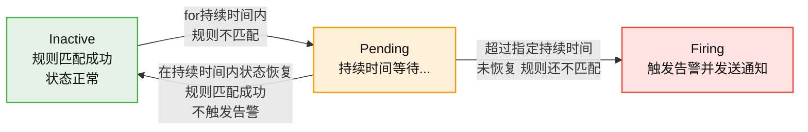

---
title: Prometheus + Grafana + Alertmanager 实现邮件监控告警及配置告警信息
icon: circle-info
order: 1
category:
  - Linux
  - Prometheus
  - Grafana
  - Alertmanager
tag:
  - Linux
  - Prometheus
  - Grafana
  - Alertmanager
  - 运维
date: 2026-01-29
isOriginal: true
pageview: true
article: true
breadcrumb: false
comment: true
---


>👨‍🎓**博主简介**
>
>&emsp;&emsp;🏅[CSDN博客专家](https://blog.csdn.net/liu_chen_yang?type=blog)
>&emsp;&emsp;🏅[云计算领域优质创作者](https://blog.csdn.net/liu_chen_yang?type=blog)
>&emsp;&emsp;🏅[华为云开发者社区专家博主](https://bbs.huaweicloud.com/community/usersnew/id_1661843828089234)
>&emsp;&emsp;🏅[阿里云开发者社区专家博主](https://developer.aliyun.com/profile/7yu26jk3lfqxg)
>💊**交流社区：**[运维交流社区](https://bbs.csdn.net/forums/lcy) 欢迎大家的加入！
>🐋 希望大家多多支持，我们一起进步！😄
>🎉如果文章对你有帮助的话，欢迎 点赞 👍🏻 评论 💬 收藏 ⭐️ 加关注+💗

---

## 前言 - 服务器信息
|软件/服务器| 版本 |
|--|--|
|  操作系统| centos7 |
|Prometheus  |3.7.3  |
| node_exporter | 1.10.2 |
| grafana | 12.3.0 |
| alertmanager | 0.30.0 |
|部署方式  |二进制  |

> **提示**：本文只提供`Alertmanager`的部署和使用及`Prometheus、Grafana`的配置，如需`Prometheus、node_exportes和Grafana`的部署，请查看：[【Linux】Prometheus + Grafana 的部署及介绍（亲测无问题）](https://liucy.blog.csdn.net/article/details/131049402)
## 一、Prometheus 的架构及数据传输
> 要实现`Prometheus + Grafana + Alertmanager`告警，我们就需要先了解`Prometheus`的架构原理及他是如何采集并拿到数据的，下面先来讲讲；
### 1.1 Prometheus 架构图
> 此架构图来源与官方


### 1.2 Prometheus 是如何采集数据并传输给自己的？
> `Prometheus` 是通过拉取（Pull）模型来采集数据；
> 首先我们需要先在客户端或是需要被采集数据的服务器上安装`exporter`，例如：`node_exporter`、`mysql_exporter`、`blackbox_exporter`等，更多exporter可查看官方支持列表：[英文官网 - exporter列表](https://prometheus.io/docs/instrumenting/exporters/) | [中文官网 - exporter列表](https://prometheus.ac.cn/docs/instrumenting/exporters/)
> 然后`Prometheus`就会定时去`Exporter` 暴露的接口 `/metrics`中拉取数据，并把拉取返回的指标文本存进自己的时序数据库中。


具体流程如下：

1. **部署 Exporter**  
   在目标主机或服务上部署对应的 Exporter（如 `node_exporter`、`mysql_exporter`、`blackbox_exporter` 等），这些 Exporter 会暴露一个 HTTP 接口（默认路径为 `/metrics`），并以 Prometheus 支持的文本格式返回指标数据。

2. **配置 Prometheus 拉取任务**  
   在 Prometheus 的配置文件（`prometheus.yml`）中，通过 `scrape_configs` 定义要拉取的目标（即 Exporter 的地址）和拉取频率（`scrape_interval`）。

3. **Prometheus 主动拉取数据**  
   Prometheus 会按照配置的时间间隔，主动通过 HTTP 请求访问每个目标的 `/metrics` 接口，获取最新的指标数据，并将其存储在本地的时序数据库（TSDB）中。

---
- **exporter**：是一个独立的程序，用于从目标服务中提取监控数据，并将其转换为 Prometheus 可以理解的格式（通常是时间序列数据）。例如：
   - **node_exporter**：用于采集 Linux 系统的性能指标，如 CPU、内存、磁盘 I/O 等。
   - **mysql_exporter**：用于采集 MySQL 数据库的性能指标。
   - **blackbox_exporter**：用于监控网络服务的可用性，如 HTTP、DNS、TCP 等。

> `exporter`的安装方式基本一直，可参考：[【Linux】Prometheus + Grafana 的部署及介绍（亲测无问题）](https://liucy.blog.csdn.net/article/details/131049402) 第四步、第五步，部署 node_exporter并添加到Prometheus配置中；
---

## 二、为什么选择 Alertmanager 来做告警？
> 熟悉 `Prometheus` 的采集与存储机制后，可以先用其 WebUI 或可选的 `Grafana` 做可视化；随后再在 `Prometheus` 里编写告警规则，当指标达到阈值时，由 `Alertmanager` 负责收敛并发送通知，以便及时响应

**那么为什么选择 Alertmanager 来做告警呢？**

> **只有 Alertmanager 能把 Prometheus 的“原始告警事件”变成“可治理、可收敛、高可用、能送到人手里”的通知，而 Grafana 或其他方案在 Prometheus 生态里要么做不到、要么做得不完整。**


| 需求 | Prometheus 原生 | Grafana Unified Alerting | Alertmanager | 说明 |
|---|---|---|---|---|
| 1. 告警分组（同故障合并） | ❌ | ✅（仅 Grafana 内部） | ✅ | 500 个实例挂掉只收到 1 条短信，AM 靠 `group_by` 标签 1 行配置搞定。 |
| 2. 抑制规则（高优屏蔽低优） | ❌ | ❌ | ✅ | 网络分区→所有服务探针失败；AM 一条 inhibit 规则即可屏蔽后续噪音。 |
| 3. 静默（维护窗口） | ❌ | ✅（仅 Grafana 内部） | ✅ | 凌晨割接，AM 一条 silence 全集群生效，无需改规则文件。 |
| 4. 多接收端/高可用 | ❌ | 单实例 | ✅ 多实例可跑 HA 集群 | AM 之间 Gossip 同步，保证同一条告警不重复、不丢失。 |
| 5. 发送渠道丰富度 | 0 渠道 | 10+ 渠道 | 30+ 渠道+Webhook | 企业微信、钉钉、Slack、PagerDuty、OpsGenie、VictorOps、邮件、短信网关…即插即用。 |
| 6. 与 Prometheus 一体集成 | ✅ | ❌（额外插件） | ✅ | Prometheus 自带 `alerting` 配置段，指向 AM 即可，零耦合。 |

**告警架构**


**核心概念**
* **分组（Grouping）**：分组是将类似性质的告警分类为单个通知的机制。在大型中断期间，例如网络分区导致许多服务实例无法访问数据库，Prometheus中针对每个服务实例的告警规则会被触发，数百个告警发送到Alertmanager。此时，可将Alertmanager配置为按群集和alertname对警报进行分组，这样用户就能收到单个紧凑通知，同时确切了解哪些服务实例受到影响。通知的接收器通过配置文件中的路由树来配置告警分组，并定时进行分组通知。
* **抑制（Inhibition）**：如果某些特定的告警已经触发，那么可以配置Alertmanager抑制其他相关告警。例如，当某个告警触发表示无法访问整个集群时，可让Alertmanager在该特定告警触发时，将与该集群有关的所有其他告警静音，防止收到数百或数千个与实际问题无关的告警通知。
* **静默（Silences）**：静默是在给定时间内简单地静音告警的方法。基于匹配器配置静默，就像路由树一样。检查告警是否匹配或者正则表达式匹配静默，如果匹配，则不会发送该告警的通知。可以在Alertmanager的Web界面中配置静默。


**配置告警规则的基本流程**

* 新增告警规则的操作有以下三步
> 前提是Prometheus必须配置好Alertmanager 告警工具并引入告警规则；


<br>

**配置告警规则，具体请看文章中 5.2**
1. 名称（alert）
2. 触发条件（expr），这是个PromQL表达式，例如CPU使用率超过50%，在触发条件被满足之前，告警的状态都是Inactive
3. 持续时间（for），例如CPU使用率超过50%的时间持续30秒，在30秒之内，此告警状态为`pending`，超过30秒就进入`firing`状态
4. 标签（labels），给告警打上标签，在使用时可以根据标签定位到指定告警
5. 注解（annotations），对告警的描述，这些内容可以用来详明告警时刻的详细情况

## 三、Alertmanager 的部署
### 3.1 下载 Alertmanager 部署包
> Alertmanager开源地址：[https://github.com/prometheus](https://github.com/prometheus)
> Alertmanager安装包下载地址：[https://github.com/prometheus/alertmanager/releases](https://github.com/prometheus/alertmanager/releases)
> Alertmanager 官方最新下载地址：[https://prometheus.io/download/](https://prometheus.io/download/)
> 
> ---
> 如果需要选择最新的版本可以直接访问 [Alertmanager 官方最新下载地址](https://prometheus.io/download/)，搜索`alertmanager`，进行下载；
> 如果选择其他版本可以访问 [Alertmanager安装包下载地址](https://github.com/prometheus/alertmanager/releases)，按照自己所需版本及平台进行下载；


```bash
# 使用wget下载或直接页面下载
wget https://github.com/prometheus/alertmanager/releases/download/v0.30.0-rc.0/alertmanager-0.30.0-rc.0.linux-amd64.tar.gz
```

### 3.2 解压安装包并放到指定目录

```bash
#解压安装包
tar xf alertmanager-0.30.0-rc.0.linux-amd64.tar.gz

#移动到/usr/local/目录，并修改名字
mv alertmanager-0.30.0-rc.0.linux-amd64 /usr/local/alertmanager
```
### 3.3 配置系统启动文件，启动并设置开机自启

```bash
#加入systemd管理：进入这个文件，默认是没有的，直接进入就行
vim /usr/lib/systemd/system/alertmanager.service

#将下面的全部写进去
[Unit]
Description=alertmanager
Documentation=https://prometheus.io/
After=network.target

[Service]
Type=simple
ExecStart=/usr/local/alertmanager/alertmanager --config.file=/usr/local/alertmanager/alertmanager.yml
ExecReload=/bin/kill -SIGHUP $MAINPID
Restart=always

[Install]
WantedBy=multi-user.target
```

```bash
# 给此service可执行权限
chmod 775 /usr/lib/systemd/system/alertmanager.service

# 配置开机自启并启动服务
systemctl enable --now alertmanager

# 查看服务状态（是否启动成功）
systemctl status alertmanager

#查看端口是否启动：9093|9094
netstat -anput | grep -E '9093|9094'
```


## 四、Prometheus 加入 Alertmanager 告警工具并引入告警规则
> 修改Prometheus配置，加入Alertmanager工具，两边进行通讯；
> 并引入告警规则，添加告警规则存放路径；

```bash
# 这里是Prometheus的配置文件，根据自己路径进行修改
cd /usr/local/prometheus/
vim prometheus.yml
```

```yaml
global:
# 采集间隔时间为15秒，默认1分钟
  scrape_interval: 15s 
# 评估规则间隔15秒，默认1分钟
  evaluation_interval: 15s

# 接入alertmanager工具
alerting:
  alertmanagers:
    - static_configs:
        - targets:
          - 172.16.11.230:9093

# 定义告警规则存放位置，可以写绝对路径，也可也写相对路径，如果没有此路径，需提前创建
rule_files:
  - "/usr/local/prometheus/rules/*_rules.yml"

# 采集数据源的源信息的配置项，可以配置多个
scrape_configs:
# Prometheus 服务端健康状态监控
  - job_name: "prometheus"
    static_configs:
      - targets: ["172.16.11.230:9090"]
        labels:
          app: "prometheus"
          
# Prometheus 被监控端（客户端）健康状态监控
  - job_name: 'agent'
    static_configs:
      - targets: ['172.16.11.230:9100','172.16.11.231:9100','172.16.11.232:9100']
        labels:
          app: "prometheus"

# alertmanager 监控服务健康状态监控
  - job_name: 'alertmanager'
    static_configs:
      - targets: ['172.16.11.230:9093']
        labels:
          app: "prometheus"
```


### 4.1 添加 alertmanager 健康状态监控
> 添加 `alertmanager` 健康状态监控到 `Prometheus`；

在Prometheus配置文件中添加一个：`scrape_configs` - `job`

```yml
  - job_name: 'alertmanager'
    static_configs:
      # alertmanager 服务的ip：端口
      - targets: ['172.16.11.230:9093']
        labels:
          app: "prometheus"
```


### 4.2 检查Prometheus的配置文件

```bash
cd /usr/local/prometheus/
./promtool check config prometheus.yml
```


### 4.3 重启 Prometheus 服务 并校验 alertmanager 健康状态监控

```bash
systemctl restart prometheus.service
```
* 校验 alertmanager 健康状态监控

浏览器访问：`ip:9090`，选择`status` -- `Target health`，就可以看到alertmanager的健康状态了；


> 告警规则目前还是看不到的，需要添加了告警规则之后，页面才可以看到；


### 4.4 注意事项

如果 `Alertmanager` 版本大于`0.27.0`，就需要使用`V2 API`；因为从 `alertmanager 0.27.0` 版本开始，就已经彻底把`v1 API` 移除了。因此，如果大于`0.27.0`版本，就需要在 `Prometheus`配置文件中使用 `v2 API`，<font color=blue>因为Prometheus是主要程序，用来连接alertmanager的，所以，需要在Prometheus中添加这个配置。</font>

在Prometheus配置文件中添加：`api_version: v2`，如下图：


修改需要重启Prometheus服务；

## 五、Alertmanager 配置告警
### 5.1 配置邮件信息

* alertmanager.yml

二进制安装的正常位置应该是在`/usr/local/alertmanager/alertmanager.yml`，可以根据此配置进行修改；
```yml
global:   # 全局的配置
  resolve_timeout: 5m  # 解析的超时时间
  smtp_smarthost: 'smtp.163.com:465'
  smtp_from: 'test@163.com'
  smtp_auth_username: 'test@163.com'
  smtp_auth_password: 'kso12u32aslsadb'
  smtp_require_tls: false

route:    # 将告警具体怎么发送
  group_by: ['alertname']  # 根据标签进行分组
  group_wait: 10s          # 发送告警等待时间
  group_interval: 10s      # 发送告警邮件的间隔时间
  repeat_interval: 1h      # 重复的告警发送时间
  receiver: 'email'        # 接收者是谁，需和receivers中的name一致
receivers:                 # 将告警发送给谁
- name: 'email'
  email_configs:
  # 接收者
  - to: 'test1@qq.com,test2@qq.com'
inhibit_rules:   # 抑制告警
  - source_match:
      severity: 'critical'   # 当收到同一台机器发送的critical时候，屏蔽掉warning类型的告警
    target_match:
      severity: 'warning'
    equal: ['alertname', 'severity', 'instance']  # 根据这些标签来定义抑制
```

* **global**：全局配置，包括报警解决后的超时时间、SMTP 相关配置、各种渠道通知的 API 地址等等。
* **route**：用来设置报警的分发策略，它是一个树状结构，按照深度优先从左向右的顺序进行匹配。
* **receivers**： 配置告警消息接受者信息，例如常用的 email、wechat、slack、webhook 等消息通知方式。
* **inhibit_rules**： 抑制规则配置，当存在与另一组匹配的警报（源）时，抑制规则将禁用与一组匹配的警报（目标）。

* **邮箱配置具体内容**
	- **smtp_smarthost**：163邮箱的SMTP服务地址为 `smtp.163.com`，端口通常为 `465`（SSL）或`994`（SSL，需要身份验证）；需要在163邮箱中开启 `POP3/SMTP` 服务。
	- **smtp_from**：发件人邮箱，使用登录邮箱即可；
	- **smtp_auth_username**：使用163邮箱的账户名，通常是163邮箱的完整地址。
	- **smtp_auth_password**：163邮箱开启SMTP的授权码，获取授权码的时候在开启`POP3/SMTP`的时候会展示，需记住，因为只展示一次。
	- **smtp_require_tls**：是否使用TLS加密。对于163邮箱，如果使用端口 `465`，则通常不需要手动开启TLS；如果使用端口 `994`，则需要开启TLS。
	- **insecure_skip_verify**：如果SMTP服务器的TLS证书不是由受信任的证书颁发机构签发，连接时可能会出现 `x509: certificate signed by unknown authority` 错误。在这种情况下，可以设置 `insecure_skip_verify: true` 来跳过TLS证书验证，但这会降低安全性，因此不推荐在生产环境中使用。

#### 5.1.1 验证altermanager配置文件
检查altermanager配置文件，看看是否有报错，是否有发现规则;

```bash
cd /usr/local/alertmanager/
./amtool check-config alertmanager.yml
```

#### 5.1.2 重启alertmanager服务

```bash
systemctl restart alertmanager.service
systemctl status alertmanager.service
```

### 5.2 告警规则定义
node节点告警规则定义，这里举例几个常用的，其他告警规则按照此格式照猫画虎即可；

文件放到在Prometheus配置中配置的地址即可：命名为：`*_rules.yml`，如需其他命名，可以在Prometheus配置中进行修改，这里为了规范，每个yml都加了`_rules.yml`；

```bash
# 如果没有此路径，需提前创建
cd /usr/local/prometheus/rules/
vim test_rules.yml
vim kubernetes_rules.yml
```
* `test_rules.yml`
> **一组一个告警规则**：node_exportes服务状态、cpu使用率、/根目录磁盘使用率；
```yaml
# 告警规则分组，每一个组下有多个告警规则
groups:
  # 组名
  - name: node_status
    # 告警规则数组
    rules:
    # 下面是一个具体的告警规则，名为：节点状态，可以自定义
    - alert: '节点状态'
      # 基于PromQL的具体规则，当 up == 0 时触发告警，表示节点不可用
      expr: up == 0
      # 持续时间，实际情况满足expr后，规则从inactive状态变为firing状态需要的持续时间
      for: 5m  # 修改为5分钟，与描述一致
      # 给规则自身设置标签，这些标签可以在告警通知中使用
      labels:
        severity: '严重'
      annotations:
        # 告警内容摘要，可以用表达式获取变量的值，提供告警的简要概述
        summary: "IP为 {{ $labels.instance }} 节点宕机"
        # 告警内容详情，可以用表达式获取变量的值，描述告警的具体信息
        description: "IP为 {{ $labels.instance }} 的服务器超过5分钟无法连接，请检查服务器状态"

  - name: cpu_use
    rules:
    - alert: 'CPU使用情况'
      expr: 100-(avg(irate(node_cpu_seconds_total{mode="idle"}[5m])) by(instance,company,ownningsystem)* 100) > 90  # 假设使用idle模式计算CPU使用率
      for: 1m
      labels:
        severity: '警告'
      annotations:
        summary: "IP为 {{ $labels.instance }} 节点CPU使用率过高"
        description: "IP为 {{ $labels.instance }} 节点CPU使用率大于90%(当前使用率为:{{humanize  $value}}%)"

  - name: disk_use /
    rules:
    - alert: '根目录磁盘少于%10'
      expr: (1 - (node_filesystem_free_bytes{mountpoint="/"} / node_filesystem_size_bytes{mountpoint="/"})) * 100 > 90 # 磁盘根目录使用情况
      for: 1m
      labels:
        severity: '紧急严重'
      annotations:
        summary: "IP为 {{ $labels.instance }} 服务器根目录磁盘告警"
        description: "IP为 {{ $labels.instance }} 服务器根目录磁盘使用率超过90%，剩余空间不足10%(当前使用率为:{{humanize  $value}}%)"
```
* `kubernetes_rules.yml`
> **一组多个告警规则**： 存放`kubernets`集群所需服务状态；

```yml
groups:
  - name: kubernetes核心服务状态
    rules:

      - alert: etcd服务宕机
        expr: node_systemd_unit_state{name="etcd.service",state="active"} == 0
        for: 1m
        labels:
          severity: 严重
        annotations:
          summary: "IP为 {{ $labels.instance }} 的 etcd 服务已停止"
          description: "IP为 {{ $labels.instance }} 的 etcd 服务当前为非激活状态，请立即检查 etcd 及集群健康，防止数据不一致或集群无法选主。"

      - alert: kubeApiserver服务宕机
        expr: node_systemd_unit_state{name="kube-apiserver.service",state="active"} == 0
        for: 1m
        labels:
          severity: 严重
        annotations:
          summary: "IP为 {{ $labels.instance }} 的 kube-apiserver 服务已停止"
          description: "IP为 {{ $labels.instance }} 的 kube-apiserver 服务当前为非激活状态，将导致整个集群 API 不可用，请立即排查。"

      - alert: kubeControllerManager服务宕机
        expr: node_systemd_unit_state{name="kube-controller-manager.service",state="active"} == 0
        for: 1m
        labels:
          severity: 严重
        annotations:
          summary: "IP为 {{ $labels.instance }} 的 kube-controller-manager 服务已停止"
          description: "IP为 {{ $labels.instance }} 的 kube-controller-manager 服务当前为非激活状态，将导致副本控制器、节点控制器等无法工作，请立即修复。"

      - alert: kubeScheduler服务宕机
        expr: node_systemd_unit_state{name="kube-scheduler.service",state="active"} == 0
        for: 1m
        labels:
          severity: 严重
        annotations:
          summary: "IP为 {{ $labels.instance }} 的 kube-scheduler 服务已停止"
          description: "IP为 {{ $labels.instance }} 的 kube-scheduler 服务当前为非激活状态，将导致 Pod 无法被调度到新节点，请立即检查。"

      - alert: kubelet服务宕机
        expr: node_systemd_unit_state{name="kubelet.service",state="active"} == 0
        for: 1m
        labels:
          severity: 严重
        annotations:
          summary: "IP为 {{ $labels.instance }} 的 kubelet 服务已停止"
          description: "IP为 {{ $labels.instance }} 的 kubelet 服务当前为非激活状态，将导致该节点 Pod 生命周期无法管理，请立即恢复 kubelet。"

      - alert: kubeProxy服务宕机
        expr: node_systemd_unit_state{name="kube-proxy.service",state="active"} == 0
        for: 1m
        labels:
          severity: 严重
        annotations:
          summary: "IP为 {{ $labels.instance }} 的 kube-proxy 服务已停止"
          description: "IP为 {{ $labels.instance }} 的 kube-proxy 服务当前为非激活状态，将导致该节点服务流量无法转发，请立即检查。"
```


配置完成之后，重启Prometheus服务，打开Prometheus后台，找到`Alerts`，我们就可以看到刚刚定义的告警信息了；

```bash
systemctl restart prometheus.service
systemctl status prometheus.service
```


### 5.3 检验告警规则

> 如果没有收到邮件，请检查：
> 1、连接Prometheus配置中的alertmanager的ip 端口是否正确
> 2、alertmanager配置中的收件人和发件人信息是否正确；
> 3、Prometheus版本是否大于等于3.0.0版本，需要单独配置`api_version: v2`，具体请看<font color=blue>常见问题</font>；

这里我们就测试一下简单的吧，比如节点状态，我们停一台机器的`node_exporter`；

然后可以在Prometheus页面上观看，会发现有个监控变成黄色的了，后面的状态变成了`Pending(1)`，这是在匹配当前的状态，然后过 ==5分钟== 左右再刷新一下，就会发现变成红色了，后面的状态也变成了`firing (1)`，这时候，就会确认存在问题，并通过`alertmanager`配置中配置的告警信息进行告警通知，这时候就可以再邮件里看到告警信息了；

> 那么为什么是需要等5分钟才会发送，那是因为再配置告警规则的时候，写的持续时间（for）是5分钟，所需需要等待5分钟之后如果还是没有起来，就会进行告警通知；
> <font color=green>如果再这5分钟之内，你恢复了服务状态，那么他就不会进行告警；</font>

告警的三种状态：`inactive`、`Pending`、`Firing`，具体的关系如下：



<br>


### 5.4 恢复告警通知
> 默认`alertmanager`是只有在有问题的时候才会进行告警，问题恢复之后是不会主动通知的，如果想需要通知恢复告警，可以在alertmanager配置文章中配置：`send_resolved: true`，需要配置到 **接收者** 中；


* 恢复通知邮件信息


### 5.5 动态重载告警规则配置
> 主要用于：不重启`Prometheus`，使其新增的告警规则配置生效；
> **可以通过发送 HTTP 请求来触发配置重载。**

* 使用 HTTP 请求重载配置：
> <font color=blue>Prometheus 提供了一个 HTTP API，可以通过发送 POST 请求来触发配置重载；</font>
> 再部署Prometheus的服务器上执行如下`curl`命令；
> 也可以再其他服务器上执行，需要把`localhost`换成部署`Prometheus`服务器的`ip`即可；

```bash
curl -X POST http://localhost:9090/-/reload
```
> **注意**：前提是需要再启动Prometheus的时候添加`--web.enable-lifecycle`参数，如果部署参考的[【Linux】Prometheus + Grafana 的部署及介绍（亲测无问题）](https://blog.csdn.net/liu_chen_yang/article/details/131049402)本篇文章的`systemd`方式启动，那么默认就有这个配置，可以直接使用；

> 如果没有添加`--web.enable-lifecycle`参数，执行命令就会报错：`Lifecycle APIs are not enabled`；


## 六、引入告警模板并测试
系统默认的告警模板要是觉得不是很好看的话，可以使用如下告警模板；

* 创建告警模板存放目录

```bash
mkdir -p /usr/local/alertmanager/templates
```
* 添加告警模板信息(tmpl)
`vim email.tmpl`

> 此告警模板中包含`告警`及`恢复`不同样式的通知；
```html
{{ define "email.html" }}
<!DOCTYPE html>
<html>
<head>
    <meta http-equiv="Content-Type" content="text/html; charset=utf-8">
    <style type="text/css">
        body {
            font-family: 'Helvetica Neue', Arial, sans-serif;
            line-height: 1.6;
            color: #333;
            max-width: 700px;
            margin: 0 auto;
            padding: 20px;
            background-color: #f9f9f9;
        }
        .alert-card {
            border-radius: 8px;
            padding: 20px;
            margin-bottom: 20px;
            box-shadow: 0 2px 10px rgba(0,0,0,0.1);
        }
        .alert-critical {
            background: linear-gradient(135deg, #FFF6F6 0%, #FFEBEB 100%);
            border-left: 5px solid #FF5252;
        }
        .alert-resolved {
            background: linear-gradient(135deg, #F6FFF6 0%, #EBFFEB 100%);
            border-left: 5px solid #4CAF50;
        }
        .alert-title {
            font-size: 18px;
            font-weight: bold;
            margin-bottom: 15px;
            display: flex;
            align-items: center;
        }
        .alert-icon {
            width: 24px;
            height: 24px;
            margin-right: 10px;
        }
        .alert-field {
            margin-bottom: 8px;
            display: flex;
        }
        .field-label {
            font-weight: bold;
            min-width: 80px;
            color: #555;
        }
        .field-value {
            flex: 1;
        }
        .timestamp {
            color: #666;
            font-size: 13px;
            margin-top: 15px;
            text-align: right;
        }
        .divider {
            height: 1px;
            background: #eee;
            margin: 15px 0;
        }
    </style>
</head>
<body>
{{- if gt (len .Alerts.Firing) 0 -}}
    <div class="alert-header alert-critical">
        
    </div>
    {{- range $index, $alert := .Alerts -}}
        <div class="alert-card alert-critical">
            <div class="alert-title">
                告警触发 - 请立即处理！
            </div>
            <div class="alert-field">
                <span class="field-label">告警名称:</span>
                <span class="field-value">{{ .Labels.alertname }}</span>
            </div>
            <div class="alert-field">
                <span class="field-label">告警级别:</span>
                <span class="field-value">{{ .Labels.severity }}</span>
            </div>
            <div class="alert-field">
                <span class="field-label">告警主机:</span>
                <span class="field-value">{{ .Labels.instance }}</span>
            </div>
            <div class="alert-field">
                <span class="field-label">告警摘要:</span>
                <span class="field-value">{{ .Annotations.summary }}</span>
            </div>
            <div class="alert-field">
                <span class="field-label">告警时间:</span>
                <span class="field-value">{{ (.StartsAt.Add 28800e9).Format "2006-01-02 15:04:05" }}</span>
            </div>
            {{- if .Annotations.description }}
            <div class="divider"></div>
            <div class="alert-field">
                <span class="field-label">告警详情:</span>
                <span class="field-value">{{ .Annotations.description }}</span>
            </div>
            {{- end }}
        </div>
    {{- end }}
{{- end }}

{{- if gt (len .Alerts.Resolved) 0 -}}
    {{- range $index, $alert := .Alerts -}}
    <div class="alert-card alert-resolved">
        <div class="alert-title">
            告警恢复通知
        </div>
        <div class="alert-field">
            <span class="field-label">告警名称:</span>
            <span class="field-value">{{ .Labels.alertname }}</span>
        </div>
        <div class="alert-field">
            <span class="field-label">告警主机:</span>
            <span class="field-value">{{ .Labels.instance }}</span>
        </div>
        <div class="alert-field">
            <span class="field-label">告警摘要:</span>
            <span class="field-value">[ {{ .Annotations.summary }}] 此告警已经恢复~</span>
        </div>
        <div class="alert-field">
            <span class="field-label">告警时间:</span>
            <span class="field-value">{{ (.StartsAt.Add 28800e9).Format "2006-01-02 15:04:05" }}</span>
        </div>
        <div class="alert-field">
            <span class="field-label">恢复时间:</span>
            <span class="field-value">{{ (.EndsAt.Add 28800e9).Format "2006-01-02 15:04:05" }}</span>
        </div>
        {{- if .Annotations.description }}
        <div class="alert-field">
            <span class="field-label">告警详情:</span>
            <span class="field-value">{{ .Annotations.description }}</span>
        </div>
        {{- end }}
    </div>
    {{- end }}
{{- end }}

</body>
</html>
{{ end }}
```
> 模板内容解析：
> - **`{{ define "email.html" }}`**：定义一个名为 `email.html` 的模板块，这个名称可以在 Alertmanager 的配置中引用。
> - **`{{ .Labels.alertname }}`**：告警规则名称，同一类故障的标识。
> - **`{{ .Labels.severity }}`**：从告警的 `Labels` 中获取 `severity` 标签，表示告警的严重性级别。
> - **`{{ .Labels.instance }}`**：从告警的 `Labels` 中获取 `instance` 标签，通常表示故障主机的 IP 地址或主机名。
> - **`{{ .Annotations.summary }}`**：从告警的 `Annotations` 中获取 `summary`，通常是一个简短的告警概述。
> - **`{{ (.StartsAt.Add 28800e9).Format "2006-01-02 15:04:05" }}`**：获取告警触发的时间戳 `.StartsAt`，并将其转换为 UTC+8 时区（28800 秒 = 8 小时），然后格式化为指定的时间格式。
> - **`{{ .Annotations.description }}`**：从告警的 `Annotations` 中获取 `description`，通常是一个更详细的告警描述。
> - **`{{ end }}`**：结束当前的模板块或循环。


* 修改alertmanager.yml；

> 修改`alertmanager.yml`配置文件：
> 1、添加告警标题，告警标题区分`恢复及告警`；
> 2、引入告警模板
> 3、引入告警模板存放地址及名称

```bash
    # 告警标题
    headers:
      Subject: >
        {{ if eq .Status "firing" }}🔥【Prometheus告警】服务器:  {{ .CommonLabels.instance  }} 发生 {{ .CommonLabels.alertname }} 故障
        {{ else }}✅【Prometheus恢复】服务器: {{ .CommonLabels.instance }} 发生 {{ .CommonLabels.alertname }} 已恢复
        {{ end }}
    # 引入告警模板
    html: '{{ template "email.html" . }}'

# 告警模板存放地址
templates:
  - '/usr/local/alertmanager/templates/email.tmpl'
```


* **重启服务** 或 **重载alertmanager配置**

```bash
# 重启服务
systemctl restart alertmanager
systemctl status alertmanager

# 重载配置
curl -lv -X POST http://localhost:9093/-/reload
```

* 进行测试，邮件通知

	* 告警通知


	* 恢复通知


## 七、Grafana 加入 Alertmanager监控

> 个人观点：觉得直接在服务器上写yml好用；
### 7.1 添加 alertmanager 数据源


保存并测试，测试连通性


### 7.2 启用其他Alertmanager服务

警报 - 设置 - 禁用`内置Alertmanager` - 启用`其他Alertmanager`
> 这里可以自行选择，如果使用内置的话，服务器配置的东西就没什么用了；


### 7.3 配置联络点


选择alertmanager，这里可以看到在服务器上配置的邮件信息，这里只可以查看，不可以修改；

### 7.4 通知策略


选择alertmanager；

### 7.5 Grafana 新建告警规则

在服务器添加的告警规则，可以直接在Grafana的警报规则里看到，如下图：


也可以新创建规则
* 新建规则


* 展示：


## 八、常见报错
### 8.1 查看服务是否报错
> 仅限于宿主机部署的服务查看，docker可查看具体配置及使用`docker logs `查看；
```bash
# prometheus日志
journalctl -u prometheus.service > prometheus.log
# alertmanager日志
journalctl -u alertmanager.service > alertmanager.log
```
### 8.2 错误1：source=v1_deprecation_router.go:49 
* 报错详情：

`level=WARN source=v1_deprecation_router.go:49 msg="v1 API received a request on a removed endpoint" component=api version=v1 path=/api/v1/alerts method=POST`
或
`User: {"status":"deprecated","error":"The Alertmanager v1 API was deprecated in version 0.16.0 and is removed as of version 0.27.0 - please use the equivalent route in the v2 API"}  `
* 报错解析：

因为现在的`Alertmanger`使用的是 **0.30.0** 版本，而从 `alertmanager 0.27.0` 版本开始，就已经彻底把`v1 API` 移除了。因此，如果大于`0.27.0`版本，就需要在 `Prometheus`配置文件中使用 `v2 API`，<font color=blue>因为Prometheus是主要程序，用来连接alertmanager的，所以，需要在Prometheus中添加这个配置。</font>


* 解决方法：

在Prometheus配置文件中添加：`api_version: v2`


重启服务

```bash
systemctl restart prometheus
systemctl restart alertmanager
```
测试邮件发送，这里ip改为自己的alertmanager服务部署的ip地址就行

```bash
curl -X POST -H "Content-Type: application/json" -d '[{"labels":{"alertname":"TestAlert"}}]' http://172.16.11.230:9093/api/v2/alerts

curl http://localhost:9093/api/v2/status
```


## 九、参考文章
|文章标题| 文章链接 |
|--|--|
| Prometheus+Grafana+Alertmanager监控告警 | [https://joshzhong.blog.csdn.net/article/details/140808812](https://joshzhong.blog.csdn.net/article/details/140808812) |
|prometheus实战之三：告警规则|[https://blog.csdn.net/boling_cavalry/article/details/130461338](https://blog.csdn.net/boling_cavalry/article/details/130461338)|
|Prometheus-Prometheus与Alertmanager配置详解|[https://developer.aliyun.com/article/1266970](https://developer.aliyun.com/article/1266970)|
|Alertmanager自定义邮件告警模板|[https://blog.csdn.net/GGB_GG/article/details/132804207](https://blog.csdn.net/GGB_GG/article/details/132804207)|
|Alertmanager实现告警和恢复使用不同的模板 |[https://www.cnblogs.com/yinzhengjie/p/18807058](https://www.cnblogs.com/yinzhengjie/p/18807058)|


> **相关专栏**：[《Prometheus入门到实践》](https://blog.csdn.net/liu_chen_yang/category_12341726.html)
> 更多相关Prometheus、Grafana、Alertmanager，部署、使用、PromQL语句等可关注[《Prometheus入门到实践》](https://blog.csdn.net/liu_chen_yang/category_12341726.html) 专栏；

