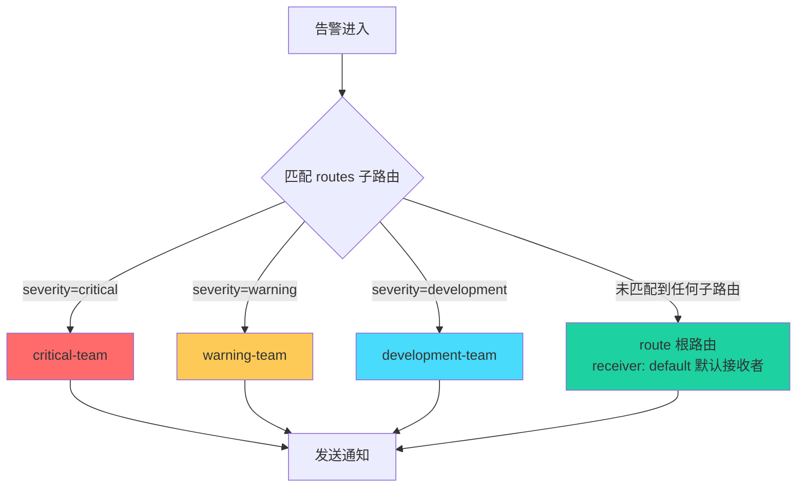
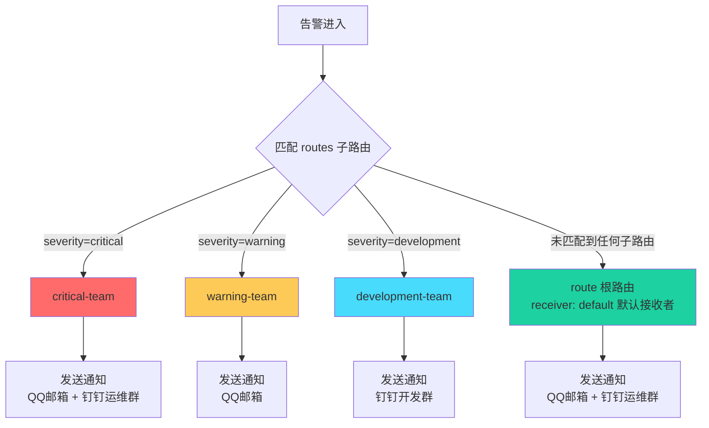

---
title: Prometheus 之 Alertmanager配置说明及路由的使用
icon: circle-info
order: 1
category:
  - Linux
  - Prometheus
tag:
  - Linux
  - Prometheus
  - Alertmanager
  - 运维
date: 2026-03-02
isOriginal: true
pageview: true
article: true
breadcrumb: false
comment: true
---

>👨‍🎓**博主简介**
>
>&emsp;&emsp;🏅[CSDN博客专家](https://blog.csdn.net/liu_chen_yang?type=blog)
>&emsp;&emsp;🏅[云计算领域优质创作者](https://blog.csdn.net/liu_chen_yang?type=blog)
>&emsp;&emsp;🏅[华为云开发者社区专家博主](https://bbs.huaweicloud.com/community/usersnew/id_1661843828089234)
>&emsp;&emsp;🏅[阿里云开发者社区专家博主](https://developer.aliyun.com/profile/7yu26jk3lfqxg)
>💊**交流社区：**[运维交流社区](https://bbs.csdn.net/forums/lcy) 欢迎大家的加入！
>🐋 希望大家多多支持，我们一起进步！😄
>🎉如果文章对你有帮助的话，欢迎 点赞 👍🏻 评论 💬 收藏 ⭐️ 加关注+💗

---


## 一、前言
Prometheus 的 Alertmanager 是一个用于处理警告消息的工具，它允许你根据不同的条件将警告消息路由到不同的接收者（如 Slack, email, dingtalk 等）。通过配置 Alertmanager 的路由规则，你可以确保不同类型的警告被发送到合适的接收者或团队。

## 二、Alertmanager 配置说明
```yaml
global:   # 全局的配置
  resolve_timeout: 5m  # 解析的超时时间
  # 邮箱的配置
  smtp_smarthost: 'smtp.163.com:465'
  smtp_from: 'test@163.com'
  smtp_auth_username: 'test@163.com'
  smtp_auth_password: 'kso12u32aslsadb'
  smtp_require_tls: false

route:    # 将告警具体怎么发送
  group_by: ['alertname']  # 根据标签进行分组
  group_wait: 10s          # 发送告警等待时间
  group_interval: 10s      # 发送告警邮件的间隔时间
  repeat_interval: 1h      # 重复的告警发送时间
  receiver: 'default'        # 接收者是谁，需和receivers中的name一致
  routes: 	# 子路由
    # 告警等级：严重
    - match:    # 匹配条件
        severity: critical    
      receiver: 'critical-team'
    # 告警等级： 警告
    - match:
        severity: warning
      receiver: 'warning-team'
    # 告警等级 - 自定义：开发 
    - match:
        severity: development
      receiver: 'development-team'
  
receivers:                 # 将告警发送给谁
  # 默认接收者
  - name: 'default'
    email_configs:
      # 接收者
      - to: 'test1@qq.com,test2@qq.com'
        send_resolved: true
    webhook_configs:
      - url: 'http://localhost:8060/dingtalk/webhook1/send'
        send_resolved: true

  # 警告级别接收者
  - name: 'warning-team'
    email_configs:
      - to: 'test1@qq.com'
        send_resolved: true

  # 严重级别接收者
  - name: 'critical-team'
    email_configs:
      - to: 'test1@qq.com'
        send_resolved: true
    webhook_configs:
      - url: 'http://localhost:8060/dingtalk/webhook1/send'
        send_resolved: true

  # 开发团队接收者
  - name: 'development-team'
    webhook_configs:
      - url: 'http://localhost:8060/dingtalk/development/send'
        send_resolved: true
    
  
inhibit_rules:   # 抑制告警
  - source_match:
      severity: 'critical'   # 当收到同一台机器发送的critical时候，屏蔽掉warning类型的告警
    target_match:
      severity: 'warning'	
    equal: ['alertname', 'severity', 'instance']  # 根据这些标签来定义抑制
```
关键配置项解释：

*  **global**: 设置全局配置，如超时时间。
*  **route**: 定义了路由的默认行为和规则。
   - **group_by**: 定义分组规则，基于哪些标签来分组警告。
   - **group_wait**: 在发送新组的第一条警告之前等待的时间。
   - **group_interval**: 发送告警邮件的间隔时间。
   - **repeat_interval**: 在重复发送相同警告之间的时间间隔。
   - **receiver:** 默认接收者名称。
   - **routes**: 定义了更具体的路由规则，可以根据不同的标签值将警告发送到不同的接收者。
	   - **match**: 定义标签匹配的具体规则，精确匹配。
	   - **match_re**: 定义标签匹配的具体规则，支持正则匹配。
			- **severity**: 具体条件：告警规则中标签 severity 的值等于这个值才会触发。
	   - **receiver**:  匹配成功后，发给这个接收者，接收者配置的name需和这个相同。
*  **receivers**: 定义了可以接收警告的接收者，每个接收者可以有不同的配置（如发送邮件、Slack消息等）。
	* **- name**: 定义接收者的名称，需和`route、routes`中的`receiver`相匹配。
		* **email_configs**: 定义了邮件发送的配置。
		* **webhook_configs**： 定义了钉钉发送的配置。
		* **wechat_configs**: 定义了企业微信发送的配置。
			* **send_resolved**: 是否开启恢复告警通知。
* **inhibit_rules**: 定义告警抑制规则，用于屏蔽冗余告警。
	* **source_match**: 定义源告警匹配条件，当存在匹配的源告警时，将抑制目标告警。
		* **severity**: 定义源告警的严重级别标签。
	* **target_match**: 定义目标告警匹配条件，满足条件的告警将被抑制。
		* **severity**: 定义目标告警的严重级别标签。
	* **equal**: 定义用于判断告警是否为同一来源的标签列表，这些标签值相同时才执行抑制。


## 三、路由的使用


### 3.1 路由的写法
> 默认只有`route`全局的路由配置，所有告警都会发送到一个接收者，这样消息就比较混乱，那么可以通过如下添加`routes`来细分子路由的匹配规则；
> 最后在为每个子路由及路由添加接收者；

   - **routes**: 定义了更具体的路由规则，可以根据不同的标签值将警告发送到不同的接收者。
	   - **match**: 定义标签匹配的具体规则，精确匹配。
	   - **match_re**: 定义标签匹配的具体规则，支持正则匹配。
			- **severity**: 具体条件：告警规则中标签 severity 的值等于这个值才会触发。
	   - **receiver**:  匹配成功后，发给这个接收者，接收者配置的name需和这个相同。
*  **receivers**: 定义了可以接收警告的接收者，每个接收者可以有不同的配置（如发送邮件、Slack消息等）。
	* **- name**: 定义接收者的名称，需和`route、routes`中的`receiver`相匹配。
		* **email_configs**: 定义了邮件发送的配置。
		* **webhook_configs**： 定义了钉钉发送的配置。
		* **wechat_configs**: 定义了企业微信发送的配置。
			* **send_resolved**: 是否开启恢复告警通知。

```bash
route:
  group_by: ['alertname']
  group_wait: 10s  
  group_interval: 10s 
  repeat_interval: 1h   
  receiver: 'default'        # 接收者是谁，需和receivers中的name一致
  routes: 	# 子路由
    # 告警等级：严重
    - match:    # 匹配条件
        severity: critical    
      receiver: 'critical-team'
    # 告警等级： 警告
    - match:
        severity: warning
      receiver: 'warning-team'
    # 告警等级 - 自定义：开发 
    - match:
        severity: development
      receiver: 'development-team'
  
receivers:                 # 将告警发送给谁
  # 默认接收者
  - name: 'default'
    email_configs:
      # 接收者
      - to: 'test1@qq.com,test2@qq.com'
        send_resolved: true
    webhook_configs:
      - url: 'http://localhost:8060/dingtalk/webhook1/send'
        send_resolved: true

  # 警告级别接收者
  - name: 'warning-team'
    email_configs:
      - to: 'test1@qq.com'
        send_resolved: true

  # 严重级别接收者
  - name: 'critical-team'
    email_configs:
      - to: 'test1@qq.com'
        send_resolved: true
    webhook_configs:
      - url: 'http://localhost:8060/dingtalk/webhook1/send'
        send_resolved: true

  # 开发团队接收者
  - name: 'development-team'
    webhook_configs:
      - url: 'http://localhost:8060/dingtalk/development/send'
        send_resolved: true
```
### 3.2 路由匹配的规则

* 匹配顺序：从上往下顺序进行匹配，一旦匹配则停止；
如果想继续匹配，可添加`continue: true`配置，与`receiver`同级，意思是：允许继续匹配其他路由规则，到时候只要匹配到的都会发送告警。
* 标签匹配：常见标签如 alertname、severity、instance；也可以自己定义标签。


### 3.3 路由匹配流程图




> 简单来说就是：现在有两个`routes`，一个`route`，有`routes`先匹配`routes`里的标签路由规则，没有就匹配默认的`route`的路由规则，发给配置的默认接收者；


### 3.4 路由匹配 + 告警接收人流程图

> 以文中展示的配置为例




## 四、注意事项
> 修改完Alertmanager配置记得验证并重新加载配置或重启服务；

* 验证Alertmanager配置是否有错误

```bash
cd /usr/local/alertmanager/
./amtool check-config alertmanager.yml
```

* 重新加载Alertmanager配置

```bash
curl -lv -X POST http://localhost:9093/-/reload
```

