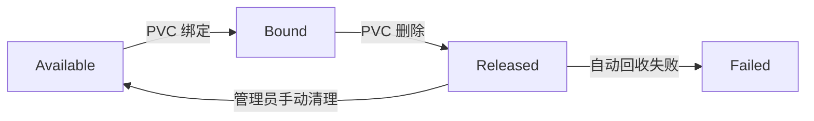
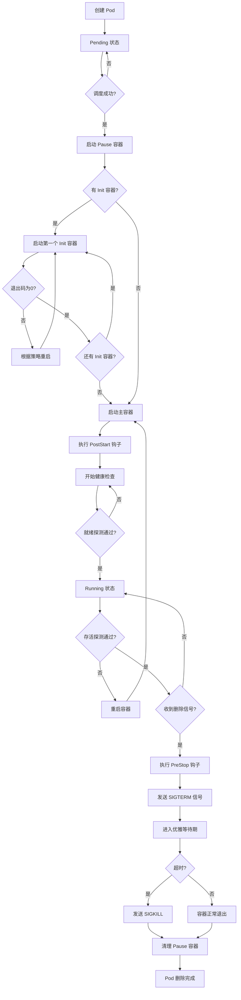

## 1.说下k8s的核心组件都有哪些，并简述下他们各自的作用

答：

> Kubernetes（k8s）的核心组件可以分为**控制平面（Control Plane）组件**和**工作节点（Node）组件**两大类；

* [x] **控制平面组件（Control Plane Components）**
* etcd：分布式键值存储，保存集群状态。
*   kube-apiserver：提供 Kubernetes API，是整个集群的前端入口。
*   kube-scheduler：负责调度新创建的 Pod 到合适的工作节点上运行。
*   kube-controller-manager：运行控制器（如 Node Controller、Replication Controller）。
*   [x] **工作节点组件（Node Components）**
*   kubelet：节点上的主要代理，管理节点上的 Pod 和容器。
*   kube-proxy：负责**网络代理和负载均衡**，实现 Kubernetes Service 的通信。
*   Container Runtime：负责运行容器的软件（如 Docker、containerd）。

## 2、k8s中都有哪些对象资源？

答：

* [x] 工作负载类（Workload）

| 资源名称                  | 简称     | 作用                                              |
| ------------------------- | -------- | ------------------------------------------------- |
| **Pod**                   | `po`     | 最小部署单元，包含一个或多个紧密耦合的容器        |
| **Deployment**            | `deploy` | 声明式管理无状态应用，支持滚动更新和回滚          |
| **StatefulSet**           | `sts`    | 管理有状态应用，提供稳定的网络标识和持久存储      |
| **DaemonSet**             | `ds`     | 确保每个（或指定）节点上运行一个 Pod 副本         |
| **ReplicaSet**            | `rs`     | 维护指定数量的 Pod 副本（通常被 Deployment 管理） |
| **Job**                   | -        | 一次性任务，运行完成后即结束                      |
| **CronJob**               | `cj`     | 定时任务，按 Cron 表达式周期性执行 Job            |
| **ReplicationController** | `rc`     | 旧版副本控制器（已被 ReplicaSet/Deployment 取代） |

* [x] 服务与网络类（Service & Networking）

| 资源名称          | 简称     | 作用                                                         |
| ----------------- | -------- | ------------------------------------------------------------ |
| **Service**       | `svc`    | 为一组 Pod 提供稳定的网络访问入口（ClusterIP/NodePort/LoadBalancer/ExternalName） |
| **Ingress**       | `ing`    | 管理外部 HTTP/HTTPS 访问，提供基于域名的路由                 |
| **IngressClass**  | -        | 定义 Ingress 控制器的配置类                                  |
| **NetworkPolicy** | `netpol` | 定义 Pod 之间的网络访问策略（防火墙规则）                    |
| **EndpointSlice** | -        | 存储 Service 的后端端点信息（替代旧的 Endpoints）            |
| **Endpoints**     | `ep`     | Service 对应的后端 Pod IP:Port 列表（逐渐被 EndpointSlice 取代） |

* [x] 配置与存储类（Config & Storage）

| 资源名称                  | 简称  | 作用                                             |
| ------------------------- | ----- | ------------------------------------------------ |
| **ConfigMap**             | `cm`  | 存储非敏感的配置数据（键值对、配置文件等）       |
| **Secret**                | -     | 存储敏感数据（密码、Token、证书等），Base64 编码 |
| **PersistentVolume**      | `pv`  | 集群中的持久化存储资源（由管理员配置或动态供给） |
| **PersistentVolumeClaim** | `pvc` | Pod 对持久化存储的请求声明                       |
| **StorageClass**          | `sc`  | 定义存储的"类"，支持动态卷供给                   |
| **VolumeAttachment**      | -     | 记录存储卷的挂载状态（CSI 使用）                 |
| **CSI Driver/Node**       | -     | 容器存储接口相关资源                             |

* [x] 身份与权限类（RBAC & Security）

| 资源名称               | 简称  | 作用                                                         |
| ---------------------- | ----- | ------------------------------------------------------------ |
| **ServiceAccount**     | `sa`  | 为 Pod 提供身份标识，用于 API 认证                           |
| **Role**               | -     | 定义命名空间级别的权限规则                                   |
| **ClusterRole**        | -     | 定义集群级别的权限规则                                       |
| **RoleBinding**        | -     | 将 Role 绑定到用户/组/ServiceAccount（命名空间级别）         |
| **ClusterRoleBinding** | -     | 将 ClusterRole 绑定到用户/组/ServiceAccount（集群级别）      |
| **PodSecurityPolicy**  | `psp` | 定义 Pod 的安全策略（已弃用，被 Pod Security Standards 替代） |
| **PodSecurityContext** | -     | 定义 Pod/容器的安全上下文（非独立资源，是字段）              |

* [x] 调度与节点类（Scheduling & Node）

| 资源名称                        | 简称     | 作用                                      |
| ------------------------------- | -------- | ----------------------------------------- |
| **Node**                        | `no`     | 集群中的工作节点（物理机或虚拟机）        |
| **Namespace**                   | `ns`     | 资源隔离的虚拟集群（如 dev、test、prod）  |
| **ResourceQuota**               | `quota`  | 限制命名空间的资源使用总量                |
| **LimitRange**                  | `limits` | 设置命名空间中 Pod/容器的默认资源限制     |
| **PriorityClass**               | `pc`     | 定义 Pod 的调度优先级                     |
| **RuntimeClass**                | -        | 定义不同的容器运行时配置                  |
| **Taint** / **Toleration**      | -        | 节点污点与 Pod 容忍度（字段，非独立资源） |
| **Affinity** / **AntiAffinity** | -        | Pod 亲和性与反亲和性（字段，非独立资源）  |

## 3、labels 的本质是什么？他的作用又是什么？

答：Label其实就一对 `key/value` ，被关联到对象上。他可以起到服务发现和集群调度的作用。

## 4、Service 在 K8s 中有哪几种类型？

答：

| 类型             | 名称          | 访问方式              | 典型使用场景                 |
| :--------------- | :------------ | :-------------------- | :--------------------------- |
| **ClusterIP**    | 集群内部 IP   | 仅集群内部访问        | 微服务内部通信、数据库服务   |
| **NodePort**     | 节点端口      | `<NodeIP>:<NodePort>` | 开发测试、简单外部访问       |
| **LoadBalancer** | 云负载均衡器  | 云厂商提供的公网 IP   | 生产环境、云平台部署         |
| **ExternalName** | 外部 DNS 别名 | 映射到外部域名        | 访问集群外服务、服务迁移过渡 |

## 5、Secret 在k8s中的作用？

答：Secret 解决了密码、token、密钥等敏感数据的配置问题，而不需要把这些敏感数据暴露到镜像或者 Pod Spec中。

PS : 只有与 apiserver 组件进行交互的 pod 才会有如下的 证书、命名空间、tekon密钥。

## 6、简述下PV 和 PVC是什么

答：

PV - 持久卷：集群中**预先配置好**的存储资源，由管理员或动态供给创建。

PVC - 持久卷声明：用户对存储资源的**申请请求**，类似于 Pod 申请 CPU/内存。

* PV

```yaml
apiVersion: v1
kind: PersistentVolume
metadata:
  name: nfs-pv
spec:
  capacity:
    storage: 10Gi          # 存储容量
  accessModes:
    - ReadWriteOnce        # 访问模式（RWO/RWX/ROX）
  persistentVolumeReclaimPolicy: Retain  # 回收策略
  storageClassName: nfs    # 存储类
  nfs:
    server: 192.168.1.100
    path: /data/k8s
```

* PVC

```yaml
apiVersion: v1
kind: PersistentVolumeClaim
metadata:
  name: my-pvc
  namespace: default
spec:
  accessModes:
    - ReadWriteOnce
  resources:
    requests:
      storage: 5Gi         # 申请 5GB 存储
  storageClassName: nfs    # 指定 StorageClass
```

> 在简单一句话就是：
>
> **PV 是"房子"，PVC 是"租房申请"，Pod 是"租客"。**
> 管理员建好房子（PV），用户提交申请（PVC），系统匹配钥匙（绑定），租客入住使用（Pod 挂载）。

## 7、PV和PVC的生命周期  

PV（PersistentVolume，持久卷）和 PVC（PersistentVolumeClaim，持久卷声明）的生命周期分为**五个阶段**：**配置 → 绑定 → 使用 → 释放 → 回收**。


* 完整生命周期流程图


## 8、PV卷都有哪些声明状态 

PV（PersistentVolume）有四种生命周期状态：

| 状态          | 说明   | 含义                                                        |
| :------------ | :----- | :---------------------------------------------------------- |
| **Available** | 可用   | PV 已创建，空闲未绑定，等待 PVC 来认领                      |
| **Bound**     | 已绑定 | PV 已成功绑定到某个 PVC，正在被使用                         |
| **Released**  | 已释放 | PVC 被删了，PV 还保留着数据，但**不能复用**，需要管理员处理 |
| **Failed**    | 失败   | 自动回收失败（通常很少见）                                  |


状态流程图




## 9、简述Kubernetes Replica Set 和 Replication Controller 之间有什么区别？

答：两者几乎一样，都是确保在任何给定时间运行指定数量的 Pod 副本。不同之处在于RS 使用基于集合的选择器，而 Replication Controller 使用基于等式的选择器。

## 10、一般Kubernetes是如何进行优雅的节点关机维护？

答：由于Kubernetes节点运行大量Pod，因此在进行关机维护之前，建议先标记节点为不可调度（节点隔离），然后使用kubectl drain将该节点的Pod进行驱逐，等待所有pod都清除之后，在进行关机维护。

```bash
┌─────────────────────────────────────────────────────────────┐
│                      节点维护流程                            │
│                                                             │
│  1. 标记节点不可调度（Cordon）                                │
│         ↓                                                   │
│  2. 驱逐节点上的 Pod（Drain）                                 │
│         ↓                                                   │
│  3. 等待 Pod 优雅终止（Graceful Termination）                 │
│         ↓                                                   │
│  4. 执行维护操作（关机/升级/重启）                            │
│         ↓                                                   │
│  5. 恢复节点（Uncordon）                                      │
└─────────────────────────────────────────────────────────────┘
```


## 11、ConfigMap 和 Secret是什么，他们有什么区别？

> ConfigMap 和 Secret 都是 Kubernetes 中用于服务与配置分离的的核心资源，将应用配置与容器解耦。两者功能相似，但适用场景和安全级别不同。
>
> * ConfigMap：一般是明文配置，用于存储非敏感的配置数据。
> * Secret：一般是采用base64编码配置，用于存储敏感数据（如密码、密钥），需先将明文转化为base64编码，在写入Secret里。


* **详细对比**

| 特性             | ConfigMap                                        | Secret                                            |
| :--------------- | :----------------------------------------------- | :------------------------------------------------ |
| **用途**         | 存储非敏感配置（配置文件、环境变量、命令行参数） | 存储敏感数据（密码、Token、证书、密钥）           |
| **编码方式**     | **明文存储**（UTF-8 文本）                       | **Base64 编码**（非加密，仅编码）                 |
| **数据大小限制** | 1 MiB（ETCD 限制）                               | 1 MiB（但建议 < 500KB，因 API Server 内存开销大） |
| **etcd 加密**    | ❌ 不加密                                         | ✅ 可启用静态加密（K8s 1.7+）                      |
| **内存处理**     | 直接存储                                         | 存储在 tmpfs（内存文件系统），避免落盘            |
| **访问控制**     | 普通 RBAC                                        | 建议更严格的 RBAC 策略                            |
| **类型区分**     | 无类型                                           | 多种内置类型（Opaque、tls、docker-registry 等）   |

## 12、什么是 StatefulSet？  
答：StatefulSet 是 Kubernetes 中专门用于管理**有状态应用**的工作负载控制器，为 Pod 提供**稳定的网络标识、持久存储和有序部署**能力。

## 13、什么是 Service？  
答：Service 简称 svc，用于定义一组 Pod 的访问策略，提供负载均衡和服务发现。

## 14、什么是 DaemonSet？  
答：DaemonSet 简称 DS，用于在每个节点上运行一个 Pod 副本，通常用于日志收集、监控或网络代理。

## 15、什么是 Ingress？  
答：Ingress 是 Kubernetes 中管理**外部 HTTP/HTTPS 访问**的 API 对象，提供**基于域名的路由**和**负载均衡**能力，是 Service 的"上层网关"。

## 16、service的类型有几种，都是什么？

| 类型         | 说明                          |
| :----------- | :---------------------------- |
| ClusterIP    | 集群内部访问（默认）          |
| NodePort     | 暴露节点端口，外部可访问      |
| LoadBalancer | 云厂商负载均衡器，分配公网 IP |
| ExternalName | 映射外部域名                  |

## 17、Ingress 与 Service 的关系

```bash
外部流量 → [Ingress] → [Service] → [Pod]
              ↑            ↑
           七层路由      四层转发
        (域名/路径/SSL)  (ClusterIP)
```

> Ingress 是集群的"智能网关"，把外部 HTTP 流量按域名和路径路由到内部 Service，实现统一的入口管理。

## 18、如何定义资源清单中的环境变量？  

```yaml
apiVersion: v1
kind: Pod
metadata:
  name: my-pod
spec:
  containers:
  - name: my-container
    image: nginx
    env:
    # 直接定义
    - name: ENV_NAME
      value: "production"
    
    # 从 ConfigMap 引用
    - name: DB_HOST
      valueFrom:
        configMapKeyRef:
          name: my-config
          key: db-host
    
    # 从 Secret 引用
    - name: DB_PASSWORD
      valueFrom:
        secretKeyRef:
          name: db-secret
          key: password
    
    # 从 Downward API 引用
    - name: POD_NAME
      valueFrom:
        fieldRef:
          fieldPath: metadata.name
    
    # 批量引用 ConfigMap 和 Secret
    envFrom:
    - configMapRef:
        name: app-config
    - secretRef:
        name: app-secret
```


## 19、资源清单中的 apiVersion 字段有什么作用？  
答:

`apiVersion` 字段用于指定创建资源时使用的 **Kubernetes API 版本**。

简单来说，它的作用是：
1.  **告诉 Kubernetes 使用哪个 API 来创建资源**（不同的版本可能字段不同）
2.  **区分资源是属于稳定版还是测试版**（例如 `v1` 代表稳定，`beta` 代表测试）

**常见示例：**
-   `apps/v1`：用于 Deployment、StatefulSet
-   `v1`：用于 Pod、Service、ConfigMap
-   `batch/v1`：用于 Job、CronJob

## 20、如何定义资源清单中的资源限制（Resource Limits）？  
答：  在 Kubernetes 资源清单中，通过`resources.requests` 和 `resources.limits`  字段来定义资源限制。

* `requests`: 容器启动时请求的资源。  

* `limits`: 容器资源使用的上限。

示例：

```yaml
apiVersion: v1
kind: Pod
metadata:
  name: my-pod
spec:
  containers:
  - name: my-container
    image: nginx
    resources:
      requests:    # 调度时保证的最小资源
        cpu: "250m"      # 0.25 核 CPU
        memory: "512Mi"  # 512 MiB 内存
      limits:      # 运行时不能超过的最大资源
        cpu: "500m"      # 0.5 核 CPU
        memory: "1Gi"    # 1 GiB 内存
```

 **CPU 单位说明**

- `1` = 1 核（vCPU/超线程）
- `100m` = 0.1 核（100 milliCPU）
- 最小单位：`1m`

**内存单位说明**

- `Mi`：Mebibytes（二进制，1Mi = 1024×1024 字节）
- `M` 或 `MB`：Megabytes（十进制，1M = 1000×1000 字节）
- `Gi`：Gibibytes（二进制，1Gi = 1024Mi）
- `Ki`、`K` 类似

> 注意事项：
>
> - **requests 必须 ≤ limits**
> - 如果只设置 `limits`，`requests` 默认等于 `limits`
> - CPU 是可压缩资源（超过限制会限流，不会 kill）
> - 内存是不可压缩资源（超过限制会 OOM kill）

## 21、超过资源清单中的限制会怎么样？

- CPU 是可压缩资源（超过限制会限流，不会 kill）
- 内存是不可压缩资源（超过限制会 OOM kill）

## 22、不设置资源限制会有什么后果？

- 容器可能耗尽节点所有资源
- 影响同节点其他 Pod 正常运行
- 节点资源不足时，无限制的 Pod 可能被驱逐

## 23、如何定义 Pod 的健康检查  
答：  通过添加探针来定义 Pod 的健康检查。

* `livenessProbe`: 检查容器是否存活。 
* `readinessProbe`: 检查容器是否准备好接收流量。

## 24、探针的监控检查方式都有哪些？

### 24.1 HTTP GET 检查

```yaml
apiVersion: v1
kind: Pod
metadata:
  name: my-pod
spec:
  containers:
  - name: my-container
    image: nginx
    livenessProbe:
      httpGet:
        path: /healthz     # 检查路径
        port: 80           # 检查端口
        httpHeaders:       # 可选：自定义请求头
        - name: Custom-Header
          value: Awesome
      initialDelaySeconds: 5   # 容器启动后延迟多少秒开始检查
      periodSeconds: 10        # 检查间隔（秒）
      timeoutSeconds: 1        # 超时时间（秒）
      successThreshold: 1      # 成功几次才算成功
      failureThreshold: 3      # 失败几次才算失败
```

### 24.2 TCP Socket 检查

```yaml
readinessProbe:
  tcpSocket:
    port: 8080
  initialDelaySeconds: 5
  periodSeconds: 10
```

### 24.3 Exec 命令检查

```yaml
livenessProbe:
  exec:
    command:
    - cat
    - /tmp/healthy
  initialDelaySeconds: 15
  periodSeconds: 20
```

## 25、两种探针的区别

| 探针类型           | 作用                       | 失败后果                                |
| :----------------- | :------------------------- | :-------------------------------------- |
| **livenessProbe**  | 检查容器是否存活           | 失败则重启容器                          |
| **readinessProbe** | 检查容器是否准备好提供服务 | 失败则从 Service 端点中移除，不转发流量 |

示例：

```yaml
apiVersion: apps/v1
kind: Deployment
metadata:
  name: web-app
spec:
  replicas: 3
  selector:
    matchLabels:
      app: web
  template:
    metadata:
      labels:
        app: web
    spec:
      containers:
      - name: app
        image: myapp:v1
        ports:
        - containerPort: 8080
        
        # 就绪检查：应用是否准备好接收流量
        readinessProbe:
          httpGet:
            path: /ready
            port: 8080
          initialDelaySeconds: 10   # 给应用10秒启动时间
          periodSeconds: 5           # 每5秒检查一次
          failureThreshold: 3        # 连续3次失败标记为未就绪
        
        # 存活检查：应用是否正常运行
        livenessProbe:
          httpGet:
            path: /health
            port: 8080
          initialDelaySeconds: 30    # 给应用30秒初始化
          periodSeconds: 10           # 每10秒检查一次
          failureThreshold: 3         # 连续3次失败重启容器
```

- **initialDelaySeconds** 要设置足够长，避免应用未启动就开始检查
- **periodSeconds** 不要太频繁（5-10秒较合适）
- **timeoutSeconds** 通常设置 1-5 秒
- **failureThreshold** 设置 2-3 次，避免误判
- 检查接口要轻量级，不要执行复杂逻辑
- 区分好 liveness 和 readiness 的职责

## 26、pod的生命周期  

Pod对象从创建开始至终止退出的时间范围称为生命周期。在此期间，Pod会经历多种状态并执行一系列操作。其中，创建主容器是必需执行的操作；其他操作如初始化容器（Init Container）、容器启动后钩子（PostStart Hook）、容器终止前钩子（PreStop Hook）、存活性探测（Liveness Probe）和就绪性探测（Readiness Probe）等，则根据Pod的定义选择性执行。

## 27、描述 Pod 从创建到终止的完整生命周期过程  
Pod 的生命周期从创建到终止大概分这么几步：

首先，用户通过 kubectl 创建 Pod，请求写到 etcd 后，调度器把 Pod 分配到一个节点上，节点的 kubelet 就开始干活了。

kubelet 第一件事是先启动一个 **pause 容器**，这个容器不干别的，就是给 Pod hold 住网络和命名空间，所有业务容器都共享它。

接着如果有 **Init 容器**，就按顺序跑，它们必须成功退出（返回0），主容器才会启动，不然就一直重试。

主容器启动后，如果有 **PostStart 钩子**就会执行一下。然后 kubelet 会根据配置开始做两种探测：
- **就绪探测**：判断容器能不能接收流量，通过了 Pod 才变成 Running 状态，并且 Service 才会把流量转发进来
- **存活探测**：全程盯着容器，如果发现应用死了（探测失败），就按策略重启容器

最后如果 Pod 被删了，kubelet 会先执行 **PreStop 钩子**做清理，然后发 SIGTERM 信号给容器，给它一个优雅退出的时间（默认30秒），时间到了还没退就强制 SIGKILL 杀掉，最后 pause 容器也被清理，Pod 彻底消失。”

---

* 流程图展示





## 28、Pod 生命周期有哪些主要阶段？ 

- **Pending**：Pod 刚创建，正在等调度或者拉取镜像，容器还没起来；
- **Running**：Pod 已经分配到节点，所有容器都创建好了，至少有一个在运行；
- **Succeeded**：Pod 里的所有容器都正常退出（比如跑完一个 Job），不会再重启；
- **Failed**：容器退出了，但至少有一个是异常退出（非0返回码）；
- **Unknown**：Pod 的状态获取不到，通常是节点宕机或者网络不通，apiserver 联系不上 kubelet。

## 29、Service Account的作用  
答：

> `Service Account` 是 Pod 访问 Kubernetes API 时的身份凭证，通过它结合 RBAC 可以精细控制 Pod 能做什么操作，比如一个应用想查询其他 Pod 的状态，就需要用 Service Account 来认证授权。

**详细说明：**

1. **身份认证**

- 当 Pod 需要访问 API Server（比如查询其他 Pod 状态、更新资源）时，需要使用 Service Account 进行身份认证
- 每个 Pod 都必须绑定一个 Service Account（如果不指定，会自动使用所在 Namespace 的 `default`）

2. **权限控制**

- Service Account 通常与 RBAC（基于角色的访问控制）结合使用
- 通过 Role/ClusterRole + RoleBinding 来授予不同的操作权限

3. **自动挂载凭证**

- 当 Pod 使用 Service Account 时，Kubernetes 会自动将对应的认证信息（token）通过 Volume 挂载到 Pod 的 `/var/run/secrets/kubernetes.io/serviceaccount/` 目录
- Pod 里的应用可以用这个 token 来认证自己，访问 API

示例：

```yaml
# 创建一个 Service Account
apiVersion: v1
kind: ServiceAccount
metadata:
  name: my-sa
---
# 在 Pod 中指定使用它
apiVersion: v1
kind: Pod
metadata:
  name: my-pod
spec:
  serviceAccountName: my-sa  # 指定 Service Account
  containers:
  - name: app
    image: nginx
```

如果不指定 `serviceAccountName`，Pod 会使用该 Namespace 下的 `default` Service Account。

